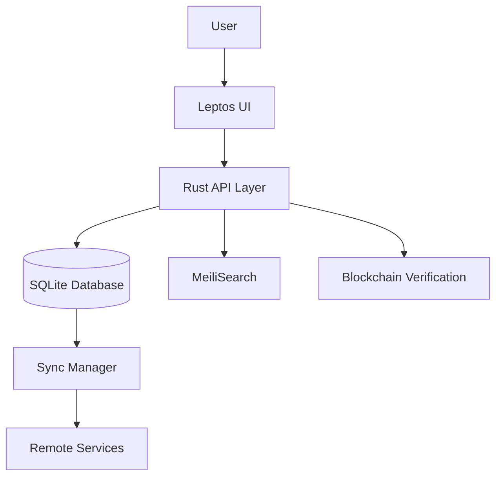

# LMS Architecture Overview

_Last updated: 2025-04-09T21:47:28.600766700-04:00_

## Architecture Principles

The LMS project follows these key architectural principles:
- **Clean Architecture**
- **SOLID**
- **Offline-first**

## Design Patterns
- **CQRS**
- **Event Sourcing**
- **Repository Pattern**

## Component Overview

The system is composed of the following major components:

### Parser Components
- **parseRequirements**: Haskell function/component
- **requirementToJson**: Haskell function/component
- **A.object [ "type" .= ("complete_assignment"**: Haskell function/component
- **A.object [ "type" .= ("score_above"**: Haskell function/component
- **A.object [ "type" .= ("and"**: Haskell function/component
- **A.object [ "type" .= ("or"**: Haskell function/component
- **A.object [ "type" .= ("not"**: Haskell function/component
- **A.object [ "type" .= ("complete_all_modules"**: Haskell function/component
- **A.object [ "type" .= ("minimum_post_count"**: Haskell function/component
- **requirementFromJson**: Haskell function/component
- **rtype <- obj .: "type"**: Haskell function/component
- **parseQueryLanguage**: Haskell function/component
- **optimizeQuery**: Haskell function/component
- **pushDownFilters**: Haskell function/component
- **reorderConditions**: Haskell function/component
- **reorderJoins**: Haskell function/component
- **eliminateUnusedColumns**: Haskell function/component
- **collectUsedColumns**: Haskell function/component
- **isColumnUsed**: Haskell function/component
- **collectColumnUsage**: Haskell function/component
- **collectConditionUsage**: Haskell function/component
- **collectExprUsage**: Haskell function/component

### Query Components
- **{ queryType**: Haskell function/component
- **, tables**: Haskell function/component
- **, conditions**: Haskell function/component
- **, projections**: Haskell function/component
- **executeQuery**: Haskell function/component
- **runQueryWithMemTracking**: Haskell function/component
- **executeQueryPure**: Haskell function/component
- **matchesConditions**: Haskell function/component
- **matchCondition**: Haskell function/component
- **queryMemLimit**: Haskell function/component
- **logMemoryWarning**: Haskell function/component

### Sync Components
- **{ opId**: Haskell function/component
- **, opType**: Haskell function/component
- **, entityId**: Haskell function/component
- **, payload**: Haskell function/component
- **{ resolvedOpId**: Haskell function/component
- **, success**: Haskell function/component
- **, conflicts**: Haskell function/component
- **processBatch**: Haskell function/component
- **processOps**: Haskell function/component
- **groupByKey**: Haskell function/component
- **resolveConflicts**: Haskell function/component

### Blockchain Components
- **blockchainHash**: Haskell function/component
- **verifyBlock**: Haskell function/component
- **generateTests**: Haskell function/component
- **generateTestCasesFromProofs**: Haskell function/component

## Integration Architecture

The LMS integrates Canvas and Discourse through these mechanisms:

### Canvas Integration
- Course management functionality is migrated from Canvas
- Assignment and grading systems are preserved
- User authentication is unified

### Discourse Integration
- Discussion forums are embedded within course contexts
- User profiles are synchronized
- Notifications are unified

## Data Flow

## Technology Stack Details

### Frontend
- **Leptos**: Reactive web framework for Rust
- **Tauri**: Desktop application framework

### Backend
- **Rust**: Primary language for performance and safety
- **Haskell**: Used for complex business logic

### Database
- **SQLite**: Embedded database for offline-first operation
- **sqlx**: Rust SQL toolkit and ORM

### Search
- **MeiliSearch**: Embedded search engine
