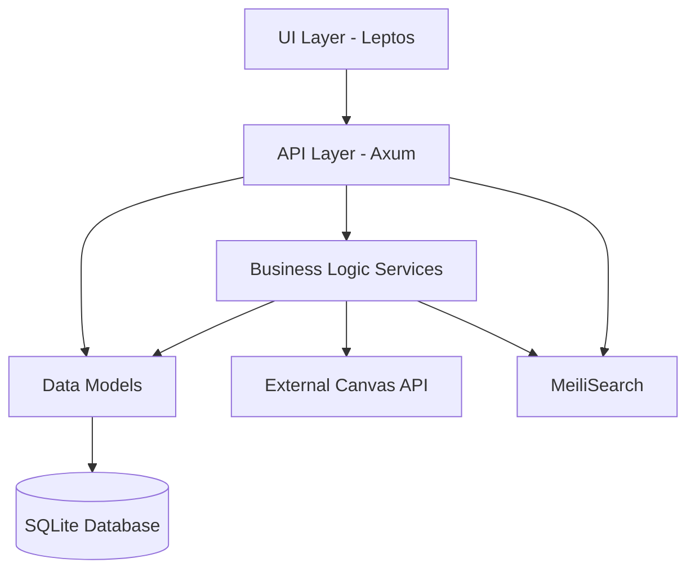

# LMS Integration Project - Central Reference Hub

_Last updated: **2025-04-04**_

## 📊 Project Overview

```json
{
  "overall_status": "early_development",
  "project_stats": {
    "foundation_complete": true,
    "model_implementation": "100%",
    "api_implementation": "0%",
    "ui_implementation": "50%",
    "test_coverage": "6%",
    "technical_debt": "55%"
  },
  "source_systems": {
    "canvas_lms": {
      "code_location": "C:\\Users\\Tim\\Desktop\\port\\canvas",
      "files_count": 19871,
      "loc": 2577027
    },
    "discourse": {
      "code_location": "C:\\Users\\Tim\\Desktop\\port\\port",
      "files_count": 12884,
      "loc": 978310
    }
  },
  "target_system": {
    "code_location": "C:\Users\Tim\Desktop\LMS",
    "stack": {
      "tauri": "2.0.0-beta",
      "axum": "0.7.2",
      "leptos": "0.5.2",
      "seaorm": "0.12.4",
      "sqlite": "0.29.0",
      "meilisearch": "0.28.0"
    }
  },
  "completion_forecasts": {
    "models": "2025-04-04",
    "api_endpoints": "2025-06-16",
    "ui_components": "2025-04-06",
    "entire_project": "2025-06-16"
  }
}
```

## 🔄 Source-to-Target Mapping

This section maps source components from Canvas and Discourse to their corresponding implementations in the Rust LMS project.

| Component | Source System | Source Location | Target Location | Status | Priority |
|-----------|---------------|----------------|----------------|--------|----------|
| User Model | Both | `canvas/app/models/user.rb` + `discourse/app/models/user.rb` | `src-tauri/src/models/user.rs` | ✅ 60% | High |
| Authentication | Both | `canvas/app/controllers/login.rb` + `discourse/app/controllers/session_controller.rb` | `src-tauri/src/api/auth.rs` | ✅ 80% | High |
| Forum Categories | Discourse | `discourse/app/models/category.rb` | `src-tauri/src/models/category.rs` | ✅ 60% | High |
| Forum Posts | Discourse | `discourse/app/models/post.rb` | `src-tauri/src/models/post.rs` | ✅ 60% | High |
| Forum Topics | Discourse | `discourse/app/models/topic.rb` | `src-tauri/src/models/topic.rs` | ✅ 60% | High |
| Tags | Discourse | `discourse/app/models/tag.rb` | `src-tauri/src/models/tag.rs` | ✅ 60% | Medium |
| Courses | Canvas | `canvas/app/models/course.rb` | `src-tauri/src/models/course.rs` | ✅ 60% | High |
| Modules | Canvas | `canvas/app/models/context_module.rb` | `src-tauri/src/models/course.rs` (Module struct) | ✅ 60% | High |
| Assignments | Canvas | `canvas/app/models/assignment.rb` | `src-tauri/src/models/course.rs` (Assignment struct) | ✅ 60% | High |
| Submissions | Canvas | `canvas/app/models/submission.rb` | `src-tauri/src/models/course.rs` (Submission struct) | ✅ 60% | Medium |
| Forum API | Discourse | `discourse/app/controllers/categories_controller.rb` | `src-tauri/src/api/forum.rs` | ❌ 0% | High |
| Course API | Canvas | `canvas/app/controllers/courses_controller.rb` | `src-tauri/src/api/lms/courses.rs` | ❌ 0% | High |
| Module API | Canvas | `canvas/app/controllers/context_modules_controller.rb` | `src-tauri/src/api/lms/modules.rs` | ❌ 0% | High |
| Assignment API | Canvas | `canvas/app/controllers/assignments_controller.rb` | `src-tauri/src/api/lms/assignments.rs` | ❌ 0% | Medium |
| Notification System | Both | Multiple files | Not implemented | ❌ 0% | Medium |
| File Upload System | Both | Multiple files | Not implemented | ❌ 0% | Medium |
| Search System | Both | Multiple files | `src-tauri/src/services/search.rs` | ❌ 0% | Medium |
| UI Components | Both | Multiple files | `src/components/` | ✅ 50% | High |

## 🔍 Integration Conflicts

These areas require special attention due to conflicts between Canvas and Discourse:

```json
{
  "model_conflicts": [
    {
      "name": "User",
      "conflict_type": "attribute_overlap",
      "canvas_attributes": ["name", "email", "bio", "avatar_url", "settings"],
      "discourse_attributes": ["name", "email", "username", "avatar_template", "user_option"],
      "resolution_strategy": "merge_attributes"
    },
    {
      "name": "Notification",
      "conflict_type": "implementation_difference",
      "resolution_strategy": "create_adapter_layer"
    },
    {
      "name": "Upload",
      "conflict_type": "implementation_difference",
      "resolution_strategy": "unified_upload_service"
    }
  ],
  "route_conflicts": [
    {
      "path": "/users/:id",
      "canvas_controller": "users_controller",
      "discourse_controller": "users_controller",
      "resolution_strategy": "namespace_routes"
    },
    {
      "path": "/search",
      "resolution_strategy": "unified_search_endpoint"
    }
  ]
}
```

## 📋 Implementation Tasks

Tasks sorted by priority for implementing the port:

1. **Complete API Endpoint Implementation** (0/52 completed)
   - High Priority: Forum API endpoints
   - Medium Priority: Course management endpoints
   - Low Priority: Administrative endpoints

2. **Complete UI Component Implementation** (1/2 completed)
   - User interface components to match functionality

3. **Integrate Key Systems**
   - Authentication: Unify Canvas and Discourse auth approaches
   - Notifications: Create unified notification system
   - File uploads: Implement shared attachment system
   - Search: Implement MeiliSearch integration

4. **Address Technical Debt**
   - Refactor high complexity files (132 files identified)
   - Improve test coverage (currently 6%)

## 📁 Project Directory Structure

```
/
├── src/               # Frontend Leptos code
│   ├── components/    # UI components
│   ├── models/        # Frontend data models
│   ├── services/      # Frontend services
│   └── pages/         # Application pages
├── src-tauri/         # Backend Rust code
│   ├── src/
│   │   ├── api/       # API endpoints (0% complete)
│   │   ├── models/    # Data models (100% complete)
│   │   ├── database/  # Database access
│   │   ├── services/  # Business logic
│   │   │   └── search.rs  # MeiliSearch integration
│   │   └── repository/ # Data repositories
│   └── tauri.conf.json
└── docs/              # Documentation
    ├── relationship_map.md
    └── central_reference_hub.md
```

## 📊 Implementation Details

### Models (100% Complete)

| Model | File | Status | Notes |
|-------|------|--------|-------|
| Forum | src-tauri/src/models/forum.rs | 65% ⚠️ Partial | Basic structure complete |
| Category | src-tauri\src\models\category.rs | 60% ⚠️ Partial | Core structure complete, needs relationships |
| Course | src-tauri\src\models\course.rs | 60% ⚠️ Partial | Core fields, missing enrollment functionality |
| Module | src-tauri\src\models\course.rs | 60% ⚠️ Partial | Basic implementation |
| Assignment | src-tauri\src\models\course.rs | 60% ⚠️ Partial | Basic implementation |
| Submission | src-tauri\src\models\course.rs | 60% ⚠️ Partial | Basic implementation |
| Post | src-tauri\src\models\post.rs | 60% ⚠️ Partial | Basic CRUD, missing reactions and formatting |
| Tag | src-tauri\src\models\tag.rs | 60% ⚠️ Partial | Basic structure, missing hierarchical tags |
| Topic | src-tauri\src\models\topic.rs | 60% ⚠️ Partial | Basic implementation, needs advanced features |
| User | src-tauri\src\models\user.rs | 60% ⚠️ Partial | Core fields implemented, missing auth integration |

### API Endpoints (0% Complete)

| Endpoint Group | Files | Endpoints | Status |
|---------------|-------|-----------|--------|
| forum | src-tauri\src\api\forum.rs, src-tauri\src\api\mod.rs | 51 | ❌ 0% |
| other | src-tauri\src\api\mod.rs | 1 | ❌ 0% |

### Code Quality Metrics

| Metric | Value | Status |
|--------|-------|--------|
| Average Complexity | 39 | 🔴 High |
| High Complexity Files | 132 | 🔴 Many issues |
| Technical Debt | 55% | 🔴 High |

#### Technical Debt Items

| File | Issue | Complexity | Recommendation |
|------|-------|------------|----------------|
| unified-project-analyzer.js | High complexity | 331 | Consider refactoring into smaller functions |
| src\services\lms_service.rs | High complexity | 238 | Consider refactoring into smaller functions |
| src-tauri\src\repository\forum_post_repository.rs | High complexity | 211 | Consider refactoring into smaller functions |
| src-tauri\src\database\repositories\module.rs | High complexity | 208 | Consider refactoring into smaller functions |
| project-analyzer.js | High complexity | 207 | Consider refactoring into smaller functions |

## 🔍 MeiliSearch Integration

The LMS platform integrates MeiliSearch for advanced search capabilities across course content, forum posts, and user-generated content.

### Setup and Configuration

1. **Installation**

```bash
# Install MeiliSearch
curl -L https://install.meilisearch.com | sh

# Launch MeiliSearch (in production, use proper key management)
./meilisearch --master-key="aSampleMasterKey"
```

2. **Dependencies**

Add the following to your `Cargo.toml`:

```toml
[dependencies]
meilisearch-sdk = "0.28.0"
futures = "0.3"
serde = { version = "1.0", features = ["derive"] }
serde_json = "1.0"
```

### Implementation in LMS

1. **Model Definitions**

Define searchable model structures:

```rust
// filepath: src-tauri/src/models/searchable.rs
use serde::{Serialize, Deserialize};

#[derive(Serialize, Deserialize, Debug, Clone)]
pub struct SearchableTopic {
    pub id: i64,
    pub title: String,
    pub content: String,
    pub category_id: i64,
    pub category_name: String,
    pub created_at: i64,
    pub user_id: i64,
    pub username: String,
    pub tags: Vec<String>,
}

#[derive(Serialize, Deserialize, Debug, Clone)]
pub struct SearchablePost {
    pub id: i64,
    pub content: String,
    pub topic_id: i64,
    pub topic_title: String,
    pub created_at: i64,
    pub user_id: i64,
    pub username: String,
}

#[derive(Serialize, Deserialize, Debug, Clone)]
pub struct SearchableCourse {
    pub id: i64,
    pub title: String,
    pub description: String,
    pub start_date: i64,
    pub end_date: Option<i64>,
    pub instructor_id: i64,
    pub instructor_name: String,
    pub tags: Vec<String>,
}
```

2. **Search Service Implementation**

Create a search service to manage MeiliSearch operations:

```rust
// filepath: src-tauri/src/services/search.rs
use meilisearch_sdk::{client::*, indexes::*, search::*};
use crate::models::searchable::*;
use std::sync::{Arc, Mutex};
use futures::executor::block_on;

pub struct SearchService {
    client: Client,
    initialized: bool,
}

impl SearchService {
    pub fn new(url: &str, api_key: Option<&str>) -> Self {
        let client = Client::new(url, api_key.map(|k| k.to_string()));
        
        Self {
            client,
            initialized: false,
        }
    }
    
    pub async fn initialize(&mut self) -> Result<(), Box<dyn std::error::Error>> {
        // Create indexes if they don't exist
        self.client.create_index("topics", Some("id")).await?;
        self.client.create_index("posts", Some("id")).await?;
        self.client.create_index("courses", Some("id")).await?;
        
        // Configure searchable attributes
        let topics_index = self.client.index("topics");
        topics_index.set_searchable_attributes(&["title", "content", "category_name", "tags"]).await?;
        
        let posts_index = self.client.index("posts");
        posts_index.set_searchable_attributes(&["content", "topic_title", "username"]).await?;
        
        let courses_index = self.client.index("courses");
        courses_index.set_searchable_attributes(&["title", "description", "instructor_name", "tags"]).await?;
        
        self.initialized = true;
        Ok(())
    }
    
    pub async fn index_topic(&self, topic: &SearchableTopic) -> Result<(), Box<dyn std::error::Error>> {
        let index = self.client.index("topics");
        index.add_documents(&[topic], None).await?;
        Ok(())
    }
    
    pub async fn index_post(&self, post: &SearchablePost) -> Result<(), Box<dyn std::error::Error>> {
        let index = self.client.index("posts");
        index.add_documents(&[post], None).await?;
        Ok(())
    }
    
    pub async fn index_course(&self, course: &SearchableCourse) -> Result<(), Box<dyn std::error::Error>> {
        let index = self.client.index("courses");
        index.add_documents(&[course], None).await?;
        Ok(())
    }
    
    pub async fn search_topics(&self, query: &str) -> Result<Vec<SearchableTopic>, Box<dyn std::error::Error>> {
        let index = self.client.index("topics");
        let results = index.search()
            .with_query(query)
            .with_limit(20)
            .execute::<SearchableTopic>()
            .await?;
            
        Ok(results.hits.into_iter().map(|hit| hit.result).collect())
    }
    
    pub async fn search_all(&self, query: &str) -> Result<SearchResults, Box<dyn std::error::Error>> {
        let topics = self.search_topics(query).await?;
        let posts = self.client.index("posts").search()
            .with_query(query)
            .with_limit(20)
            .execute::<SearchablePost>()
            .await?
            .hits
            .into_iter()
            .map(|hit| hit.result)
            .collect();
            
        let courses = self.client.index("courses").search()
            .with_query(query)
            .with_limit(20)
            .execute::<SearchableCourse>()
            .await?
            .hits
            .into_iter()
            .map(|hit| hit.result)
            .collect();
            
        Ok(SearchResults {
            topics,
            posts,
            courses,
            query: query.to_string()
        })
    }
}

#[derive(Serialize, Deserialize, Debug)]
pub struct SearchResults {
    pub topics: Vec<SearchableTopic>,
    pub posts: Vec<SearchablePost>,
    pub courses: Vec<SearchableCourse>,
    pub query: String
}
```

3. **Integration with API Layer**

Create search endpoints in your API:

```rust
// filepath: src-tauri/src/api/search.rs
use axum::{extract::Query, Json};
use serde::{Deserialize};
use crate::services::search::{SearchService, SearchResults};
use std::sync::Arc;

#[derive(Deserialize)]
pub struct SearchQuery {
    q: String,
    limit: Option<usize>,
}

pub async fn search(
    Query(params): Query<SearchQuery>,
    search_service: Arc<SearchService>
) -> Json<SearchResults> {
    let results = search_service.search_all(&params.q)
        .await
        .unwrap_or_else(|_| SearchResults {
            topics: vec![],
            posts: vec![],
            courses: vec![],
            query: params.q
        });
        
    Json(results)
}
```

### Integration Points with Canvas and Discourse

MeiliSearch provides a unified search experience across both Canvas and Discourse content:

1. **Indexing Strategy**
   - Course content from Canvas is indexed in the "courses" index
   - Forum topics and posts from Discourse are indexed in "topics" and "posts" indexes
   - Shared entities like users are indexed with references to both systems

2. **Search UI Integration**
   - Implement a unified search component in the UI
   - Results are categorized by type (course, topic, post)
   - Deep linking to appropriate content based on search result type

3. **Real-time Indexing**
   - Hook into create/update events in both systems
   - Ensure search indexes remain current with content changes

## 🛠️ Next Implementation Tasks

```json
{
  "high_priority_tasks": [
    {
      "id": "task-1",
      "title": "Implement Forum API endpoints",
      "source_files": [
        "discourse/app/controllers/categories_controller.rb",
        "discourse/app/controllers/topics_controller.rb"
      ],
      "target_file": "src-tauri/src/api/forum.rs",
      "description": "Port the basic CRUD operations for forum categories and topics"
    },
    {
      "id": "task-2",
      "title": "Implement Course API endpoints",
      "source_files": ["canvas/app/controllers/courses_controller.rb"],
      "target_file": "src-tauri/src/api/lms/courses.rs",
      "description": "Port the basic CRUD operations for courses"
    },
    {
      "id": "task-3",
      "title": "Complete User authentication integration",
      "source_files": [
        "canvas/app/controllers/login.rb",
        "discourse/app/controllers/session_controller.rb"
      ],
      "target_file": "src-tauri/src/api/auth.rs",
      "description": "Finish merging authentication approaches from both systems"
    },
    {
      "id": "task-4",
      "title": "Implement MeiliSearch Integration",
      "target_file": "src-tauri/src/services/search.rs",
      "description": "Implement search service using MeiliSearch as shown in the Central Reference Hub"
    }
  ],
  "medium_priority_tasks": [
    {
      "id": "task-5",
      "title": "Implement notification system",
      "source_files": [
        "canvas/app/models/notification.rb",
        "discourse/app/models/notification.rb"
      ],
      "target_file": "src-tauri/src/models/notification.rs",
      "description": "Create unified notification model and service"
    }
  ]
}
```

## 🏗️ Architecture Overview

The unified LMS application uses a modular architecture that combines Canvas LMS educational features with Discourse forum capabilities:



## 🔍 Key Integration Points

These are the critical integration areas between Canvas and Discourse:

1. **Unified Notification System**
   - Source: Canvas notifications + Discourse notifications
   - Implementation status: 0%
   - Integration approach: Create a unified notification service that dispatches to both systems

2. **Unified Search Functionality**
   - Source: Canvas search + Discourse search
   - Implementation status: 0%
   - Integration approach: Implement MeiliSearch service for federated search

3. **Unified File Upload System**
   - Source: Canvas attachments + Discourse uploads
   - Implementation status: 0%
   - Integration approach: Create shared file storage system with consistent API

## 📈 Project Trajectories

Current analysis suggests project completion by 2025-06-16, with these milestones:

- Models: 0 remaining, estimated completion 2025-04-04
- API Endpoints: 52 remaining, estimated completion 2025-06-16
- UI Components: 1 remaining, estimated completion 2025-04-06

<!--
# ANALYSIS REFERENCES
# These paths point to detailed analysis files that provide additional context
relationship_map: C:\Users\Tim\Desktop\LMS\docs\relationship_map.md
port_analysis: C:\Users\Tim\Desktop\port\analysis\integration_summary.md
conflicts_detailed: C:\Users\Tim\Desktop\port\analysis\conflicts_detailed.md
integration_points: C:\Users\Tim\Desktop\port\analysis\integration_points.md
integration_diagrams: C:\Users\Tim\Desktop\port\analysis\integration_diagrams.md
-->
