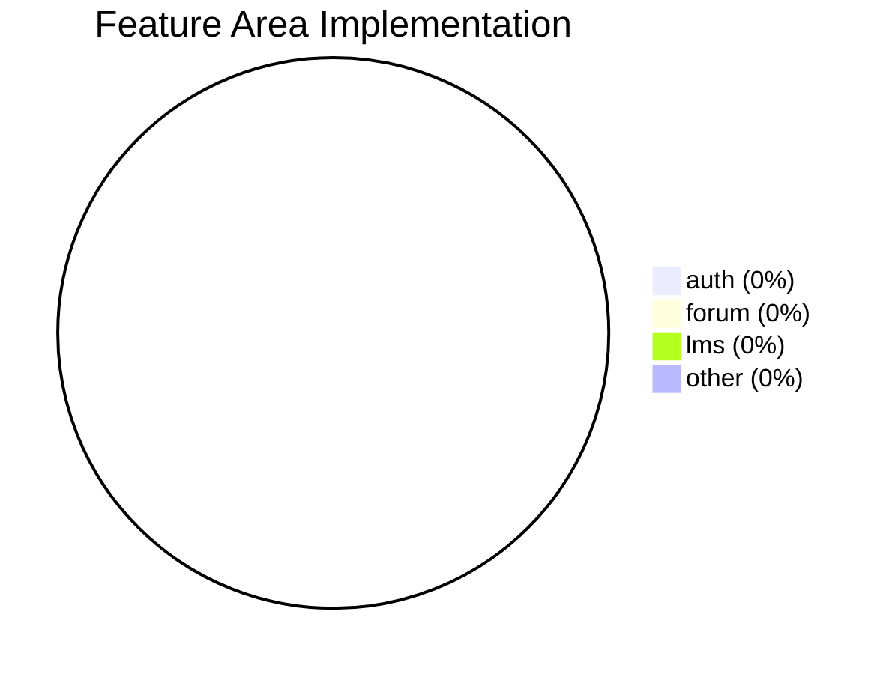
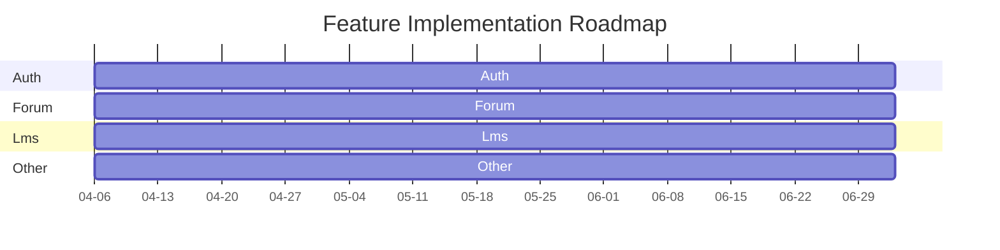

# Feature Coverage Map

_Generated on: 2025-04-06_

## Feature Area Implementation



## Feature Status

| Feature Area | Implemented | Total | Completion |
|--------------|-------------|-------|------------|
| Auth | 0 | 4 | 0% |
| Forum | 0 | 27 | 0% |
| Lms | 0 | 4 | 0% |
| Integration | 0 | 0 | 0% |
| Other | 0 | 3 | 0% |

## Feature Implementation Heatmap

```mermaid
heatmap
  title Feature Implementation Status
  x-axis [Authentication, User Management, Content Management, Discussions, Assessments, Analytics, Notifications, Integration]
  y-axis [Backend, Frontend, Testing]
  0 0 1
  0 1 0
  0 2 0
  1 0 1
  1 1 0
  1 2 0
  2 0 1
  2 1 0
  2 2 0
  3 0 1
  3 1 0
  3 2 0
  4 0 1
  4 1 0
  4 2 0
  5 0 1
  5 1 0
  5 2 0
  6 0 1
  6 1 0
  6 2 0
  7 0 1
  7 1 0
  7 2 0
  color-scheme Blues
```

## Feature Implementation Roadmap



## Feature Breakdown

### Auth

| Feature | Status | Implementation |
|---------|--------|----------------|
| Login/Logout | ⏳ 35% | 2 models, 1 endpoint, 1 component |
| User Registration | ⏳ 32% | 13 models, 4 endpoints, 5 components |
| Password Reset | ❌ Not Started | Not implemented |

### Forum

| Feature | Status | Implementation |
|---------|--------|----------------|
| Discussion Threads | ⏳ 37% | 3 models, 13 endpoints, 13 components |
| Comments | ❌ Not Started | Not implemented |
| User Mentions | ❌ Not Started | Not implemented |

### Lms

| Feature | Status | Implementation |
|---------|--------|----------------|
| Assignments | ⏳ 36% | 2 models, 1 endpoint, 6 components |
| Courses | ⏳ 34% | 14 models, 8 endpoints, 9 components |
| Grading | ❌ Not Started | Not implemented |

### Integration

| Feature | Status | Implementation |
|---------|--------|----------------|
| Canvas Integration | ⏳ 38% | 12 components |
| Discourse Integration | ⏳ 35% | 8 models, 14 endpoints, 48 components |

### Other

| Feature | Status | Implementation |
|---------|--------|----------------|

