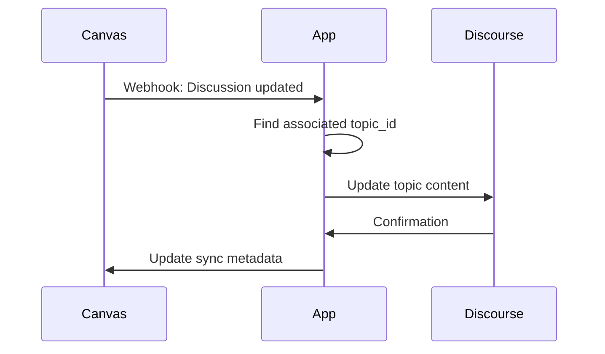

# Canvas-Discourse Integration Architecture

This document provides an overview of the architecture for integrating Canvas LMS with Discourse forums in our application.

## Overview

The integration allows course discussions in Canvas to be synchronized with Discourse forum topics, enabling richer forum experiences while maintaining the LMS context.

```mermaid
graph TD
    A[Canvas LMS] -->|API| B[LMS Integration App]
    B -->|API| C[Discourse]
    B -->|Stores| D[SQLite Database]
    E[User] -->|UI| B

    Key Components
1. Data Mapping Layer
Course-Category Mapping: Maps Canvas courses to Discourse categories
Discussion-Topic Mapping: Maps Canvas discussions to Discourse topics
Assignment-Topic Mapping: Optional mapping for assignment discussions
2. Synchronization Service
The SyncService handles bidirectional synchronization between Canvas and Discourse:

Canvas → Discourse: Creates/updates topics in Discourse when discussions are created/updated in Canvas
Discourse → Canvas: Updates discussions in Canvas when posts are added/edited in Discourse
Webhooks: Listens for events from both systems to trigger sync actions
3. Repository Layer
CourseCategoryRepository: Manages the mappings between courses and categories
DiscussionRepository: Stores and retrieves discussion data with topic_id references
4. API Endpoints
Core integration endpoints:

create_course_category_mapping: Creates a new course-category mapping
get_course_category_mapping: Retrieves a specific mapping
sync_course_category: Triggers full synchronization of a course's content
sync_discussion: Syncs a single discussion with Discourse
5. Authentication & Permissions
Application maintains API keys for both Canvas and Discourse
Permission mappings ensure appropriate access levels across both systems
Role synchronization between Canvas roles and Discourse trust levels
Synchronization Flow
Creating a Canvas Discussion in Discourse

```mermaid
sequenceDiagram
    participant User
    participant App
    participant Canvas
    participant Discourse
    
    User->>App: Create discussion
    App->>Canvas: Create discussion in Canvas
    App->>App: Find course-category mapping
    App->>Discourse: Create topic in mapped category
    App->>App: Store topic_id with discussion
    App->>User: Return updated discussion
```

Updating a Canvas Discussion in Discourse



Conflict Resolution
The system implements several strategies for conflict resolution:

Last-writer wins: Default strategy for simple conflicts
Merge strategy: For non-overlapping changes to different parts
Notification: For complex conflicts requiring manual resolution
Implementation Status
Component	Status	Completeness
Course-Category Mapping	Implemented	100%
Discussion-Topic Sync	Implemented	100%
Bidirectional Sync	Partial	65%
Conflict Resolution	Partial	40%
Webhook Handling	Not Started	0%