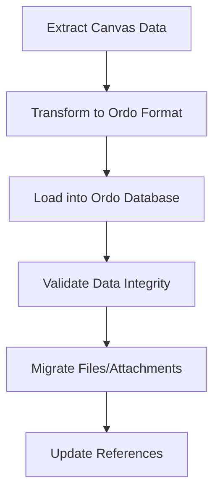
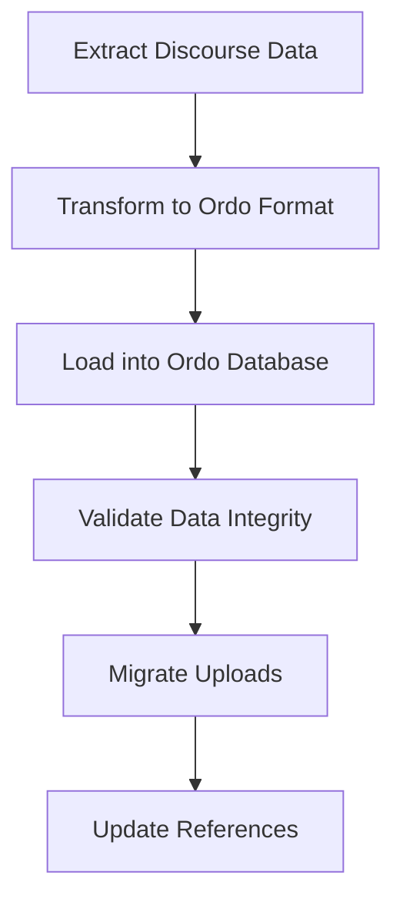

# Canvas and Discourse to Ordo Migration Guide

_Generated on: 2025-04-17_

This guide outlines the process for migrating from Canvas LMS and Discourse forum systems to the Ordo platform, including data migration strategies and compatibility considerations.

## Migration Overview

The migration process follows these high-level steps:

1. **Assessment**: Evaluate existing Canvas and Discourse installations
2. **Preparation**: Set up Ordo environment and migration tools
3. **Data Migration**: Transfer data from source systems to Ordo
4. **Validation**: Verify data integrity and functionality
5. **Cutover**: Switch from legacy systems to Ordo
6. **Monitoring**: Track system performance and address issues

## System Requirements

| Requirement | Specification |
|-------------|---------------|
| **Ordo Server** | 4+ CPU cores, 16GB+ RAM, 100GB+ SSD |
| **Database** | SQLite (embedded) |
| **Operating System** | Linux, macOS, or Windows |
| **Network** | 100Mbps+ for initial migration |

## Data Migration

### Canvas LMS Migration

#### Data Mapping

| Canvas Entity | Ordo Entity | Migration Complexity |
|---------------|-------------|----------------------|
| Course | Course | Low |
| Module | Module | Low |
| Assignment | Assignment | Medium |
| Quiz | Assessment | Medium |
| Discussion | Discussion | Medium |
| User | User | Low |
| Enrollment | Enrollment | Low |
| Submission | Submission | Medium |
| File | Attachment | Medium |
| Page | Page | Low |
| Announcement | Announcement | Low |
| Calendar Event | Event | Low |
| Rubric | Rubric | High |
| Outcome | LearningOutcome | High |

#### Migration Process



#### Canvas API Migration

The migration tool uses Canvas API to extract data:

```rust
pub async fn extract_canvas_courses(
    canvas_url: &str,
    api_token: &str,
) -> Result<Vec<CanvasCourse>, MigrationError> {
    let client = reqwest::Client::new();
    
    // Fetch courses from Canvas API
    let response = client
        .get(&format!("{}/api/v1/courses", canvas_url))
        .header("Authorization", format!("Bearer {}", api_token))
        .send()
        .await?;
    
    if !response.status().is_success() {
        return Err(MigrationError::ApiError(format!(
            "Failed to fetch courses: {}",
            response.status()
        )));
    }
    
    let courses: Vec<CanvasCourse> = response.json().await?;
    Ok(courses)
}
```

### Discourse Migration

#### Data Mapping

| Discourse Entity | Ordo Entity | Migration Complexity |
|------------------|-------------|----------------------|
| Category | ForumCategory | Low |
| Topic | ForumTopic | Medium |
| Post | ForumPost | Medium |
| User | User | Low |
| Tag | Tag | Low |
| Group | Group | Medium |
| Private Message | Message | High |
| Notification | Notification | Medium |
| Upload | Attachment | Medium |
| Badge | Badge | Medium |

#### Migration Process



#### Discourse API Migration

The migration tool uses Discourse API to extract data:

```rust
pub async fn extract_discourse_topics(
    discourse_url: &str,
    api_key: &str,
    api_username: &str,
) -> Result<Vec<DiscourseTopic>, MigrationError> {
    let client = reqwest::Client::new();
    
    // Fetch topics from Discourse API
    let response = client
        .get(&format!("{}/latest.json", discourse_url))
        .query(&[
            ("api_key", api_key),
            ("api_username", api_username),
        ])
        .send()
        .await?;
    
    if !response.status().is_success() {
        return Err(MigrationError::ApiError(format!(
            "Failed to fetch topics: {}",
            response.status()
        )));
    }
    
    let data: DiscourseTopicList = response.json().await?;
    Ok(data.topic_list.topics)
}
```

## User Migration

User accounts require special handling to ensure security and continuity:

1. **Account Mapping**: Match users between Canvas and Discourse
2. **Password Handling**: Reset passwords or use temporary tokens
3. **Role Migration**: Map roles and permissions to Ordo equivalents
4. **Profile Data**: Consolidate profile information from both systems

### User Migration Code Example

```rust
pub async fn migrate_users(
    canvas_users: Vec<CanvasUser>,
    discourse_users: Vec<DiscourseUser>,
) -> Result<Vec<OrdoUser>, MigrationError> {
    let mut ordo_users = Vec::new();
    
    // Create a map of email to Discourse user for quick lookup
    let discourse_user_map: HashMap<String, DiscourseUser> = discourse_users
        .into_iter()
        .map(|u| (u.email.clone(), u))
        .collect();
    
    // Process each Canvas user
    for canvas_user in canvas_users {
        // Look for matching Discourse user
        let discourse_user = discourse_user_map.get(&canvas_user.email);
        
        // Create Ordo user with combined data
        let ordo_user = OrdoUser {
            id: Uuid::new_v4().to_string(),
            email: canvas_user.email.clone(),
            name: canvas_user.name.clone(),
            username: discourse_user
                .map(|u| u.username.clone())
                .unwrap_or_else(|| generate_username(&canvas_user.name)),
            avatar_url: discourse_user
                .map(|u| u.avatar_template.clone())
                .unwrap_or_default(),
            bio: discourse_user
                .map(|u| u.bio_raw.clone())
                .unwrap_or_default(),
            created_at: Utc::now(),
            // Generate temporary password and require reset
            password_hash: generate_temporary_password_hash(),
            password_reset_required: true,
        };
        
        ordo_users.push(ordo_user);
    }
    
    Ok(ordo_users)
}
```

## Content Migration

### File Attachments

Files and attachments are migrated using this process:

1. Download file from source system
2. Hash file contents for integrity verification
3. Upload to Ordo storage system
4. Update references in migrated content

### Rich Content

Rich content (HTML, embedded media) requires special handling:

1. Parse HTML content
2. Update internal links and references
3. Rewrite embedded content for Ordo format
4. Validate content rendering

## Integration Considerations

### Authentication Integration

If maintaining external authentication systems:

```rust
pub async fn configure_sso(
    config: &mut OrdoConfig,
    canvas_oauth_config: Option<CanvasOAuthConfig>,
    discourse_sso_config: Option<DiscourseSsoConfig>,
) -> Result<(), ConfigError> {
    // Configure Canvas OAuth if available
    if let Some(canvas_config) = canvas_oauth_config {
        config.oauth_providers.push(OAuthProvider {
            name: "canvas".to_string(),
            client_id: canvas_config.client_id,
            client_secret: canvas_config.client_secret,
            authorize_url: format!("{}/login/oauth2/auth", canvas_config.base_url),
            token_url: format!("{}/login/oauth2/token", canvas_config.base_url),
            user_info_url: format!("{}/api/v1/users/self", canvas_config.base_url),
            scope: "read".to_string(),
        });
    }
    
    // Configure Discourse SSO if available
    if let Some(discourse_config) = discourse_sso_config {
        config.sso_providers.push(SsoProvider {
            name: "discourse".to_string(),
            sso_secret: discourse_config.sso_secret,
            sso_url: format!("{}/session/sso_provider", discourse_config.base_url),
        });
    }
    
    Ok(())
}
```

### API Compatibility

For systems that integrate with Canvas or Discourse APIs:

1. Ordo provides Canvas API compatibility layer
2. Discourse API compatibility is partial
3. Update API endpoints in integrating systems

## Post-Migration Tasks

1. **Verify User Access**: Ensure all users can access their content
2. **Check Permissions**: Verify roles and permissions are correctly applied
3. **Validate Content**: Sample content to ensure proper migration
4. **Test Integrations**: Verify all integrated systems work properly
5. **Performance Testing**: Ensure system performs well under load

## Rollback Plan

In case of migration issues:

1. Keep source systems running during migration
2. Maintain database backups of source systems
3. Document rollback procedures for each migration step
4. Test rollback procedures before migration

## Migration Timeline

| Phase | Duration | Description |
|-------|----------|-------------|
| Planning | 2-4 weeks | Assessment and preparation |
| Development | 4-8 weeks | Migration tool development |
| Testing | 2-4 weeks | Testing in staging environment |
| Migration | 1-2 days | Actual data migration |
| Validation | 1 week | Post-migration validation |
| Support | 4 weeks | Post-migration support |

## Conclusion

Migrating from Canvas and Discourse to Ordo requires careful planning and execution, but provides significant benefits in terms of offline capabilities, integrated functionality, and improved performance. This guide provides a framework for successful migration, but each implementation may require customization based on specific needs and configurations.