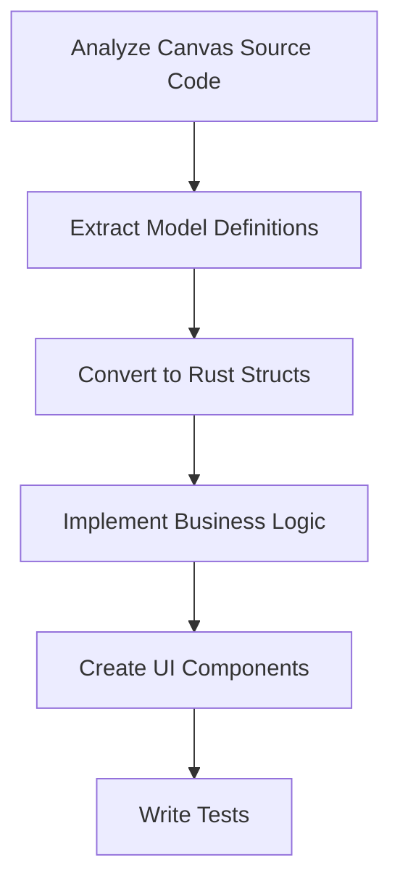
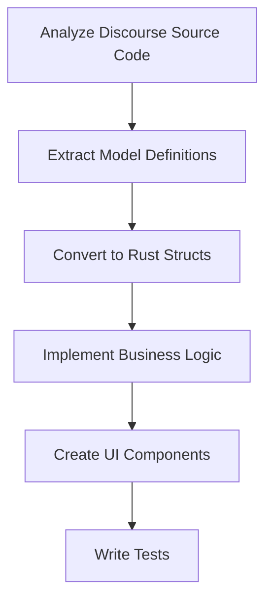

# Canvas and Discourse Source Code Migration Guide

_Generated on: 2025-04-18_

This guide outlines the process for migrating the source code from Canvas LMS and Discourse forum systems to the Ordo platform. This guide focuses exclusively on source code migration, not data migration from built applications.

## Migration Overview

The source code migration process follows these high-level steps:

1. **Assessment**: Analyze Canvas and Discourse source code structure
2. **Preparation**: Set up Ordo development environment and migration tools
3. **Code Migration**: Transform source code from Ruby/JavaScript to Rust/Haskell
4. **Validation**: Verify code functionality through tests
5. **Integration**: Ensure all migrated components work together
6. **Documentation**: Update technical documentation for the migrated codebase

## Development Environment Requirements

| Requirement | Specification |
|-------------|---------------|
| **Development Machine** | 4+ CPU cores, 16GB+ RAM, 100GB+ SSD |
| **Operating System** | Linux, macOS, or Windows |
| **Required Tools** | Rust toolchain, Haskell toolchain, Git |
| **Source Code** | Access to Canvas and Discourse source repositories |

## Source Code Migration

### Canvas LMS Source Code Migration

#### Code Structure Mapping

| Canvas Component | Ordo Component | Migration Complexity |
|------------------|----------------|----------------------|
| Models | Rust Structs | Medium |
| Controllers | Rust Services | High |
| Views | Leptos Components | High |
| JavaScript | Rust/WASM | High |
| Helpers | Rust Utilities | Medium |
| Migrations | SQLx Migrations | Medium |
| Tests | Rust Tests | Medium |
| API Endpoints | Tauri Commands | Medium |
| Background Jobs | Tokio Tasks | Medium |
| Plugins | Modular Features | High |

#### Migration Process



#### Canvas Model Migration Example

The migration tool analyzes Ruby models and converts them to Rust:

```rust
pub fn convert_canvas_model_to_rust(
    ruby_file_path: &str,
) -> Result<String, MigrationError> {
    // Read the Ruby file
    let ruby_content = fs::read_to_string(ruby_file_path)?;

    // Extract model name and fields
    let model_name = extract_model_name(&ruby_content)?;
    let fields = extract_model_fields(&ruby_content)?;

    // Generate Rust struct
    let mut rust_code = format!("#[derive(Debug, Clone, Serialize, Deserialize)]\npub struct {} {{\n", model_name);

    // Add fields
    for (field_name, field_type) in fields {
        let rust_type = map_ruby_type_to_rust(&field_type);
        rust_code.push_str(&format!("    pub {}: {},\n", field_name, rust_type));
    }

    rust_code.push_str("}\n\n");

    // Generate implementation
    rust_code.push_str(&format!("impl {} {{\n", model_name));
    rust_code.push_str("    // TODO: Implement methods\n");
    rust_code.push_str("}\n");

    Ok(rust_code)
}
```

### Discourse Source Code Migration

#### Code Structure Mapping

| Discourse Component | Ordo Component | Migration Complexity |
|---------------------|----------------|----------------------|
| Models | Rust Structs | Medium |
| Controllers | Rust Services | High |
| Views | Leptos Components | High |
| Ember Components | Leptos Components | Very High |
| Helpers | Rust Utilities | Medium |
| Migrations | SQLx Migrations | Medium |
| Tests | Rust Tests | Medium |
| API Endpoints | Tauri Commands | Medium |
| Jobs | Tokio Tasks | Medium |
| Plugins | Modular Features | High |

#### Migration Process



#### Discourse Frontend Migration Example

The migration tool analyzes Ember.js components and converts them to Leptos:

```rust
pub fn convert_ember_component_to_leptos(
    js_file_path: &str,
    template_file_path: &str,
) -> Result<String, MigrationError> {
    // Read the JavaScript and template files
    let js_content = fs::read_to_string(js_file_path)?;
    let template_content = fs::read_to_string(template_file_path)?;

    // Extract component name and properties
    let component_name = extract_component_name(&js_content)?;
    let properties = extract_component_properties(&js_content)?;

    // Extract template structure
    let template_structure = analyze_handlebars_template(&template_content)?;

    // Generate Leptos component
    let mut leptos_code = format!("#[component]\npub fn {}(cx: Scope) -> impl IntoView {{\n", component_name);

    // Add properties as signal props
    for (prop_name, prop_type) in properties {
        let rust_type = map_js_type_to_rust(&prop_type);
        leptos_code.push_str(&format!("    #[prop]\n    pub {}: {},\n", prop_name, rust_type));
    }

    // Convert template to Leptos view
    leptos_code.push_str("\n    view! { cx,\n");
    leptos_code.push_str(&convert_template_to_leptos_view(&template_structure));
    leptos_code.push_str("    }\n");

    leptos_code.push_str("}\n");

    Ok(leptos_code)
}
```

## Model Migration

Model definitions require special handling to ensure proper conversion:

1. **Schema Analysis**: Extract field definitions from Ruby models
2. **Type Mapping**: Convert Ruby types to appropriate Rust types
3. **Relationship Mapping**: Convert ActiveRecord relationships to Rust struct relationships
4. **Validation Rules**: Implement validation logic in Rust

### User Model Migration Example

```rust
// Original Ruby model (app/models/user.rb):
//
// class User < ApplicationRecord
//   has_many :enrollments
//   has_many :courses, through: :enrollments
//   has_many :submissions
//   has_many :notifications
//
//   validates :name, presence: true
//   validates :email, presence: true, uniqueness: true
// end

// Converted Rust model:
#[derive(Debug, Clone, Serialize, Deserialize)]
pub struct User {
    pub id: Uuid,
    pub name: String,
    pub email: String,
    pub created_at: DateTime<Utc>,
    pub updated_at: DateTime<Utc>,
}

impl User {
    pub fn new(name: String, email: String) -> Result<Self, ValidationError> {
        // Implement validation logic
        if name.is_empty() {
            return Err(ValidationError::new("name cannot be empty"));
        }

        if email.is_empty() {
            return Err(ValidationError::new("email cannot be empty"));
        }

        // Create new user
        Ok(Self {
            id: Uuid::new_v4(),
            name,
            email,
            created_at: Utc::now(),
            updated_at: Utc::now(),
        })
    }

    // Relationship methods would be implemented separately
    pub async fn enrollments(&self, db: &SqlitePool) -> Result<Vec<Enrollment>, DbError> {
        // Query enrollments for this user
        sqlx::query_as!(Enrollment,
            "SELECT * FROM enrollments WHERE user_id = ?",
            self.id
        )
        .fetch_all(db)
        .await
        .map_err(|e| DbError::QueryError(e.to_string()))
    }
}
```

## Controller and Business Logic Migration

### Controller Migration

Controllers are migrated to Rust services and Tauri commands:

1. Analyze controller actions and parameters
2. Convert to Rust functions with appropriate signatures
3. Implement business logic in Rust
4. Expose functionality through Tauri commands

### Business Logic Migration

Business logic requires careful analysis and conversion:

1. Identify core algorithms and workflows
2. Convert Ruby/JavaScript logic to Rust/Haskell
3. Ensure identical behavior through comprehensive tests
4. Optimize for performance where appropriate

## Frontend Migration

### View Migration

Migrating views from ERB/Handlebars to Leptos components:

```rust
// Original ERB template (app/views/courses/show.html.erb):
//
// <div class="course-header">
//   <h1><%= @course.name %></h1>
//   <p><%= @course.description %></p>
// </div>
// <div class="course-modules">
//   <% @course.modules.each do |mod| %>
//     <div class="module">
//       <h2><%= mod.name %></h2>
//       <p><%= mod.description %></p>
//     </div>
//   <% end %>
// </div>

// Converted Leptos component:
#[component]
pub fn CourseView(cx: Scope, course_id: String) -> impl IntoView {
    let course = create_resource(cx,
        move || course_id.clone(),
        |id| async move { fetch_course(&id).await }
    );

    view! { cx,
        <div class="course-header">
            {move || course.read(cx).map(|course| view! { cx,
                <h1>{&course.name}</h1>
                <p>{&course.description}</p>
            })}
        </div>
        <div class="course-modules">
            {move || course.read(cx).map(|course| {
                course.modules.iter().map(|module| view! { cx,
                    <div class="module">
                        <h2>{&module.name}</h2>
                        <p>{&module.description}</p>
                    </div>
                }).collect::<Vec<_>>()
            })}
        </div>
    }
}
```

### API Compatibility

For API compatibility with existing systems:

1. Implement Canvas API compatibility layer in Rust
2. Implement Discourse API compatibility where needed
3. Document API differences for integrating systems

## Testing Strategy

1. **Unit Tests**: Write comprehensive tests for all migrated components
2. **Integration Tests**: Test interactions between components
3. **Behavior Tests**: Ensure migrated code behaves identically to original
4. **Performance Tests**: Verify performance meets or exceeds original code
5. **UI Tests**: Test frontend components for correct rendering and behavior

## Documentation

Documentation is critical for source code migration:

1. **Code Comments**: Document complex algorithms and business logic
2. **API Documentation**: Document all public interfaces
3. **Architecture Documentation**: Document system design and component interactions
4. **Migration Decisions**: Document key decisions made during migration

## Source Code Migration Timeline

| Phase | Duration | Description |
|-------|----------|-------------|
| Analysis | 2-4 weeks | Source code assessment and planning |
| Tool Development | 4-6 weeks | Migration tool development |
| Model Migration | 4-6 weeks | Converting data models to Rust |
| Controller Migration | 6-8 weeks | Converting business logic to Rust |
| View Migration | 8-10 weeks | Converting UI to Leptos components |
| Testing | 4-6 weeks | Comprehensive testing of migrated code |
| Documentation | 2-4 weeks | Creating technical documentation |
| Refinement | 4-6 weeks | Optimization and bug fixing |

## Conclusion

Migrating the Canvas and Discourse source code to Ordo requires careful analysis and systematic conversion, but provides significant benefits in terms of performance, maintainability, and offline capabilities. This source-code-only approach allows for a clean implementation that fully leverages Rust's strengths while preserving the core functionality of the original systems. The migration process should be incremental, with continuous testing to ensure correctness at each step.