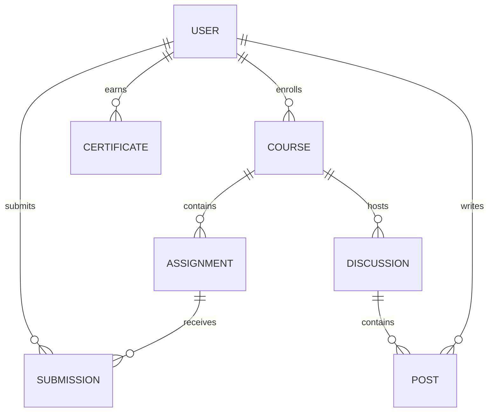

# LMS Data Models

_Last updated: 2025-04-09T21:47:28.600766700-04:00_

## Discourse Models

| Model | Fields | File Path |
|-------|--------|-----------|
| Category | id, name, color, text_color, description, description_text, topic_count, post_count, position, parent_category_id | .\lms-integration\src\api\discourse_client.rs |
| CategoryResponse | category | .\lms-integration\src\api\discourse_client.rs |
| DiscourseApiConfig | base_url, api_key, api_username, timeout_seconds, max_retries | .\src\api\discourse_client.rs |
| DiscourseTopic | id, title, post_stream | .\src\clients\discourse_client.rs |
| PostStream | posts | .\src\clients\discourse_client.rs |
| Post | id, cooked, raw, post_number | .\src\clients\discourse_client.rs |
| Topic | id, title, fancy_title, posts_count, created_at, views, reply_count, last_posted_at, closed, archived, pinned, category_id, user_id, tags | .\src-tauri\src\services\integration\discourse_integration.rs |
| Post | id, user_id, topic_id, post_number, raw, cooked, created_at, updated_at, reply_to_post_number, like_count | .\src-tauri\src\services\integration\discourse_integration.rs |
| Category | id, name, slug, description, color, parent_category_id | .\src-tauri\src\services\integration\discourse_integration.rs |
| User | id, username, name, avatar_template, created_at, last_seen_at, trust_level | .\src-tauri\src\services\integration\discourse_integration.rs |

## Native Models

| Model | Fields | File Path |
|-------|--------|-----------|
| FileTypeStats | total, js, rust, other | .\fs-utils-wasm\src\lib.rs |
| SyncTransaction | transaction_id, entity_type, source_entity_id, target_entity_id, direction, status, created_at, updated_at, error_message, metadata | .\lms-integration\src\models\sync_transaction.rs |
| Course | id, code, name, description, instructor_id, start_date, end_date, created_at, updated_at, status | .\shared\models\course.rs |
| Module | id, course_id, title, description, position, published, created_at, updated_at | .\shared\models\course.rs |
| Assignment | id, course_id, title, description, due_date, points, created_at, updated_at | .\shared\models\course.rs |
| Submission | id, assignment_id, user_id, content, submitted_at, grade, feedback | .\shared\models\course.rs |
| Enrollment | id, user_id, course_id, role, created_at, updated_at | .\shared\models\course.rs |
| ForumCategory | id, name, slug, description, course_id, parent_id, color, text_color, created_at, updated_at | .\shared\models\forum.rs |
| ForumTopic | id, category_id, title, slug, user_id, pinned, locked, created_at, updated_at, last_post_at, view_count | .\shared\models\forum.rs |
| ForumPost | id, topic_id, user_id, content, is_solution, parent_id, created_at, updated_at | .\shared\models\forum.rs |
| ForumUserPreferences | id, user_id, email_on_reply, email_on_mention, email_digest, created_at, updated_at | .\shared\models\forum.rs |
| ForumTrustLevel | id, user_id, trust_level, posts_read, posts_created, updated_at | .\shared\models\forum.rs |
| User | id, name, email, password_hash, avatar_url, created_at, updated_at | .\shared\models\user.rs |
| UserRole | id, user_id, role, context_type, context_id | .\shared\models\user.rs |
| UserProfile | user, roles, forum_trust_level | .\shared\models\user.rs |
| LoginRequest | email, password | .\shared\models\user.rs |
| RegisterRequest | name, email, password | .\shared\models\user.rs |
| AuthResponse | token, user | .\shared\models\user.rs |
| Course | id, title, description, instructor_id, created_at, updated_at | .\shared\src\models\course.rs |
| ForumCategory | id, name, description, slug | .\shared\src\models\forum.rs |
| ForumTopic | id, title, category_id, user_id, created_at | .\shared\src\models\forum.rs |
| ForumPost | id, topic_id, user_id, content, created_at | .\shared\src\models\forum.rs |
| User | id, username, email, display_name, avatar_url | .\shared\src\models\user.rs |
| LoginRequest | email, password | .\shared\src\models\user.rs |
| RegisterRequest | username, email, password, name | .\shared\src\models\user.rs |
| AuthResponse | token, user | .\shared\src\models\user.rs |
| CreateDiscussionMappingRequest | canvas_discussion_id, discourse_topic_id, course_category_id, title | .\src\api\discussion_routes.rs |
| UpdateDiscussionMappingRequest | title, sync_enabled, sync_posts | .\src\api\discussion_routes.rs |
| Category | id, name, slug, description, created_at, updated_at | .\src\api\forum.rs |
| Topic | id, title, slug, category_id, user_id, created_at, updated_at | .\src\api\forum.rs |
| NewCategory | name, slug, description | .\src\api\forum.rs |
| NewTopic | title, slug, category_id, user_id | .\src\api\forum.rs |
| BatchRequest | requests | .\src\api\forum.rs |
| SingleRequest | id, path, method | .\src\api\forum.rs |
| BatchResponse | responses | .\src\api\forum.rs |
| SingleResponse | status, body | .\src\api\forum.rs |
| CreateMappingRequest | course_id, category_id | .\src\api\integration.rs |
| MappingResponse | id, course_id, category_id, sync_enabled, sync_topics, sync_users, created_at, updated_at, last_synced_at | .\src\api\integration.rs |
| UpdateMappingRequest | sync_enabled, sync_topics, sync_users | .\src\api\integration.rs |
| GenerateSSOTokenRequest | user_id, role, canvas_id, discourse_id | .\src\api\integration.rs |
| TokenResponse | token | .\src\api\integration.rs |
| CreateMappingRequest | canvas_course_id, discourse_category_id, name, sync_direction | .\src\api\mapping_routes.rs |
| UpdateMappingRequest | name, sync_enabled, sync_direction | .\src\api\mapping_routes.rs |
| SearchResult | hits, total_hits, processing_time_ms | .\src\api\search_client.rs |
| CreateTopicMappingRequest | canvas_topic_id, discourse_topic_id, course_id | .\src\api\topic_mapping.rs |
| CreatePostMappingRequest | canvas_entry_id, discourse_post_id, canvas_topic_id | .\src\api\topic_mapping.rs |
| ToggleSyncRequest | enabled | .\src\api\topic_mapping.rs |
| UpdateTimeRequest | timestamp | .\src\api\topic_mapping.rs |
| TopicMappingResponse | id, canvas_topic_id, discourse_topic_id, mapping_id, sync_enabled, created_at, updated_at, last_synced_at, canvas_updated_at, discourse_updated_at | .\src\api\topic_mapping.rs |
| PostMappingResponse | id, canvas_entry_id, discourse_post_id, topic_mapping_id, created_at, updated_at, last_synced_at | .\src\api\topic_mapping.rs |
| SyncStatusResponse | topic_mapping_id, needs_sync, sync_direction | .\src\api\topic_mapping.rs |
| CanvasWebhookPayload | event_name, event_data | .\src\api\webhooks.rs |
| CanvasEventData | discussion_topic_id, discussion_entry_id, updated_at | .\src\api\webhooks.rs |
| DiscourseWebhookPayload | event_name, topic_id, post_id, updated_at | .\src\api\webhooks.rs |
| WebhookResponse | success, message | .\src\api\webhooks.rs |
| GreetArgs | name | .\src\app.rs |
| ForumThread | id, title, category, created_at | .\src\app.rs |
| Claims | sub, exp, iat, role, canvas_id, jti, discourse_id, email, name | .\src\auth\jwt.rs |
| Claims | sub, exp, iat, role, canvas_id, discourse_id, jti, email, name | .\src\auth\jwt_service.rs |
| RefreshTokenData | user_id, token_id, expires_at, revoked, canvas_id, discourse_id, role | .\src\auth\jwt_service.rs |
| RefreshTokenData | user_id, token_id, expires_at, revoked | .\src\auth\refresh_token.rs |
| DiscoursePayload | external_id, email, username, name, admin, moderator, groups, return_sso_url | .\src\auth\sso.rs |
| AuditEntry | model, file, source, source_file, percentage, output | .\src\bin\update_audit.rs |
| DashboardStats | total_users, new_users_today, total_topics, new_topics_today, total_posts, new_posts_today, flagged_content | .\src\components\admin\dashboard.rs |
| ActivityItem | id, user_id, username, action_type, entity_type, entity_id, description, created_at | .\src\components\admin\dashboard.rs |
| SystemHealth | status, database_status, disk_space, memory_usage, uptime | .\src\components\admin\dashboard.rs |
| LoginRequest | email, password | .\src\components\auth\login.rs |
| LoginResponse | token | .\src\components\auth\login.rs |
| RegisterRequest | name, email, password, password_confirmation, username | .\src\components\auth\register.rs |
| RegisterResponse | token | .\src\components\auth\register.rs |
| CourseDetail | id, title, description, instructor, image_url, modules | .\src\components\courses\course_detail.rs |
| Module | id, title, position, content_type, is_completed | .\src\components\courses\course_detail.rs |
| Course | id, title, description, instructor, image_url | .\src\components\courses\course_list.rs |
| RuleParseResult | valid, requirement, error | .\src\components\course_builder.rs |
| RuleRequest | rule_text | .\src\components\course_builder.rs |
| CourseIntegrationSettings | course_id, canvas_course_id, auto_sync_enabled, sync_frequency_hours, sync_modules, sync_assignments, sync_discussions, sync_files, sync_announcements, last_sync | .\src\components\course_integration_settings.rs |
| SearchHit | id, title, content, category_id, category_name, created_at, slug | .\src\components\forum\optimized_search.rs |
| SearchResponse | hits, total_hits, processing_time_ms | .\src\components\forum\optimized_search.rs |
| SearchStatus | state, documents_indexed, is_available, last_indexed | .\src\components\forum\optimized_search.rs |
| SearchArgs | query, category_id | .\src\components\forum\optimized_search.rs |
| SearchHit | id, title, content, category_id, category_name, created_at, slug | .\src\components\forum\search.rs |
| SearchResponse | hits, total_hits, processing_time_ms | .\src\components\forum\search.rs |
| ItemContent | id, title, content_type, description, url | .\src\components\module_item_manager.rs |
| Module | id, course_id, name, description, position, prerequisite_module_id, unlock_at, created_at, updated_at, published, items | .\src\components\module_manager.rs |
| ModuleItem | id, module_id, title, item_type, content_id, external_url, position, published, created_at, updated_at | .\src\components\module_manager.rs |
| ModuleRequest | course_id, name, description, position, prerequisite_module_id, unlock_at, published | .\src\components\module_manager.rs |
| ModuleItemRequest | module_id, title, item_type, content_id, external_url, position, published | .\src\components\module_manager.rs |
| SyncHistoryEntry | id, sync_type, content_id, content_type, sync_time, success, error_message, duration_ms | .\src\components\sync_history.rs |
| SyncHistoryStats | total_count, success_count, error_count, avg_duration_ms, content_type_stats | .\src\components\sync_history.rs |
| ContentTypeStats | content_type, count, success_count, error_count | .\src\components\sync_history.rs |
| SyncHistoryFilters | content_type, success_only, error_only, limit, offset | .\src\components\sync_history.rs |
| SyncStatus | canvas_connected, discourse_connected, last_sync, pending_syncs, sync_in_progress, sync_errors | .\src\components\sync_status.rs |
| Config | canvas, discourse | .\src\config.rs |
| CanvasConfig | api_url, api_token | .\src\config.rs |
| DiscourseConfig | api_url, api_key, api_username | .\src\config.rs |
| CreateAssignmentRequest | canvas_id, course_id, title, description, points_possible, due_date, unlock_date, lock_date | .\src\controllers\assignment_controller.rs |
| AssignmentResponse | assignment | .\src\controllers\assignment_controller.rs |
| AssignmentTopicResponse | assignment, topic, posts | .\src\controllers\assignment_controller.rs |
| CreateAssignmentTopicRequest | category_id | .\src\controllers\assignment_controller.rs |
| AssignmentWithTopicResponse | assignment, topic | .\src\controllers\assignment_controller.rs |
| CreateTopicFromAssignmentRequest | category_id | .\src\controllers\assignment_controller.rs |
| MapTopicToAssignmentRequest | topic_id | .\src\controllers\assignment_controller.rs |
| LoginRequest | username, password | .\src\controllers\auth_controller.rs |
| LoginResponse | token, user | .\src\controllers\auth_controller.rs |
| RegisterRequest | username, email, password, canvas_id | .\src\controllers\auth_controller.rs |
| CreateCourseRequest | canvas_id, name, code, description, instructor_id, start_date, end_date | .\src\controllers\course_controller.rs |
| CourseResponse | course, category | .\src\controllers\course_controller.rs |
| MapCategoryRequest | category_name | .\src\controllers\course_controller.rs |
| CreateTopicRequest | title, category_id, initial_post_content, pinned | .\src\controllers\topic_controller.rs |
| TopicResponse | topic, initial_post | .\src\controllers\topic_controller.rs |
| TopicWithPostsResponse | topic, posts | .\src\controllers\topic_controller.rs |
| UpdateTopicRequest | title, pinned, closed | .\src\controllers\topic_controller.rs |
| ForumConfig | categories, trust_levels, plugins | .\src\core\forum.rs |
| Category | name | .\src\core\forum.rs |
| TrustSystem | None detected | .\src\core\forum.rs |
| PluginConfig | None detected | .\src\core\forum.rs |
| Hierarchy | None detected | .\src\core\forum.rs |
| ForumSettings | forum_name, forum_description, logo_url, favicon_url, primary_color, allow_guest_view, require_email_verification, allow_registration, allow_file_uploads, max_upload_size_mb, allowed_file_types, topics_per_page, posts_per_page, min_chars_per_post, max_chars_per_post, enable_user_signatures | .\src\models\admin.rs |
| ForumSettingsUpdate | forum_name, forum_description, logo_url, favicon_url, primary_color, allow_guest_viewing, allow_registration, require_email_verification, posts_per_page, topics_per_page, max_topic_title_length, min_post_length, max_post_length | .\src\models\admin.rs |
| ReportedContent | id, reporter_id, reporter_name, content_id, content_type, parent_id, content_title, content_excerpt, reason, details, status, created_at, resolved_by, resolver_name, resolved_at, decision, resolution_note | .\src\models\admin.rs |
| ActivityLog | id, user_id, username, ip_address, activity_type, target_id, target_name, details, created_at | .\src\models\admin.rs |
| ActivityLogPage | logs, total, page, total_pages | .\src\models\admin.rs |
| DashboardStats | total_users, active_users, new_users_today, total_topics, new_topics_today, total_posts, new_posts_today, total_page_views, page_views_today, pending_reports_count, popular_topics, top_contributors | .\src\models\admin.rs |
| PopularTopic | id, title, view_count, author_name, category_name | .\src\models\admin.rs |
| TopContributor | id, name, avatar_url, created_at, post_count, topic_count | .\src\models\admin.rs |
| ActivityData | time_series, distribution | .\src\models\admin.rs |
| TimeSeriesData | date, posts, topics, users, views | .\src\models\admin.rs |
| DistributionData | label, value, color | .\src\models\admin.rs |
| UserManagementPage | users, total, page, total_pages | .\src\models\admin.rs |
| NotificationSettings | enable_email, smtp_host, smtp_port, smtp_username, smtp_password, smtp_from_email, smtp_from_name, smtp_use_tls, email_welcome_enabled, email_welcome_subject, email_post_reply_enabled, email_post_reply_subject, email_topic_reply_enabled, email_topic_reply_subject, email_mention_enabled, email_mention_subject | .\src\models\admin.rs |
| UserGroup | id, name, description, color, icon, is_visible, is_public, can_self_assign, member_count, created_at, updated_at | .\src\models\admin.rs |
| UserGroupCreate | name, description, color, icon, is_visible, is_public, can_self_assign | .\src\models\admin.rs |
| UserGroupUpdate | name, description, color, icon, is_visible, is_public, can_self_assign | .\src\models\admin.rs |
| GroupMember | user_id, username, email, avatar_url, joined_at | .\src\models\admin.rs |
| GroupMember | id, group_id, user_id, workflow_state, moderator, created_at, updated_at, just_created, sis_batch_id, sis_import_id | .\src\models\admin.rs |
| SiteCustomization | site_name, site_tagline, site_description, site_logo_url, site_favicon_url, primary_color, secondary_color, success_color, info_color, warning_color, danger_color, background_color, text_color, heading_font, body_font, code_font, base_font_size, border_radius, button_style, card_style, custom_css, custom_header_html, custom_footer_html | .\src\models\admin.rs |
| ExportOptions | include_users, include_categories, include_tags, include_topics, include_posts, include_uploads, include_settings, format | .\src\models\admin.rs |
| ImportOptions | merge_users, replace_categories, replace_tags | .\src\models\admin.rs |
| ImportStats | users_imported, categories_imported, tags_imported, topics_imported, posts_imported | .\src\models\admin.rs |
| BackupInfo | id, filename, size, format, created_at | .\src\models\admin.rs |
| Setting | id, name, value, description, created_at, updated_at | .\src\models\admin.rs |
| Assignment | id, course_id, title, description, points_possible, due_date, available_from, available_until, submission_types, canvas_id, topic_id, created_at, updated_at | .\src\models\assignment.rs |
| Category | id, name, slug, description, parent_id, created_at, updated_at, course_id, position | .\src\models\category.rs |
| Course | id, code, name, description, instructor_id, start_date, end_date, status, access_code, enrollment_count, category_id, created_at, updated_at, canvas_course_id, discourse_category_id, integration_status | .\src\models\course\mod.rs |
| Course | id, canvas_id, name, code, description, instructor_id, start_date, end_date, created_at, updated_at, category_id, is_published | .\src\models\course.rs |
| DiscussionMapping | id, canvas_discussion_id, discourse_topic_id, course_category_id, title, last_sync, sync_enabled, sync_posts, created_at | .\src\models\discussion.rs |
| DiscussionSyncSummary | mapping_id, start_time, end_time, operations, status | .\src\models\discussion.rs |
| Category | id, name, slug, description, color, text_color, position, parent_category_id, course_id, module_id, created_at, updated_at, topic_count, post_count | .\src\models\forum\category.rs |
| CategoryRequest | name, description, color, text_color, parent_category_id, course_id, module_id, position | .\src\models\forum\category.rs |
| Post | id, topic_id, user_id, post_number, raw, html, cooked, reply_to_post_id, updated_by_id, deleted_at, editor_id, like_count, reads, created_at, updated_at, user | .\src\models\forum\post.rs |
| PostRequest | topic_id, raw, reply_to_post_id | .\src\models\forum\post.rs |
| Tag | id, title, context_type, context_id, tag_type, url, workflow_state, created_at, updated_at, content_type, content_id | .\src\models\forum\tag.rs |
| TagWithTopics | tag, recent_topics | .\src\models\forum\tag.rs |
| CreateTagRequest | name, description, color, icon, is_restricted | .\src\models\forum\tag.rs |
| UpdateTagRequest | name, description, color, icon, is_restricted | .\src\models\forum\tag.rs |
| FollowedTag | tag, notification_level, followed_at | .\src\models\forum\tag.rs |
| Topic | id, title, slug, category_id, user_id, closed, pinned, pinned_globally, visible, deleted_at, views, posts_count, like_count, created_at, updated_at, bumped_at, last_posted_at, highest_post_number, excerpt, posts, category, user | .\src\models\forum\topic.rs |
| TopicRequest | title, category_id, raw, tags | .\src\models\forum\topic.rs |
| TopicSummary | id, title, slug, category_id, user_id, closed, pinned, visible, created_at, posts_count, views, last_posted_at, excerpt, user_display_name, category_name | .\src\models\forum\topic.rs |
| Category | id, name, description, slug, parent_category_id, topic_count, post_count, position, color, text_color, read_restricted, created_at, updated_at, eportfolio_id | .\src\models\forum.rs |
| Topic | id, title, message, html_url, posted_at, last_reply_at, require_initial_post, discussion_subentry_count, assignment_id, delayed_post_at, status, pinned, locked, author_id, author, category_id, views, closed, archived, can_reply | .\src\models\forum.rs |
| Post | id, topic_id, user_id, created_at, updated_at, post_number, reply_count, quote_count, deleted_at, off_topic_count, like_count, incoming_link_count, bookmark_count, score, reads, post_type, sort_order, last_editor_id, hidden, hidden_reason_id, notify_moderators_count, spam_count, illegal_count, inappropriate_count, raw, cooked, reply_to_post_number, policy | .\src\models\forum.rs |
| ForumStats | total_posts, total_topics, total_users, posts_today, active_users_today | .\src\models\forum.rs |
| CreateTopicRequest | title, category_id, content | .\src\models\forum.rs |
| CreatePostRequest | topic_id, content, parent_id | .\src\models\forum.rs |
| UpdatePostRequest | content | .\src\models\forum.rs |
| TopicCreationRequest | title, content, category_id, pinned, locked, tags | .\src\models\forum.rs |
| TopicUpdateRequest | title, content, category_id, pinned, locked, tags | .\src\models\forum.rs |
| Group | id, name, display_name, description, members_count, mentionable_level, messageable_level, visibility_level, primary_group, title, grant_trust_level, automatic, bio_raw, bio_cooked, public_admission, public_exit, allow_membership_requests, full_name, default_notification_level, context_type, context_id, max_membership, is_public, join_level | .\src\models\forum.rs |
| Site | id, name, title, description, categories, notification_types, post_action_types, group_names, trust_levels, archetypes, user_tips, default_archetype, uncategorized_category_id, is_readonly, categories_by_id | .\src\models\forum.rs |
| SiteFeatures | tags_enabled, polls_enabled, reactions_enabled, allow_uncategorized, embed_enabled, private_messaging_enabled, secure_uploads | .\src\models\forum.rs |
| PostActionType | id, name_key, name, description, is_flag, icon, position, score_bonus | .\src\models\forum.rs |
| UserFieldType | id, name, field_type, editable, description, required, show_on_profile, show_on_user_card, position | .\src\models\forum.rs |
| Course | id, name, course_code, workflow_state, account_id, root_account_id, enrollment_term_id, start_at, end_at, grading_standard_id, is_public, created_at, course_format, restrict_enrollments_to_course_dates, enrollment_count, allow_student_forum_attachments, open_enrollment, self_enrollment, license, allow_wiki_comments, hide_final_grade, time_zone, uuid, default_view, syllabus_body, course_color | .\src\models\lms.rs |
| Module | id, course_id, name, position, unlock_at, require_sequential_progress, prerequisite_module_ids, items_count, items_url, state, completed_at, publish_final_grade, workflow_state | .\src\models\lms.rs |
| ModuleItem | id, module_id, position, title, indent, content_type, content_id, html_url, url, page_url, external_url, new_tab, completion_requirement, published | .\src\models\lms.rs |
| CompletionRequirement | r#type, min_score, completed | .\src\models\lms.rs |
| Assignment | id, course_id, title, description, due_date, available_from, available_until, points_possible, submission_types, published, created_at, updated_at, grading_type, position, peer_review_count, group_category_id, grade_group_students_individually, anonymous_grading, allowed_attempts, omit_from_final_grade, assignment_group_id, parent_assignment_id, sub_assignment_tag | .\src\models\lms.rs |
| AssignmentGroup | id, course_id, name, position, group_weight, rules, created_at, updated_at | .\src\models\lms.rs |
| AssignmentGroupRules | drop_lowest, drop_highest, never_drop | .\src\models\lms.rs |
| Enrollment | id, user_id, course_id, role, status, created_at, updated_at | .\src\models\lms.rs |
| CourseCreationRequest | code, name, description, start_date, end_date, status | .\src\models\lms.rs |
| ModuleWithItems | module, items | .\src\models\lms.rs |
| Submission | id, assignment_id, user_id, content, submission_type, submitted_at, grade, score, feedback, graded_by, graded_at, attempt, late, missing, excused, workflow_state, created_at, updated_at, group_id | .\src\models\lms.rs |
| Page | id, course_id, title, content, published, front_page, created_at, updated_at | .\src\models\lms.rs |
| Submission | id, assignment_id, user_id, submitted_at, grade, score, workflow_state, grade_matches_current_submission, url, preview_url, submission_type, body, grade_status, attempt, submission_comments, late, missing, late_policy_status, points_deducted, graded_at, grader_id, excused, posted_at | .\src\models\lms.rs |
| SubmissionComment | id, author_id, author_name, comment, created_at, edited_at | .\src\models\lms.rs |
| Page | id, title, body, url, created_at, updated_at, editing_roles, published, hide_from_students, front_page, locked_for_user, lock_explanation | .\src\models\lms.rs |
| CourseCategoryMapping | id, course_id, category_id, sync_enabled, created_at, updated_at, last_synced_at, sync_topics, sync_users | .\src\models\mapping.rs |
| CourseCategory | id, canvas_course_id, discourse_category_id, name, last_sync, sync_enabled, sync_direction | .\src\models\mapping.rs |
| SyncSummary | start_time, end_time, operations, status | .\src\models\mapping.rs |
| DiscussionTopicMapping | id, canvas_topic_id, discourse_topic_id, title, last_sync, sync_enabled | .\src\models\mapping.rs |
| Module | id, course_id, title, position, items_count, publish_final_grade, published, status, created_at, updated_at | .\src\models\module.rs |
| ModuleCreate | course_id, title, position, publish_final_grade, published | .\src\models\module.rs |
| ModuleUpdate | title, position, publish_final_grade, published, status | .\src\models\module.rs |
| ModuleItem | id, module_id, title, position, item_type, content_id, content_type, url, page_url, published, created_at, updated_at | .\src\models\module.rs |
| ModuleItemCreate | module_id, title, position, item_type, content_id, content_type, url, page_url, published | .\src\models\module.rs |
| ModuleItemUpdate | title, position, published, url, page_url | .\src\models\module.rs |
| Notification | id, subject, message, notification_type, read, created_at, user_id, workflow_state, context_type, context_id, url | .\src\models\notification.rs |
| NotificationPreference | id, user_id, notification_type, frequency, communication_channel_id | .\src\models\notification.rs |
| NotificationPreferences | user_id, enable_browser_notifications, enable_email_notifications, mentions_notification, replies_notification, quotes_notification, likes_notification, messages_notification, follows_notification, group_mentions_notification, group_messages_notification, digest_emails | .\src\models\notification.rs |
| NotificationSummary | total_count, unread_count, mention_count, message_count | .\src\models\notification.rs |
| NotificationData | title, message, topic_id, topic_title, post_id, post_number, from_user_id, from_username, from_user_avatar, category_id, category_name, category_color, tag_name, badge_id, badge_name, badge_icon, reaction_type, group_id, group_name, old_category_id, old_category_name, user_count | .\src\models\notification.rs |
| NotificationSettings | user_id, email_notifications_enabled, browser_notifications_enabled, push_notifications_enabled, notification_types, quiet_hours_enabled, quiet_hours_start, quiet_hours_end, digest_frequency, created_at, updated_at | .\src\models\notification.rs |
| Notification | id, notification_type, user_id, actor_id, target_id, target_type, data, read, created_at | .\src\models\notifications.rs |
| NotificationSummary | id, notification_type, title, body, url, actor_name, actor_avatar, read, created_at | .\src\models\notifications.rs |
| Post | id, topic_id, author_id, content, is_first_post, parent_id, created_at, updated_at | .\src\models\post.rs |
| SearchRequest | query, filter_type, filter_categories, filter_tags, filter_date_from, filter_date_to, filter_user_id, sort_by, page, limit | .\src\models\search.rs |
| SearchResult | result_type, id, title, excerpt, highlight, url, category_id, category_name, category_color, topic_id, topic_title, author, created_at, last_activity_at, reply_count, view_count, tags, score | .\src\models\search.rs |
| SearchResponse | results, total, page, limit, query, filters_applied, execution_time_ms | .\src\models\search.rs |
| SearchFilters | filter_type, filter_categories, filter_tags, filter_date_from, filter_date_to, filter_user_id, sort_by | .\src\models\search.rs |
| SearchSuggestion | text, type_, id, url | .\src\models\search.rs |
| SearchStats | post_count, topic_count, user_count, indexed_up_to | .\src\models\search.rs |
| SyncQueueItem | id, topic_mapping_id, sync_direction, status, attempt_count, max_attempts, last_attempt_at, error_message, created_at, updated_at | .\src\models\sync_queue.rs |
| SyncStatus | entity_type, entity_id, source_system, target_id, status, last_synced, last_attempted, last_error, created_at, updated_at | .\src\models\sync_state.rs |
| Transaction | id, entity_type, entity_id, operation, source_system, status, created_at, completed_at | .\src\models\sync_transaction.rs |
| TransactionStep | id, transaction_id, step_name, details, created_at | .\src\models\sync_transaction.rs |
| Topic | id, title, slug, category_id, author_id, pinned, closed, post_count, view_count, assignment_id, created_at, updated_at | .\src\models\topic.rs |
| TopicMapping | id, canvas_topic_id, discourse_topic_id, mapping_id, sync_enabled, created_at, updated_at, last_synced_at, canvas_updated_at, discourse_updated_at | .\src\models\topic_mapping.rs |
| PostMapping | id, canvas_entry_id, discourse_post_id, topic_mapping_id, created_at, updated_at, last_synced_at | .\src\models\topic_mapping.rs |
| UserActivity | id, user_id, activity_type, target_id, target_type, data, created_at | .\src\models\user\activity.rs |
| UserFollow | id, follower_id, following_id, created_at | .\src\models\user\follow.rs |
| TopicSubscription | id, user_id, topic_id, subscription_level, created_at, updated_at | .\src\models\user\follow.rs |
| CategorySubscription | id, user_id, category_id, subscription_level, created_at, updated_at | .\src\models\user\follow.rs |
| UserSummary | id, username, display_name, avatar_url | .\src\models\user\mod.rs |
| UserProfile | user_id, bio, website, location, title, tag_line, profile_views, trust_level, is_moderator, is_admin, last_seen_at, created_topics_count, posts_count, likes_given, likes_received, featured_topic_id, followers_count, following_count | .\src\models\user\profile.rs |
| UserProfileUpdate | bio, website, location, title, tag_line | .\src\models\user\profile.rs |
| UserPermissionMapping | id, canvas_user_id, discourse_user_id, canvas_role, discourse_group, sync_enabled, created_at, updated_at, last_synced_at | .\src\models\user_permission.rs |
| SyncMetrics | total_syncs_attempted, total_syncs_succeeded, total_syncs_failed, last_sync_attempt, last_successful_sync, avg_sync_duration_ms, recent_error_rate, canvas_api_healthy, discourse_api_healthy, database_healthy | .\src\monitoring\sync_metrics.rs |
| TopicSearchResultDto | id, title, excerpt, created_at, author_id, author_name, category_id, category_name, reply_count | .\src\services\forum.rs |
| PostSearchResultDto | id, content, excerpt, created_at, author_id, author_name, topic_id, topic_title | .\src\services\forum.rs |
| UserSearchResultDto | id, name, avatar_url, bio, created_at, topic_count, post_count | .\src\services\forum.rs |
| SyncEvent | entity_type, entity_id, operation, source_system, target_system, data, timestamp, transaction_id | .\src\services\integration\sync_service.rs |
| CrossReference | id, source_type, source_id, target_type, target_id, created_at, updated_at, metadata | .\src\services\integration_service.rs |
| ActivityEntry | id, user_id, entity_type, entity_id, action_type, created_at, metadata | .\src\services\integration_service.rs |
| AppState | user, theme, notifications, is_online, last_sync, forum | .\src\state\app_state.rs |
| User | id, username, email, role | .\src\state\app_state.rs |
| Notification | id, message, read, type_, timestamp | .\src\state\app_state.rs |
| ForumState | current_category_id, last_visited_topic_ids, category_expanded | .\src\state\app_state.rs |
| SyncQueue | operations | .\src\sync\sync_queue.rs |
| SyncState | last_sync_timestamp, entities | .\src\sync\sync_state.rs |
| User | id, username, email, created_at, role | .\src\utils\auth.rs |
| JwtClaims | sub, name, email, roles, exp | .\src\utils\auth.rs |
| JsProjectStructure | directories, files_by_type, files_by_dir, dir_categories | .\src\utils\file_system_utils.rs |
| JsDirCategories | api, models, ui, tests, services | .\src\utils\file_system_utils.rs |
| JsFileTypeStats | total, js, rust, other | .\src\utils\file_system_utils.rs |
| CachedData | data, timestamp | .\src\utils\resource.rs |
| SyncOperation | id, operation_type, entity_type, entity_id, payload, timestamp, synced | .\src\utils\sync.rs |
| GeminiConfig | api_key, model, temperature, max_tokens | .\src-tauri\src\ai\gemini_analyzer.rs |
| GeminiRequest | contents, generation_config | .\src-tauri\src\ai\gemini_analyzer.rs |
| GeminiContent | parts | .\src-tauri\src\ai\gemini_analyzer.rs |
| GeminiPart | text | .\src-tauri\src\ai\gemini_analyzer.rs |
| GeminiGenerationConfig | temperature, max_output_tokens | .\src-tauri\src\ai\gemini_analyzer.rs |
| GeminiResponse | candidates | .\src-tauri\src\ai\gemini_analyzer.rs |
| GeminiCandidate | content, finish_reason | .\src-tauri\src\ai\gemini_analyzer.rs |
| AnalysisRequest | target_dirs, exclude_patterns, output_dir, update_rag_knowledge_base, generate_ai_insights | .\src-tauri\src\analyzers\analysis_commands.rs |
| AnalysisProgress | stage, progress, message | .\src-tauri\src\analyzers\analysis_commands.rs |
| AnalysisResponse | success, message, central_reference_hub, last_analysis_results | .\src-tauri\src\analyzers\analysis_commands.rs |
| AnalysisCommand | target_dirs, exclude_patterns, output_dir, update_rag_knowledge_base, generate_ai_insights | .\src-tauri\src\analyzers\analysis_runner.rs |
| AnalysisResult | timestamp, project_status, models, api_endpoints, ui_components, code_quality, tests, integration, architecture, sync_system, blockchain, feature_areas, recommendations | .\src-tauri\src\analyzers\unified_analyzer.rs |
| ProjectStatus | phase, completion_percentage, last_active_area, estimated_completion_date | .\src-tauri\src\analyzers\unified_analyzer.rs |
| ModelMetrics | total, implemented, details | .\src-tauri\src\analyzers\unified_analyzer.rs |
| ModelInfo | name, file_path, completeness, source_system, source_file, relationships | .\src-tauri\src\analyzers\unified_analyzer.rs |
| ModelRelationship | from, to, relationship_type | .\src-tauri\src\analyzers\unified_analyzer.rs |
| ApiEndpointMetrics | total, implemented, details | .\src-tauri\src\analyzers\unified_analyzer.rs |
| ApiEndpointInfo | path, method, handler, file_path, completeness, feature_area | .\src-tauri\src\analyzers\unified_analyzer.rs |
| ComponentMetrics | total, implemented, details | .\src-tauri\src\analyzers\unified_analyzer.rs |
| UiComponentInfo | name, file_path, completeness, props, states | .\src-tauri\src\analyzers\unified_analyzer.rs |
| CodeQualityMetrics | complexity, tech_debt, solid_violations, design_patterns | .\src-tauri\src\analyzers\unified_analyzer.rs |
| ComplexityMetrics | average, high, file_details | .\src-tauri\src\analyzers\unified_analyzer.rs |
| TechDebtMetrics | score, items | .\src-tauri\src\analyzers\unified_analyzer.rs |
| TechDebtItem | description, file_path, severity | .\src-tauri\src\analyzers\unified_analyzer.rs |
| SolidViolations | srp, ocp, lsp, isp, dip | .\src-tauri\src\analyzers\unified_analyzer.rs |
| CodeViolation | description, file_path, line_number | .\src-tauri\src\analyzers\unified_analyzer.rs |
| DesignPatternUsage | patterns_used, pattern_implementations | .\src-tauri\src\analyzers\unified_analyzer.rs |
| DesignPatternImplementation | pattern, file_path, description | .\src-tauri\src\analyzers\unified_analyzer.rs |
| TestMetrics | total, passing, coverage, details | .\src-tauri\src\analyzers\unified_analyzer.rs |
| TestInfo | name, file_path, status | .\src-tauri\src\analyzers\unified_analyzer.rs |
| IntegrationMetrics | canvas_integrations, discourse_integrations, conflicts | .\src-tauri\src\analyzers\unified_analyzer.rs |
| IntegrationPoint | source_feature, target_implementation, status, details | .\src-tauri\src\analyzers\unified_analyzer.rs |
| IntegrationConflict | description, affected_components, resolution_status | .\src-tauri\src\analyzers\unified_analyzer.rs |
| ArchitectureInfo | frameworks, design_patterns, technologies | .\src-tauri\src\analyzers\unified_analyzer.rs |
| SyncSystemInfo | implementation_status, offline_capability, conflict_resolution | .\src-tauri\src\analyzers\unified_analyzer.rs |
| BlockchainInfo | implementation_status, features | .\src-tauri\src\analyzers\unified_analyzer.rs |
| FeatureAreaMetrics | total, implemented, priority | .\src-tauri\src\analyzers\unified_analyzer.rs |
| Recommendation | area, description, priority, related_files | .\src-tauri\src\analyzers\unified_analyzer.rs |
| CourseRequest | name, code, description | .\src-tauri\src\api\courses.rs |
| CreateCourseRequest | title, description, status, start_date, end_date | .\src-tauri\src\api\courses.rs |
| UpdateCourseRequest | title, description, status, start_date, end_date | .\src-tauri\src\api\courses.rs |
| CreateMappingRequest | canvas_discussion_id, discourse_topic_id, course_category_id, title | .\src-tauri\src\api\discussion_routes.rs |
| UpdateMappingRequest | title, sync_enabled, sync_posts | .\src-tauri\src\api\discussion_routes.rs |
| CreateMappingRequest | course_id, category_id | .\src-tauri\src\api\forum_mapping.rs |
| MappingResponse | mapping | .\src-tauri\src\api\forum_mapping.rs |
| PostsQuery | page, per_page | .\src-tauri\src\api\forum_posts.rs |
| TopicQuery | page, per_page, course_id, category_id | .\src-tauri\src\api\forum_topics.rs |
| CreateTopicRequest | title, content, category_id, course_id, tags | .\src-tauri\src\api\forum_topics.rs |
| ActivityQuery | limit | .\src-tauri\src\api\integration.rs |
| TopicMappingResponse | id, canvas_topic_id, discourse_topic_id, local_topic_id, last_sync_at, sync_status | .\src-tauri\src\api\integration_commands.rs |
| SyncTopicRequest | topic_id, target_system | .\src-tauri\src\api\integration_commands.rs |
| CourseIntegrationSettings | course_id, canvas_course_id, auto_sync_enabled, sync_frequency_hours, sync_modules, sync_assignments, sync_discussions, sync_files, sync_announcements, last_sync | .\src-tauri\src\api\integration_settings.rs |
| CourseFilter | status, user_id | .\src-tauri\src\api\lms\courses.rs |
| EnrollmentRequest | user_id, role, status | .\src-tauri\src\api\lms\courses.rs |
| EnrollmentUpdateRequest | role, status | .\src-tauri\src\api\lms\courses.rs |
| CanvasSyncResponse | message, created_modules, updated_modules, created_items, updated_items | .\src-tauri\src\api\module_commands.rs |
| SearchQuery | q, limit, offset, category_id, user_id, sort_by, sort_dir | .\src-tauri\src\api\search.rs |
| SearchResponse | hits, total_hits, processing_time_ms | .\src-tauri\src\api\search.rs |
| SyncStatus | canvas_connected, discourse_connected, last_sync, pending_syncs, sync_in_progress, sync_errors | .\src-tauri\src\api\sync_status.rs |
| Claims | sub, exp, iat, role, canvas_id, discourse_id | .\src-tauri\src\auth\jwt_handler.rs |
| Claims | sub, name, exp, iat, is_admin | .\src-tauri\src\auth.rs |
| BenchmarkConfig | duration_seconds, users, ramp_up_seconds, scenarios | .\src-tauri\src\benchmark\mod.rs |
| Scenario | name, weight, actions | .\src-tauri\src\benchmark\mod.rs |
| BenchmarkResults | total_requests, successful_requests, failed_requests, duration_ms, requests_per_second, latencies, results_by_action | .\src-tauri\src\benchmark\mod.rs |
| LatencyStats | min_ms, max_ms, avg_ms, percentile_50ms, percentile_90ms, percentile_95ms, percentile_99ms | .\src-tauri\src\benchmark\mod.rs |
| ActionStats | count, success_count, failure_count, avg_latency_ms | .\src-tauri\src\benchmark\mod.rs |
| ProjectAnalysis | timestamp, summary, components, models, routes, integrations, tech_stack, architecture | .\src-tauri\src\bin\project_analyzer.rs |
| ProjectSummary | total_files, lines_of_code, file_types, rust_files, haskell_files | .\src-tauri\src\bin\project_analyzer.rs |
| Component | name, file_path, dependencies, description | .\src-tauri\src\bin\project_analyzer.rs |
| Model | name, file_path, fields, associations, source_system | .\src-tauri\src\bin\project_analyzer.rs |
| Route | path, component, methods, auth_required | .\src-tauri\src\bin\project_analyzer.rs |
| Integration | name, source_system, target_system, integration_points, status | .\src-tauri\src\bin\project_analyzer.rs |
| TechStack | frontend, backend, database, search, ai, blockchain, authentication | .\src-tauri\src\bin\project_analyzer.rs |
| ArchitectureInfo | patterns, principles, diagrams | .\src-tauri\src\bin\project_analyzer.rs |
| ForumPost | id, content, author, timestamp, version | .\src-tauri\src\blockchain\anchoring.rs |
| CourseAchievement | student_id, course_id, achievement_type, metadata, timestamp | .\src-tauri\src\blockchain\anchoring.rs |
| ConsensusConfig | validation_threshold, block_interval, max_peers, gossip_interval | .\src-tauri\src\blockchain\config.rs |
| StorageConfig | compact_history, history_retention_days | .\src-tauri\src\blockchain\config.rs |
| PerformanceConfig | max_cache_size_mb, max_pending_txs | .\src-tauri\src\blockchain\config.rs |
| ChainConfig | consensus, storage, performance | .\src-tauri\src\blockchain\config.rs |
| BlockchainEntity | id, entity_type, data, created_at, updated_at, version | .\src-tauri\src\blockchain\core.rs |
| BlockData | timestamp, prev_hash, state_hash, entity_count | .\src-tauri\src\blockchain\core.rs |
| UserId | None detected | .\src-tauri\src\blockchain\domain.rs |
| AchievementRecord | user, course, tx_hash, timestamp, achievement_type | .\src-tauri\src\blockchain\domain.rs |
| AchievementTx | user_id, course_id, achievement_type, timestamp, signature | .\src-tauri\src\blockchain\memory.rs |
| MetricsSnapshot | transaction_count, block_count, tx_p99_us, block_p99_us, sync_p99_us, avg_memory_bytes, timestamp | .\src-tauri\src\blockchain\metrics.rs |
| CompactBlock | t, p, h, s | .\src-tauri\src\blockchain\mod.rs |
| HashOnly | h | .\src-tauri\src\blockchain\mod.rs |
| LmsBlock | timestamp, prev_hash, state_hash, signatures | .\src-tauri\src\blockchain\mod.rs |
| GradeSubmission | student_id, course_id, assignment_id, grade, timestamp | .\src-tauri\src\blockchain\sync.rs |
| CertificateIssuance | student_id, course_id, certificate_id, issue_date, metadata | .\src-tauri\src\blockchain\sync.rs |
| CourseCompletion | student_id, course_id, completion_date, grade | .\src-tauri\src\blockchain\sync.rs |
| ForumPost | user_id, thread_id, post_id, content, timestamp | .\src-tauri\src\blockchain\sync.rs |
| ProfileUpdate | user_id, field, old_value, new_value, timestamp | .\src-tauri\src\blockchain\sync.rs |
| BadgeAwarded | student_id, course_id, badge_id, timestamp | .\src-tauri\src\blockchain\sync.rs |
| CustomEvent | event_id, user_id, related_id, event_name, metadata, timestamp | .\src-tauri\src\blockchain\sync.rs |
| TopicCacheStats | hit_count, miss_count, entry_count, stale_refreshes, total_size_bytes | .\src-tauri\src\cache\topic_cache.rs |
| TopicData | id, title, content, post_count, views, author, last_post_at | .\src-tauri\src\cache\topic_cache.rs |
| Config | app, forum, database, search, media, websocket | .\src-tauri\src\config\mod.rs |
| AppConfig | name, version, debug, log_level | .\src-tauri\src\config\mod.rs |
| ForumConfig | title, description, posts_per_page, topics_per_page, enable_markdown, enable_code_highlighting, enable_latex, max_post_length, max_title_length | .\src-tauri\src\config\mod.rs |
| DatabaseConfig | path, pool_size, max_connections, timeout_seconds | .\src-tauri\src\config\mod.rs |
| SearchConfig | enabled, provider, meilisearch_url, meilisearch_key, auto_index, index_interval_minutes | .\src-tauri\src\config\mod.rs |
| MediaConfig | storage_path, max_upload_size_mb, allowed_extensions, optimize_images, max_image_width, thumbnail_size | .\src-tauri\src\config\mod.rs |
| WebSocketConfig | enabled, port, ping_interval_seconds, max_connections | .\src-tauri\src\config\mod.rs |
| RefreshClaims | sub, exp, iat, jti, r | .\src-tauri\src\core\auth.rs |
| RefreshClaims | sub, exp, r | .\src-tauri\src\core\auth.rs |
| AppConfig | database, server, sync | .\src-tauri\src\core\config.rs |
| DatabaseConfig | connection_string, max_connections, sqlite_path | .\src-tauri\src\core\config.rs |
| ServerConfig | host, port, jwt_secret, jwt_expiration | .\src-tauri\src\core\config.rs |
| SyncConfig | enabled, sync_interval, batch_size, sync_endpoint | .\src-tauri\src\core\config.rs |
| ErrorResponse | error, error_code | .\src-tauri\src\core\errors.rs |
| SystemHealth | canvas_api_healthy, discourse_api_healthy, local_db_healthy, sync_engine_healthy, last_checked | .\src-tauri\src\core\monitoring.rs |
| SyncStatistics | total_sync_attempts, successful_syncs, failed_syncs, pending_syncs, last_successful_sync, average_sync_duration_ms | .\src-tauri\src\core\monitoring.rs |
| ConflictMetrics | total_conflicts_detected, auto_resolved_conflicts, manually_resolved_conflicts, pending_conflicts | .\src-tauri\src\core\monitoring.rs |
| MonitoringData | health, sync_stats, conflict_metrics, offline_duration_minutes, online_duration_minutes, database_size_kb, timestamp | .\src-tauri\src\core\monitoring.rs |
| CreateCategoryRequest | name, description, course_id, parent_id, color | .\src-tauri\src\forum\categories.rs |
| CreateTopicRequest | category_id, title, content | .\src-tauri\src\forum\topics.rs |
| Course | id, name, code, description, instructor_id, start_date, end_date, published, created_at, updated_at | .\src-tauri\src\lms\models\course.rs |
| CourseSettings | id, course_id, allow_student_discussion_topics, allow_student_discussion_editing, allow_student_forum_attachments, restrict_student_past_view, restrict_student_future_view, hide_final_grades, hide_distribution_graphs, created_at, updated_at | .\src-tauri\src\lms\models\course.rs |
| CourseSection | id, course_id, name, start_date, end_date, created_at, updated_at | .\src-tauri\src\lms\models\course.rs |
| CourseUser | id, course_id, user_id, role, section_id, created_at, updated_at | .\src-tauri\src\lms\models\course.rs |
| Module | id, course_id, name, position, unlock_at, require_sequential_progress, published, items_count, created_at, updated_at | .\src-tauri\src\lms\models\module.rs |
| ModuleItem | id, module_id, title, position, indent, item_type, content_id, page_url, external_url, completion_requirement, published, created_at, updated_at | .\src-tauri\src\lms\models\module.rs |
| CompletionRequirement | requirement_type, min_score, completed | .\src-tauri\src\lms\models\module.rs |
| Course | id, code, name, description, instructor_id, start_date, end_date, status, created_at, updated_at, syllabus, visibility, allow_self_enrollment, enrollment_code, homepage_type, theme_color, banner_image_url | .\src-tauri\src\lms\models.rs |
| Module | id, course_id, title, description, position, published, unlock_at, require_sequential_progress, prerequisite_module_ids, created_at, updated_at | .\src-tauri\src\lms\models.rs |
| ModuleItem | id, module_id, title, item_type, content_id, content_type, page_url, external_url, position, indent_level, published, completion_requirement, created_at, updated_at | .\src-tauri\src\lms\models.rs |
| CompletionRequirement | requirement_type, min_score, completed | .\src-tauri\src\lms\models.rs |
| Assignment | id, course_id, name, description, due_at, unlock_at, lock_at, points_possible, grading_type, submission_types, position, published, group_category_id, peer_reviews, automatic_peer_reviews, peer_review_count, created_at, updated_at | .\src-tauri\src\lms\models.rs |
| Submission | id, assignment_id, user_id, submitted_at, submission_type, submission_data, url, grade, score, graded_at, grader_id, attempt, feedback_comment, feedback_files, created_at, updated_at | .\src-tauri\src\lms\models.rs |
| SubmissionFile | id, submission_id, filename, display_name, content_type, size, url, created_at | .\src-tauri\src\lms\models.rs |
| ContentPage | id, course_id, title, body, published, front_page, url, created_at, updated_at | .\src-tauri\src\lms\models.rs |
| Enrollment | id, course_id, user_id, role, enrollment_state, limit_privileges_to_course_section, created_at, updated_at | .\src-tauri\src\lms\models.rs |
| JwtClaims | sub, name, email, roles, exp, iat, jti, iss, aud, canvas_id, discourse_id | .\src-tauri\src\models\auth.rs |
| UserAuthProfile | id, name, email, roles, canvas_id, discourse_id | .\src-tauri\src\models\auth.rs |
| AuthResponse | token, refresh_token, expires_at, user | .\src-tauri\src\models\auth.rs |
| LoginRequest | email, password, remember_me | .\src-tauri\src\models\auth.rs |
| RegisterRequest | name, email, password, password_confirmation | .\src-tauri\src\models\auth.rs |
| RefreshTokenRequest | refresh_token | .\src-tauri\src\models\auth.rs |
| Category | id, name, slug, description, color, text_color, parent_id, position, created_at, updated_at, is_deleted | .\src-tauri\src\models\category.rs |
| Assignment | id, course_id, title, description, points_possible, due_date, available_from, available_until, is_published, created_at, updated_at | .\src-tauri\src\models\content\assignment.rs |
| Submission | id, assignment_id, user_id, content, body, url, submission_type, grade, score, grader_id, status, is_late, attempt, canvas_submission_id, submitted_at, graded_at, created_at, updated_at, attachment_ids, comments | .\src-tauri\src\models\content\submission.rs |
| SubmissionComment | id, submission_id, user_id, comment, created_at, attachment_ids | .\src-tauri\src\models\content\submission.rs |
| CommentRow | id, submission_id, user_id, comment, created_at | .\src-tauri\src\models\content\submission.rs |
| Course | id, name, code, description, instructor_id, start_date, end_date, status, created_at, updated_at | .\src-tauri\src\models\course\course.rs |
| LegacyCourse | id, name, code, description, instructor_id, start_date, end_date, status, created_at, updated_at | .\src-tauri\src\models\course\course.rs |
| Enrollment | id, user_id, course_id, role, state, created_at, updated_at, last_activity_at, start_at, end_at, canvas_enrollment_id | .\src-tauri\src\models\course\enrollment.rs |
| Module | id, course_id, name, description, position, prerequisite_module_id, unlock_at, created_at, updated_at, published, canvas_module_id, items | .\src-tauri\src\models\course\module.rs |
| ModuleItem | id, module_id, title, item_type, content_id, external_url, position, published, created_at, updated_at, canvas_module_item_id | .\src-tauri\src\models\course\module.rs |
| Course | id, title, description, instructor_id, created_at | .\src-tauri\src\models\course.rs |
| Module | id, course_id, title, description, position, published, created_at, updated_at | .\src-tauri\src\models\course.rs |
| Assignment | id, course_id, title, description, due_date, points, created_at, updated_at | .\src-tauri\src\models\course.rs |
| Submission | id, assignment_id, user_id, content, submitted_at, grade, feedback | .\src-tauri\src\models\course.rs |
| CourseCreate | title, description, status, modules | .\src-tauri\src\models\course.rs |
| Discussion | id, course_id, title, content, topic_id, status, created_at, updated_at | .\src-tauri\src\models\discussion.rs |
| DiscussionCreate | course_id, title, content, topic_id, status | .\src-tauri\src\models\discussion.rs |
| DiscussionMapping | id, canvas_discussion_id, discourse_topic_id, course_category_id, title, last_sync, sync_enabled, sync_posts, created_at | .\src-tauri\src\models\discussion_mapping.rs |
| CanvasDiscussionEntry | id, user_id, message, created_at, updated_at, parent_id | .\src-tauri\src\models\discussion_mapping.rs |
| DiscourseTopic | id, title, category_id, created_at, updated_at | .\src-tauri\src\models\discussion_mapping.rs |
| DiscoursePost | id, topic_id, user_id, content, external_id, created_at, updated_at | .\src-tauri\src\models\discussion_mapping.rs |
| SyncResult | mapping_id, timestamp, canvas_updates, discourse_updates, errors, status | .\src-tauri\src\models\discussion_mapping.rs |
| Category | id, name, description, slug, parent_id, position, color, text_color, is_hidden, created_at, updated_at, discourse_category_id, course_id, sync_status, topic_count, subcategories | .\src-tauri\src\models\forum\category.rs |
| TopicMapping | id, canvas_topic_id, discourse_topic_id, last_sync_at, sync_status, local_topic_id | .\src-tauri\src\models\forum\mapping.rs |
| PostMapping | id, canvas_entry_id, discourse_post_id, topic_mapping_id, last_sync_at, sync_status, local_post_id | .\src-tauri\src\models\forum\mapping.rs |
| Post | id, topic_id, author_id, parent_id, content, html_content, created_at, updated_at, likes, is_solution, score, read_status, attachment_ids, canvas_entry_id, discourse_post_id, sync_status | .\src-tauri\src\models\forum\post.rs |
| CanvasDiscussionEntry | id, user_id, message, created_at, updated_at, parent_id | .\src-tauri\src\models\forum\post.rs |
| DiscoursePost | id, post_number, user_id, raw, cooked, created_at, updated_at, reply_to_post_number, reply_to_post_id, quote_count, incoming_link_count | .\src-tauri\src\models\forum\post.rs |
| Topic | id, category_id, title, content, author_id, is_pinned, is_closed, is_question, assignment_id, created_at, updated_at, last_post_at, publish_at, read_status, view_count, canvas_discussion_id, discourse_topic_id, sync_status, tags, post_ids | .\src-tauri\src\models\forum\topic.rs |
| UserId | None detected | .\src-tauri\src\models\ids.rs |
| CourseId | None detected | .\src-tauri\src\models\ids.rs |
| AssignmentId | None detected | .\src-tauri\src\models\ids.rs |
| TopicId | None detected | .\src-tauri\src\models\ids.rs |
| CourseCategory | id, canvas_course_id, discourse_category_id, sync_enabled, sync_direction, last_synced_at, created_at, updated_at | .\src-tauri\src\models\integration.rs |
| CourseCategoryMapping | id, course_id, category_id, sync_topics, sync_assignments, created_at, updated_at | .\src-tauri\src\models\integration.rs |
| CourseCategoryCreate | course_id, category_id, sync_topics, sync_assignments | .\src-tauri\src\models\integration.rs |
| CourseCategoryUpdate | sync_enabled, sync_direction, last_synced_at | .\src-tauri\src\models\integration.rs |
| CourseCategoryMapping | id, course_id, category_id, sync_enabled, last_synced_at, created_at, updated_at | .\src-tauri\src\models\mapping.rs |
| Module | id, course_id, title, position, items_count, publish_final_grade, published, status, created_at, updated_at | .\src-tauri\src\models\module.rs |
| ModuleCreate | course_id, title, position, publish_final_grade, published | .\src-tauri\src\models\module.rs |
| ModuleUpdate | title, position, publish_final_grade, published, status | .\src-tauri\src\models\module.rs |
| ModuleItem | id, module_id, title, position, item_type, content_id, content_type, url, page_url, published, created_at, updated_at | .\src-tauri\src\models\module.rs |
| ModuleItemCreate | module_id, title, position, item_type, content_id, content_type, url, page_url, published | .\src-tauri\src\models\module.rs |
| ModuleItemUpdate | title, position, published, url, page_url | .\src-tauri\src\models\module.rs |
| Notification | id, user_id, title, message, notification_type, status, reference_id, reference_type, created_at, updated_at | .\src-tauri\src\models\notification.rs |
| NotificationCreate | user_id, title, message, notification_type, reference_id, reference_type | .\src-tauri\src\models\notification.rs |
| Post | id, topic_id, user_id, content, content_html, created_at, updated_at, is_deleted | .\src-tauri\src\models\post.rs |
| Submission | id, assignment_id, user_id, content, attachments, status, score, feedback, submitted_at, graded_at | .\src-tauri\src\models\submission.rs |
| SubmissionCreate | assignment_id, user_id, content, attachments | .\src-tauri\src\models\submission.rs |
| SyncConfig | enabled, sync_interval_seconds, check_interval_seconds, max_retries, retry_delay_seconds, sync_courses, sync_discussions, sync_users | .\src-tauri\src\models\sync_config.rs |
| Tag | id, name, description, created_at, updated_at, is_deleted | .\src-tauri\src\models\tag.rs |
| Topic | id, title, slug, category_id, user_id, views, created_at, updated_at, last_posted_at, is_closed, is_pinned, is_deleted | .\src-tauri\src\models\topic.rs |
| UserPreferences | id, user_id, theme, email_notifications, push_notifications, forum_digest, language, time_zone, date_format, compact_view | .\src-tauri\src\models\user\preferences.rs |
| Profile | id, user_id, bio, location, website, job_title, company, interests, created_at, updated_at, twitter, github, linkedin | .\src-tauri\src\models\user\profile.rs |
| User | id, name, email, username, avatar_url, created_at, updated_at, last_seen_at, canvas_user_id, sis_user_id, lti_user_id, sortable_name, short_name, discourse_user_id, trust_level, post_count | .\src-tauri\src\models\user\user.rs |
| User | id, email, first_name, last_name, role, created_at, updated_at | .\src-tauri\src\models\user.rs |
| UserProfile | user_id, first_name, last_name, email, bio, avatar_url, created_at, updated_at | .\src-tauri\src\models\user.rs |
| UserProfileUpdate | first_name, last_name, email, bio, avatar_url | .\src-tauri\src\models\user.rs |
| AuthRequest | email, password | .\src-tauri\src\models\user.rs |
| AuthResponse | user, token | .\src-tauri\src\models\user.rs |
| RegisterRequest | email, password, first_name, last_name, role | .\src-tauri\src\models\user.rs |
| MetricSummary | count, min, max, avg, p95, p99 | .\src-tauri\src\monitoring\metrics.rs |
| Query | query_type, tables, conditions, projections | .\src-tauri\src\parser_integration.rs |
| ProfilerEntry | calls, total_duration_ns, min_duration_ns, max_duration_ns | .\src-tauri\src\profiler.rs |
| Category | id, name, slug, description, created_at, updated_at | .\src-tauri\src\repositories\forum.rs |
| NewCategory | name, slug, description | .\src-tauri\src\repositories\forum.rs |
| Topic | id, title, slug, category_id, user_id, created_at, updated_at | .\src-tauri\src\repositories\forum.rs |
| NewTopic | title, slug, category_id, user_id | .\src-tauri\src\repositories\forum.rs |
| PaginationParams | page, per_page | .\src-tauri\src\repositories\forum.rs |
| Category | id, name, slug, description, created_at, updated_at, topic_count | .\src-tauri\src\repositories\forum_optimized.rs |
| Topic | id, title, slug, content, category_id, user_id, created_at, updated_at, view_count, reply_count | .\src-tauri\src\repositories\forum_optimized.rs |
| NewTopic | title, slug, content, category_id, user_id | .\src-tauri\src\repositories\forum_optimized.rs |
| CreateCategoryPayload | name, slug, description, parent_id | .\src-tauri\src\routes\categories.rs |
| UpdateCategoryPayload | name, description, color, text_color, position | .\src-tauri\src\routes\categories.rs |
| CreatePostPayload | topic_id, user_id, content | .\src-tauri\src\routes\posts.rs |
| UpdatePostPayload | content | .\src-tauri\src\routes\posts.rs |
| RegisterUserPayload | username, email, password, display_name | .\src-tauri\src\routes\users.rs |
| LoginPayload | username, password | .\src-tauri\src\routes\users.rs |
| AuthResponse | token, user | .\src-tauri\src\routes\users.rs |
| UserResponse | id, username, email, display_name, avatar_url, is_admin, trust_level | .\src-tauri\src\routes\users.rs |
| UpdateUserPayload | display_name, avatar_url, bio, website, location | .\src-tauri\src\routes\users.rs |
| MeiliSearchConfig | host, api_key | .\src-tauri\src\search\embedded.rs |
| SearchStatus | state, documents_indexed, is_available, last_indexed | .\src-tauri\src\search\manager.rs |
| TopicDocument | id, title, content, category_id, category_name, user_id, created_at, slug | .\src-tauri\src\search\meilisearch.rs |
| CategoryDocument | id, name, description, slug, created_at | .\src-tauri\src\search\meilisearch.rs |
| SearchOptions | limit, offset, filter, sort | .\src-tauri\src\search\meilisearch.rs |
| CreateTopicRequest | title, raw, category, api_key, api_username | .\src-tauri\src\services\sync.rs |
| TopicResponse | id, topic_id | .\src-tauri\src\services\sync.rs |
| UpdateTopicRequest | title, api_key, api_username | .\src-tauri\src\services\sync.rs |
| SyncStatus | is_running, last_sync_started, last_sync_completed, next_scheduled_sync, current_operation, success_count, error_count, sync_errors | .\src-tauri\src\services\sync_manager.rs |
| Course | id, name, code, description, created_at, updated_at, deleted_at | .\src-tauri\src\shared\models\course.rs |
| SyncOperation | id, device_id, user_id, operation_type, entity_type, entity_id, payload, timestamp, vector_clock, synced, synced_at | .\src-tauri\src\sync\operations.rs |
| SyncBatch | device_id, user_id, operations, timestamp, vector_clock | .\src-tauri\src\sync\operations.rs |
| Task | id, task_type, priority, created_at, status | .\src-tauri\src\tasks\queue.rs |
| BlockEvent | tx_count, hash, duration_ms | .\src-tauri\src\telemetry\logging.rs |
| CertificateEvent | user_id, course_id, achievement_type, verification_url | .\src-tauri\src\telemetry\logging.rs |
| FileEntry | path, is_directory, size, children | .\src-tauri\src\utils\index_project.rs |
| TestModel | date | .\src-tauri\tests\date_utils_tests.rs |
| Assignment | id, title, description, due_date, points_possible, topic_id | .\src-ui\components\assignments\assignment_topic_mapper.rs |
| Topic | id, title, slug, category_id, post_count | .\src-ui\components\assignments\assignment_topic_mapper.rs |
| MapTopicRequest | category_id | .\src-ui\components\assignments\assignment_topic_mapper.rs |
| ApiResponse | assignment, topic | .\src-ui\components\assignments\assignment_topic_mapper.rs |
| CategoryResponse | category | .\src-ui\components\assignments\assignment_topic_mapper.rs |
| Category | id | .\src-ui\components\assignments\assignment_topic_mapper.rs |
| ApiResponse | topic | .\src-ui\components\assignments\assignment_topic_mapper.rs |
| Category | id, name, slug, description, parent_id, course_id, position | .\src-ui\components\courses\course_category_mapper.rs |
| OfflineAction | id, action_type, entity_type, entity_id, description, created_at | .\src-ui\components\sync\offline_sync_manager.rs |
| SyncResult | success, message, action_id | .\src-ui\components\sync\offline_sync_manager.rs |
| SyncResponse | synced_count | .\src-ui\components\sync\offline_sync_manager.rs |
| Topic | id, title, slug, post_count, view_count, created_at, updated_at, pinned, closed, author_id | .\src-ui\components\topics\topic_list.rs |
| User | id, username, email, role, canvas_id | .\src-ui\hooks\use_auth.rs |
| LoginResponse | token, user | .\src-ui\hooks\use_auth.rs |
| LoginRequest | username, password | .\src-ui\hooks\use_auth.rs |
| RegisterData | username, email, password, canvas_id | .\src-ui\hooks\use_auth.rs |
| Course | id, name, code, description, instructor_id, is_published | .\src-ui\pages\courses\courses_list.rs |
| CourseParams | course_id | .\src-ui\pages\courses\course_detail.rs |
| Course | id, name, code, description, instructor_id, is_published, created_at, updated_at | .\src-ui\pages\courses\course_detail.rs |
| TopicParams | topic_id | .\src-ui\pages\topics\topic_detail.rs |
| Topic | id, title, slug, category_id, post_count, view_count, created_at, updated_at, pinned, closed, author_id | .\src-ui\pages\topics\topic_detail.rs |
| Post | id, topic_id, author_id, content, parent_id, created_at, updated_at, author_username | .\src-ui\pages\topics\topic_detail.rs |
| TopicWithPosts | topic, posts, assignment | .\src-ui\pages\topics\topic_detail.rs |
| Assignment | id, title, course_id, due_date, points_possible | .\src-ui\pages\topics\topic_detail.rs |
| GeminiInsights | code_quality, potential_conflicts, architecture_adherence, next_steps | .\tools\project-analyzer\src\main.rs |
| ProjectAnalysis | timestamp, summary, components, models, routes, integrations, tech_stack, architecture, gemini_insights | .\tools\project-analyzer\src\main.rs |
| ProjectSummary | total_files, lines_of_code, file_types, rust_files, haskell_files | .\tools\project-analyzer\src\main.rs |
| Component | name, file_path, dependencies, description | .\tools\project-analyzer\src\main.rs |
| Model | name, file_path, fields, associations, source_system | .\tools\project-analyzer\src\main.rs |
| Route | path, component, methods, auth_required | .\tools\project-analyzer\src\main.rs |
| Integration | name, source_system, target_system, integration_points, status | .\tools\project-analyzer\src\main.rs |
| TechStack | frontend, backend, database, search, ai, blockchain, authentication | .\tools\project-analyzer\src\main.rs |
| ArchitectureInfo | patterns, principles, diagrams | .\tools\project-analyzer\src\main.rs |
| AnalyzerConfig | tech_stack, architecture, integrations | .\tools\project-analyzer\src\main.rs |
| AuditEntry | model, file, source, source_file, percentage, output | .\tools\update_audit.rs |

## Haskell Models

| Model | Fields | File Path |
|-------|--------|-----------|
| Query | { queryType, , tables, , conditions, , projections | .\haskell-integration\src\Query\Optimizer.hs |
| QueryType | executeQuery, runQueryWithMemTracking, executeQueryPure, matchesConditions, matchCondition, queryMemLimit, logMemoryWarning | .\haskell-integration\src\Query\Optimizer.hs |
| Condition | executeQuery, runQueryWithMemTracking, executeQueryPure, matchesConditions, matchCondition, queryMemLimit, logMemoryWarning | .\haskell-integration\src\Query\Optimizer.hs |
| SyncOperation | { opId, , opType, , entityId, , payload | .\haskell-integration\src\Sync\CRDT.hs |
| OperationType | None detected | .\haskell-integration\src\Sync\CRDT.hs |
| ResolvedOperation | { resolvedOpId, , success, , conflicts | .\haskell-integration\src\Sync\CRDT.hs |

## Canvas Models

| Model | Fields | File Path |
|-------|--------|-----------|
| Course | id, name, course_code, workflow_state, start_at, end_at | .\lms-integration\src\api\canvas_client.rs |
| CanvasCourse | id, name, course_code, description, workflow_state, start_at, end_at | .\src\adapters\canvas_adapter.rs |
| CanvasUser | id, name, email | .\src\adapters\canvas_adapter.rs |
| CanvasEnrollment | id, user, role, enrollment_state | .\src\adapters\canvas_adapter.rs |
| CanvasAssignment | id, name, description, points_possible, due_at, unlock_at, lock_at | .\src\adapters\canvas_adapter.rs |
| CanvasApiConfig | base_url, access_token, timeout_seconds, max_retries | .\src\api\canvas_client.rs |
| CanvasTopic | id, title, message | .\src\clients\canvas_client.rs |
| SyncStatus | course_id, canvas_course_id, modules_synced, modules_local_only, modules_canvas_only, items_synced, items_local_only, items_canvas_only, last_sync | .\src\components\canvas_sync_status.rs |
| CanvasDiscussionPayload | id, title, message, user_id, course_id | .\src\controllers\canvas_integration_controller.rs |
| CanvasReplyPayload | id, discussion_id, message, user_id, parent_id | .\src\controllers\canvas_integration_controller.rs |
| ImportResponse | success, topic_id, post_id, message | .\src\controllers\canvas_integration_controller.rs |
| DiscussionTopic | id, title, message, user_id, posted_at, assignment_id, published, locked, pinned, position, discussion_type, last_reply_at, course_id | .\src-tauri\src\services\integration\canvas_integration.rs |
| DiscussionEntry | id, user_id, message, created_at, updated_at, parent_id, read_state, attachment | .\src-tauri\src\services\integration\canvas_integration.rs |
| Attachment | id, filename, content_type, url | .\src-tauri\src\services\integration\canvas_integration.rs |
| CanvasUser | id, name, sortable_name, short_name, email, avatar_url, sis_user_id | .\src-tauri\src\services\integration\canvas_integration.rs |
| Course | id, name, course_code, start_at, end_at, syllabus_body, time_zone, default_view, license, is_public, workflow_state | .\src-tauri\src\services\integration\canvas_integration.rs |

## Entity Relationships

## Data Migration Notes

### Canvas to LMS
- Course data is migrated with structure preserved
- User accounts are synchronized with unified authentication
- Assignment and submission history is maintained

### Discourse to LMS
- Discussion forums are embedded within course contexts
- User profiles are synchronized
- Post history and attachments are preserved
