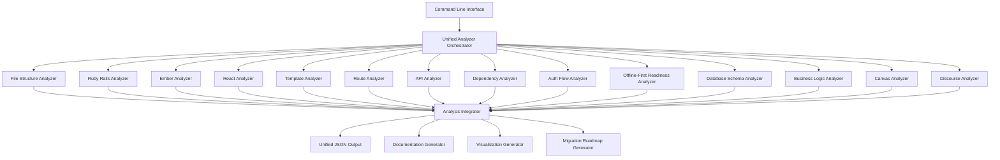

# Unified Analyzer for Discourse + Canvas

## Overview

The Unified Analyzer is a comprehensive, modular system designed to reverse-engineer the source code of Discourse (Ruby/Ember) and Canvas LMS (Ruby/React) with the intent to reproduce their full functionality in an offline-first hybrid application using Rust, Tauri, and Leptos.

## Architecture

### Core Components



### Module Descriptions

1. **Unified Analyzer Orchestrator**: Coordinates the execution of all analyzer modules and manages the flow of data between them.

2. **File Structure Analyzer**: Scans the full directory tree, outputs JSON metadata per file, identifies key directories, maps relationships between files, and generates dependency graphs.

3. **Ruby Rails Analyzer**: Extracts controllers, models, routes, callbacks, hooks, and database schema from Ruby on Rails code.

4. **Ember Analyzer**: Extracts components, services, models, routes, helpers, and initializers from Ember.js code.

5. **React Analyzer**: Extracts components, hooks, state management, routing logic, and lifecycle methods from React code.

6. **Template Analyzer**: Parses ERB, HBS, and HTML files, extracts dynamic data bindings, loops, template inheritance, and UI patterns.

7. **Route Analyzer**: Combines frontend and backend routing information, normalizes to a unified schema, maps parameters, and identifies authentication requirements.

8. **API Analyzer**: Detects REST/GraphQL calls, links frontend calls to backend controllers, captures input/output schema, and identifies authentication requirements.

9. **Dependency Analyzer**: Scans package files, flags libraries, and proposes Rust/Leptos equivalents.

10. **Auth Flow Analyzer**: Reverse engineers login/session/role logic, CSRF, token flow, permission models, and security features.

11. **Offline-First Readiness Analyzer**: Detects remote data access patterns, data update patterns, conflict resolution strategies, and real-time update requirements.

12. **Database Schema Analyzer**: Extracts database schema, relationships, indexes, constraints, and migration patterns.

13. **Business Logic Analyzer**: Identifies core business logic patterns, domain-specific algorithms, critical workflows, edge cases, and business rules.

14. **Canvas Analyzer**: Provides Canvas LMS-specific analysis.

15. **Discourse Analyzer**: Provides Discourse-specific analysis.

16. **Analysis Integrator**: Combines the outputs of all analyzers into a unified structure.

17. **Documentation Generator**: Generates comprehensive documentation from the analysis results.

18. **Visualization Generator**: Creates visual representations of the analysis results.

19. **Migration Roadmap Generator**: Creates a phased migration plan based on the analysis results.

## Data Flow

1. The CLI receives a command to analyze a project.
2. The Orchestrator initializes all analyzer modules.
3. Each analyzer module processes the codebase independently.
4. The Integrator combines the outputs of all analyzers into a unified structure.
5. The unified structure is used to generate JSON output, documentation, visualizations, and a migration roadmap.

## Output Format

The unified output is a JSON structure with the following top-level keys:

```json
{
  "files": [...],
  "routes": [...],
  "components": [...],
  "api_map": [...],
  "templates": [...],
  "auth": {...},
  "database": {...},
  "business_logic": {...},
  "offline_plan": {...}
}
```

## Implementation Status

| Module | Status | Notes |
|--------|--------|-------|
| File Structure Analyzer | ✅ Complete | |
| Ruby Rails Analyzer | ✅ Complete | |
| Ember Analyzer | ✅ Complete | |
| React Analyzer | ✅ Complete | |
| Template Analyzer | ✅ Complete | |
| Route Analyzer | ✅ Complete | |
| API Analyzer | ✅ Complete | |
| Dependency Analyzer | ✅ Complete | |
| Auth Flow Analyzer | ✅ Complete | |
| Offline-First Readiness Analyzer | ✅ Complete | |
| Database Schema Analyzer | ✅ Complete | |
| Business Logic Analyzer | ✅ Complete | |
| Canvas Analyzer | ✅ Complete | |
| Discourse Analyzer | ✅ Complete | |
| Analysis Integrator | ✅ Complete | |
| Documentation Generator | ✅ Complete | Enhanced with component documentation |
| Component Tree Generator | ✅ Complete | |
| API Map Generator | ✅ Complete | |
| Migration Roadmap Generator | ✅ Complete | |

## Usage

### Command Line

```bash
# Run a full analysis
./unified-analyze.bat full --path /path/to/project

# Run a quick analysis
./unified-analyze.bat quick --path /path/to/project

# Generate documentation
./unified-analyze.bat docs --path /path/to/project

# Generate visualizations
./unified-analyze.bat viz --path /path/to/project

# Generate migration roadmap
./unified-analyze.bat roadmap --path /path/to/project
```

## Extension Points

The analyzer system is designed to be extensible. New analyzers can be added by implementing the `Analyzer` trait and registering them with the Orchestrator.

```rust
pub trait Analyzer {
    fn analyze(&self, base_dir: &PathBuf) -> Result<String, String>;
}
```

## Future Enhancements

1. **Machine Learning Integration**: Use ML to identify patterns and make recommendations.
2. **Interactive Visualization**: Create interactive visualizations of the analysis results.
3. **Code Generation**: Generate Rust/Leptos code based on the analysis results.
4. **Incremental Analysis**: Support incremental analysis to avoid reprocessing unchanged files.
5. **Plugin System**: Support plugins to extend the analyzer's functionality.
