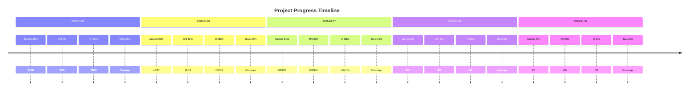
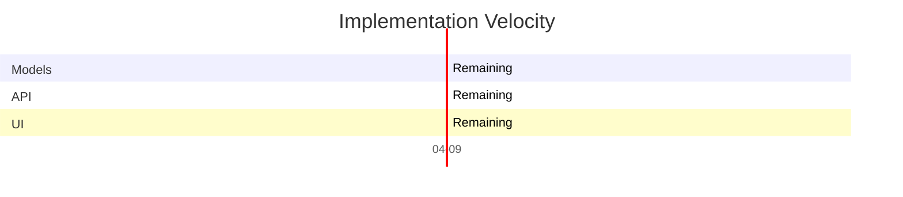

# Project Timeline Report

_Generated on: 2025-04-09_

## Progress Over Time

## Detailed History

| Date | Models | API Endpoints | UI Components | Test Coverage | Tech Debt | Phase |
|------|--------|--------------|--------------|--------------|-----------|-------|
| 2025-04-05 | 89% | 0% | 90% | 15% | 0% | mid_development |
| 2025-04-06 | 91% | 22% | 88% | 15% | 0% | mid_development |
| 2025-04-07 | 81% | 65% | 88% | 15% | 0% | late_development |
| 2025-04-08 | 0% | 0% | 0% | 0% | 0% | planning |
| 2025-04-09 | 0% | 0% | 0% | 0% | 0% | planning |

## Velocity Chart

## Trends and Observations

