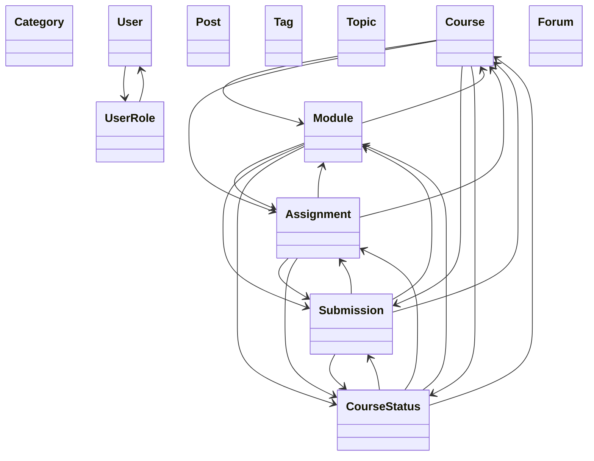
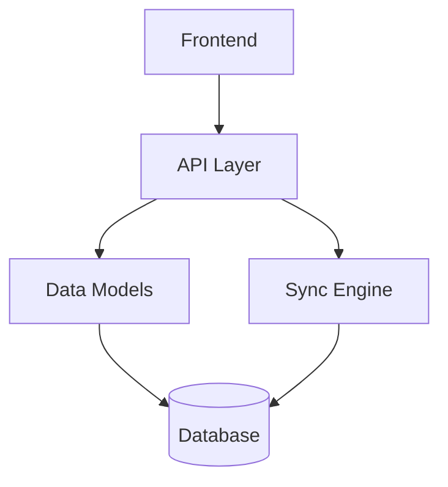

# Code Relationship Map
_Generated on 2025-04-04_

## Model Relationships

```mermaid
classDiagram
    class Category
    class Course
    class Module
    class Assignment
    class Submission
    class CourseStatus
    class Post
    class Tag
    class Topic
    class User
    class UserRole
    class Forum
    Course --> Module
    Course --> Assignment
    Course --> Submission
    Course --> CourseStatus
    Module --> Course
    Module --> Assignment
    Module --> Submission
    Module --> CourseStatus
    Assignment --> Course
    Assignment --> Module
    Assignment --> Submission
    Assignment --> CourseStatus
    Submission --> Course
    Submission --> Module
    Submission --> Assignment
    Submission --> CourseStatus
    CourseStatus --> Course
    CourseStatus --> Module
    CourseStatus --> Assignment
    CourseStatus --> Submission
    User --> UserRole
    UserRole --> User
```

## API-Model Dependencies

```mermaid
flowchart LR
    Category["Category"]
    Course["Course"]
    Module["Module"]
    Assignment["Assignment"]
    Submission["Submission"]
    CourseStatus["CourseStatus"]
    Post["Post"]
    Tag["Tag"]
    Topic["Topic"]
    User["User"]
    UserRole["UserRole"]
    Forum["Forum"]
    GET__get_categories["GET /(get/categories"]
    GET__get_categories --> Category
    POST__create_category["POST /(create/category"]
    POST__create_category --> Category
    GET__get_category["GET /(get/category"]
    GET__get_category --> Category
    PUT__update_category["PUT /(update/category"]
    PUT__update_category --> Category
    DELETE__delete_category["DELETE /(delete/category"]
    DELETE__delete_category --> Category
    GET__get_topics_by_category["GET /(get/topics/by/category"]
    GET__get_topics_by_category --> Category
    PUT__get_updated_categories["PUT /(get/updated/categories"]
    PUT__get_updated_categories --> Category
    POST__forum_categories__create_category["POST /(forum/categories::create/category"]
    POST__forum_categories__create_category --> Category
    GET__forum_categories__get_category["GET /(forum/categories::get/category"]
    GET__forum_categories__get_category --> Category
    PUT__forum_categories__update_category["PUT /(forum/categories::update/category"]
    PUT__forum_categories__update_category --> Category
    DELETE__forum_categories__delete_category["DELETE /(forum/categories::delete/category"]
    DELETE__forum_categories__delete_category --> Category
    GET__forum_topics__get_topics_by_category["GET /(forum/topics::get/topics/by/category"]
    GET__forum_topics__get_topics_by_category --> Category
    GET__health_check["GET /(health/check"]
    GET__health_check --> Category
    GET__integration__get_course_category["GET /(integration::get/course/category"]
    GET__integration__get_course_category --> Category
    GET__get_categories_by_course["GET /(get/categories/by/course"]
    GET__get_categories_by_course --> Course
    GET__integration__get_course_category["GET /(integration::get/course/category"]
    GET__integration__get_course_category --> Course
    GET__integration__get_course_forum_activity["GET /(integration::get/course/forum/activity"]
    GET__integration__get_course_forum_activity --> Course
    GET__integration__get_module_topic["GET /(integration::get/module/topic"]
    GET__integration__get_module_topic --> Module
    GET__integration__get_assignment_topic["GET /(integration::get/assignment/topic"]
    GET__integration__get_assignment_topic --> Assignment
    POST__create_category["POST /(create/category"]
    POST__create_category --> Post
    POST__create_topic["POST /(create/topic"]
    POST__create_topic --> Post
    GET__get_posts_by_topic["GET /(get/posts/by/topic"]
    GET__get_posts_by_topic --> Post
    POST__create_post["POST /(create/post"]
    POST__create_post --> Post
    GET__get_post["GET /(get/post"]
    GET__get_post --> Post
    PUT__update_post["PUT /(update/post"]
    PUT__update_post --> Post
    DELETE__delete_post["DELETE /(delete/post"]
    DELETE__delete_post --> Post
    POST__like_post["POST /(like/post"]
    POST__like_post --> Post
    PUT__get_updated_posts["PUT /(get/updated/posts"]
    PUT__get_updated_posts --> Post
    POST__forum_categories__create_category["POST /(forum/categories::create/category"]
    POST__forum_categories__create_category --> Post
    POST__forum_topics__create_topic["POST /(forum/topics::create/topic"]
    POST__forum_topics__create_topic --> Post
    GET__forum_posts__get_posts_for_topic["GET /(forum/posts::get/posts/for/topic"]
    GET__forum_posts__get_posts_for_topic --> Post
    POST__forum_posts__create_post["POST /(forum/posts::create/post"]
    POST__forum_posts__create_post --> Post
    GET__forum_posts__get_post["GET /(forum/posts::get/post"]
    GET__forum_posts__get_post --> Post
    PUT__forum_posts__update_post["PUT /(forum/posts::update/post"]
    PUT__forum_posts__update_post --> Post
    DELETE__forum_posts__delete_post["DELETE /(forum/posts::delete/post"]
    DELETE__forum_posts__delete_post --> Post
    POST__forum_posts__mark_as_solution["POST /(forum/posts::mark/as/solution"]
    POST__forum_posts__mark_as_solution --> Post
    POST__forum_posts__like_post["POST /(forum/posts::like/post"]
    POST__forum_posts__like_post --> Post
    POST__forum_posts__unlike_post["POST /(forum/posts::unlike/post"]
    POST__forum_posts__unlike_post --> Post
    GET__forum_posts__get_recent_posts["GET /(forum/posts::get/recent/posts"]
    GET__forum_posts__get_recent_posts --> Post
    GET__get_tags["GET /(get/tags"]
    GET__get_tags --> Tag
    GET__get_topics_by_tag["GET /(get/topics/by/tag"]
    GET__get_topics_by_tag --> Tag
    GET__get_topics_by_category["GET /(get/topics/by/category"]
    GET__get_topics_by_category --> Topic
    GET__get_topics["GET /(get/topics"]
    GET__get_topics --> Topic
    POST__create_topic["POST /(create/topic"]
    POST__create_topic --> Topic
    GET__get_topic["GET /(get/topic"]
    GET__get_topic --> Topic
    PUT__update_topic["PUT /(update/topic"]
    PUT__update_topic --> Topic
    DELETE__delete_topic["DELETE /(delete/topic"]
    DELETE__delete_topic --> Topic
    GET__get_posts_by_topic["GET /(get/posts/by/topic"]
    GET__get_posts_by_topic --> Topic
    GET__get_recent_topics["GET /(get/recent/topics"]
    GET__get_recent_topics --> Topic
    GET__get_topics_by_tag["GET /(get/topics/by/tag"]
    GET__get_topics_by_tag --> Topic
    PUT__get_updated_topics["PUT /(get/updated/topics"]
    PUT__get_updated_topics --> Topic
    GET__forum_topics__get_topics["GET /(forum/topics::get/topics"]
    GET__forum_topics__get_topics --> Topic
    POST__forum_topics__create_topic["POST /(forum/topics::create/topic"]
    POST__forum_topics__create_topic --> Topic
    GET__forum_topics__get_topic["GET /(forum/topics::get/topic"]
    GET__forum_topics__get_topic --> Topic
    PUT__forum_topics__update_topic["PUT /(forum/topics::update/topic"]
    PUT__forum_topics__update_topic --> Topic
    DELETE__forum_topics__delete_topic["DELETE /(forum/topics::delete/topic"]
    DELETE__forum_topics__delete_topic --> Topic
    GET__forum_topics__get_recent_topics["GET /(forum/topics::get/recent/topics"]
    GET__forum_topics__get_recent_topics --> Topic
    GET__forum_topics__get_topics_by_category["GET /(forum/topics::get/topics/by/category"]
    GET__forum_topics__get_topics_by_category --> Topic
    GET__forum_posts__get_posts_for_topic["GET /(forum/posts::get/posts/for/topic"]
    GET__forum_posts__get_posts_for_topic --> Topic
    GET__integration__get_module_topic["GET /(integration::get/module/topic"]
    GET__integration__get_module_topic --> Topic
    GET__integration__get_assignment_topic["GET /(integration::get/assignment/topic"]
    GET__integration__get_assignment_topic --> Topic
    GET__get_forum_stats["GET /(get/forum/stats"]
    GET__get_forum_stats --> Forum
    GET__search_forum["GET /(search/forum"]
    GET__search_forum --> Forum
    GET__forum_categories__get_categories["GET /(forum/categories::get/categories"]
    GET__forum_categories__get_categories --> Forum
    POST__forum_categories__create_category["POST /(forum/categories::create/category"]
    POST__forum_categories__create_category --> Forum
    GET__forum_categories__get_category["GET /(forum/categories::get/category"]
    GET__forum_categories__get_category --> Forum
    PUT__forum_categories__update_category["PUT /(forum/categories::update/category"]
    PUT__forum_categories__update_category --> Forum
    DELETE__forum_categories__delete_category["DELETE /(forum/categories::delete/category"]
    DELETE__forum_categories__delete_category --> Forum
    GET__forum_topics__get_topics["GET /(forum/topics::get/topics"]
    GET__forum_topics__get_topics --> Forum
    POST__forum_topics__create_topic["POST /(forum/topics::create/topic"]
    POST__forum_topics__create_topic --> Forum
    GET__forum_topics__get_topic["GET /(forum/topics::get/topic"]
    GET__forum_topics__get_topic --> Forum
    PUT__forum_topics__update_topic["PUT /(forum/topics::update/topic"]
    PUT__forum_topics__update_topic --> Forum
    DELETE__forum_topics__delete_topic["DELETE /(forum/topics::delete/topic"]
    DELETE__forum_topics__delete_topic --> Forum
    GET__forum_topics__get_recent_topics["GET /(forum/topics::get/recent/topics"]
    GET__forum_topics__get_recent_topics --> Forum
    GET__forum_topics__get_topics_by_category["GET /(forum/topics::get/topics/by/category"]
    GET__forum_topics__get_topics_by_category --> Forum
    GET__forum_posts__get_posts_for_topic["GET /(forum/posts::get/posts/for/topic"]
    GET__forum_posts__get_posts_for_topic --> Forum
    POST__forum_posts__create_post["POST /(forum/posts::create/post"]
    POST__forum_posts__create_post --> Forum
    GET__forum_posts__get_post["GET /(forum/posts::get/post"]
    GET__forum_posts__get_post --> Forum
    PUT__forum_posts__update_post["PUT /(forum/posts::update/post"]
    PUT__forum_posts__update_post --> Forum
    DELETE__forum_posts__delete_post["DELETE /(forum/posts::delete/post"]
    DELETE__forum_posts__delete_post --> Forum
    POST__forum_posts__mark_as_solution["POST /(forum/posts::mark/as/solution"]
    POST__forum_posts__mark_as_solution --> Forum
    POST__forum_posts__like_post["POST /(forum/posts::like/post"]
    POST__forum_posts__like_post --> Forum
    POST__forum_posts__unlike_post["POST /(forum/posts::unlike/post"]
    POST__forum_posts__unlike_post --> Forum
    GET__forum_posts__get_recent_posts["GET /(forum/posts::get/recent/posts"]
    GET__forum_posts__get_recent_posts --> Forum
    GET__integration__get_course_forum_activity["GET /(integration::get/course/forum/activity"]
    GET__integration__get_course_forum_activity --> Forum
```

## Module Structure

```mermaid
flowchart TD
    FE[Frontend]
    API[API Layer]
    Models[Data Models]
    Sync[Sync Engine]
    DB[(Database)]
    FE --> API
    API --> Models
    Models --> DB
    API --> Sync
    Sync --> DB
```
