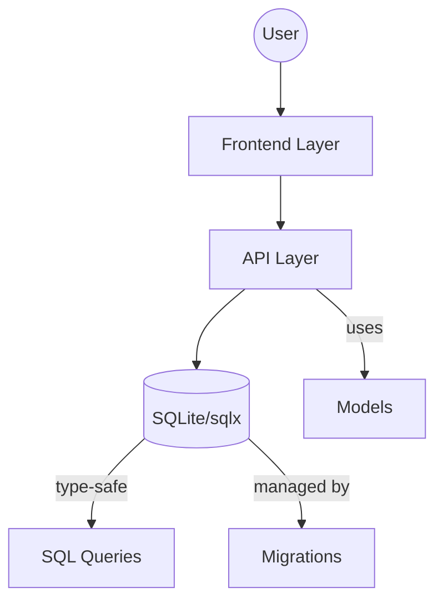

# System Architecture

_Generated on: 2025-04-09_

## Technology Stack

### Database Solution (Hardcoded)

- **Engine**: SQLite
- **Driver**: sqlx (Rust crate)
- **Configuration**: Embedded, file-based
- **Path**: ./src-tauri/educonnect.db
- **Migrations**: sqlx built-in migrations

SQLite with sqlx is hardcoded as the database solution for this project. This combination provides:

- **Offline-First Architecture**: Local database enabling full offline functionality
- **Zero Configuration**: No separate database server setup required
- **Cross-Platform**: Works consistently on all supported platforms
- **Type Safety**: Through sqlx compile-time SQL checking

### Frontend

- No frontend technologies detected

### Backend

- **Rust**: Tauri backend (with sqlx for database access)

### Infrastructure

- No infrastructure technologies detected

### Testing

- **Jest**: v^29.7.0
- **Mocha**: v^10.2.0
- **Chai**: v^4.3.8

## System Components

### Model Layer

The system contains 0 models with 0 implemented (0%).

### API Layer

The system exposes 0 API endpoints with 0 implemented (0%).

### UI Layer

The system has 0 UI components with 0 implemented (0%).

## Architecture Diagram

