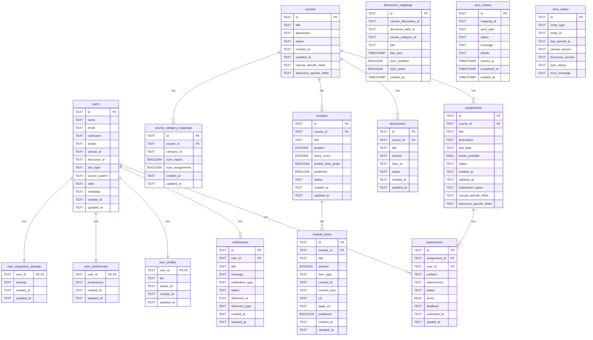

# Database Schema

## Table Details

This diagram shows the database schema for the Ordo application, including all tables and their relationships. The schema is designed to support both offline-first functionality and integration with Canvas and Discourse.

### Key Tables

- **users**: Central user table that harmonizes user data from Canvas and Discourse
- **courses**: Course information with integration fields for Canvas and Discourse
- **assignments**: Assignment data that can be synchronized with Canvas
- **discussions**: Discussion topics that can be synchronized with Discourse
- **modules**: Course modules for organizing content
- **sync_status** and **sync_history**: Tables for tracking synchronization between systems

### Relationships

The schema includes several types of relationships:
- One-to-one relationships (e.g., users to user_profiles)
- One-to-many relationships (e.g., courses to assignments)
- Many-to-many relationships through mapping tables

### Integration Design

The schema is designed to support seamless integration between:
- Canvas LMS (for courses, assignments, etc.)
- Discourse forums (for discussions)
- Ordo's native offline-first functionality

This allows for a unified experience while maintaining compatibility with existing systems.