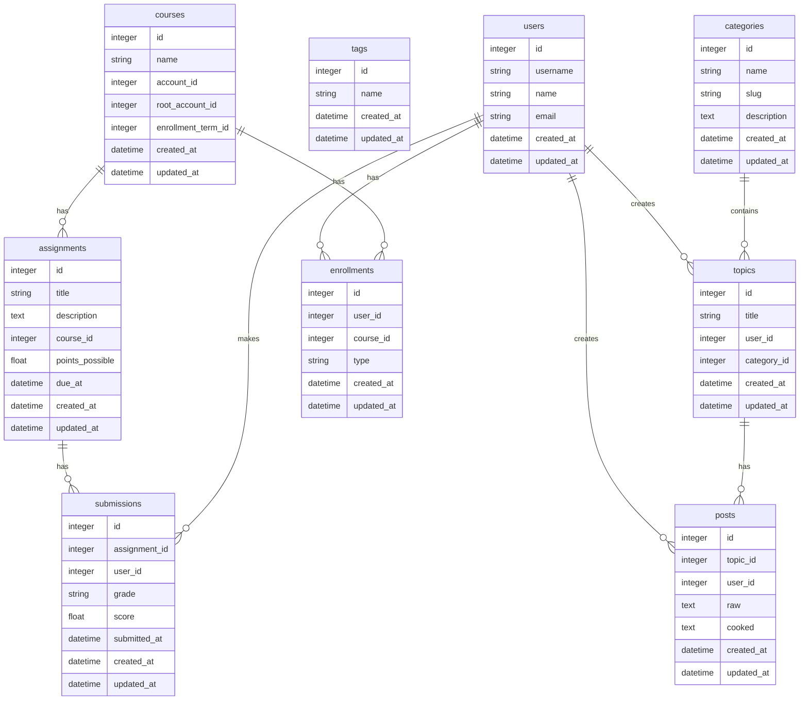

# Source Database Schema

```mermaid
erDiagram
    users {
        integer id
        string username
        string name
        string email
        datetime created_at
        datetime updated_at
    }
    tags {
        integer id
        string name
        datetime created_at
        datetime updated_at
    }
    assignments {
        integer id
        string title
        text description
        integer course_id
        float points_possible
        datetime due_at
        datetime created_at
        datetime updated_at
    }
    submissions {
        integer id
        integer assignment_id
        integer user_id
        string grade
        float score
        datetime submitted_at
        datetime created_at
        datetime updated_at
    }
    topics {
        integer id
        string title
        integer user_id
        integer category_id
        datetime created_at
        datetime updated_at
    }
    posts {
        integer id
        integer topic_id
        integer user_id
        text raw
        text cooked
        datetime created_at
        datetime updated_at
    }
    enrollments {
        integer id
        integer user_id
        integer course_id
        string type
        datetime created_at
        datetime updated_at
    }
    categories {
        integer id
        string name
        string slug
        text description
        datetime created_at
        datetime updated_at
    }
    courses {
        integer id
        string name
        integer account_id
        integer root_account_id
        integer enrollment_term_id
        datetime created_at
        datetime updated_at
    }
    courses ||--o{ assignments : "has"
    assignments ||--o{ submissions : "has"
    users ||--o{ submissions : "makes"
    users ||--o{ enrollments : "has"
    courses ||--o{ enrollments : "has"
    users ||--o{ topics : "creates"
    users ||--o{ posts : "creates"
    topics ||--o{ posts : "has"
    categories ||--o{ topics : "contains"

```
