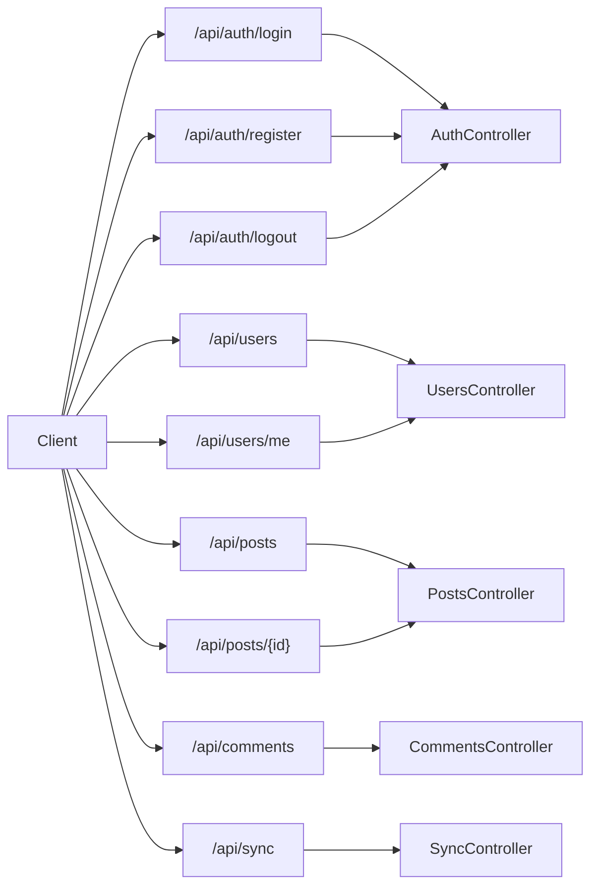

# API Map

This document provides a comprehensive map of all API endpoints in the application.

## Table of Contents

- [Authentication](#authentication)
- [Users](#users)
- [Posts](#posts)
- [Topics](#topics)
- [Categories](#categories)
- [Comments](#comments)
- [Votes](#votes)
- [Notifications](#notifications)
- [Sync](#sync)

## Authentication

### POST Endpoints

| Path | Description | Auth Required | Parameters |
|------|-------------|--------------|------------|
| `/api/auth/login` | Authenticate user and return JWT token | No | email, password |
| `/api/auth/register` | Register a new user | No | email, password, name |
| `/api/auth/logout` | Invalidate user session | Yes | |
| `/api/auth/refresh` | Refresh JWT token | Yes | |
| `/api/auth/password/reset` | Request password reset | No | email |
| `/api/auth/password/change` | Change password | Yes | current_password, new_password |

## Users

### GET Endpoints

| Path | Description | Auth Required | Parameters |
|------|-------------|--------------|------------|
| `/api/users` | Get list of users | Yes | page, per_page |
| `/api/users/{id}` | Get user by ID | Yes | id |
| `/api/users/me` | Get current user profile | Yes | |

### PUT Endpoints

| Path | Description | Auth Required | Parameters |
|------|-------------|--------------|------------|
| `/api/users/{id}` | Update user profile | Yes | id, name, bio, avatar |
| `/api/users/me` | Update current user profile | Yes | name, bio, avatar |

## Posts

### GET Endpoints

| Path | Description | Auth Required | Parameters |
|------|-------------|--------------|------------|
| `/api/posts` | Get list of posts | No | page, per_page, topic_id, category_id |
| `/api/posts/{id}` | Get post by ID | No | id |
| `/api/posts/trending` | Get trending posts | No | limit |

### POST Endpoints

| Path | Description | Auth Required | Parameters |
|------|-------------|--------------|------------|
| `/api/posts` | Create a new post | Yes | title, content, topic_id |

### PUT Endpoints

| Path | Description | Auth Required | Parameters |
|------|-------------|--------------|------------|
| `/api/posts/{id}` | Update post | Yes | id, title, content |

### DELETE Endpoints

| Path | Description | Auth Required | Parameters |
|------|-------------|--------------|------------|
| `/api/posts/{id}` | Delete post | Yes | id |

## Topics

### GET Endpoints

| Path | Description | Auth Required | Parameters |
|------|-------------|--------------|------------|
| `/api/topics` | Get list of topics | No | page, per_page, category_id |
| `/api/topics/{id}` | Get topic by ID | No | id |
| `/api/topics/trending` | Get trending topics | No | limit |

### POST Endpoints

| Path | Description | Auth Required | Parameters |
|------|-------------|--------------|------------|
| `/api/topics` | Create a new topic | Yes | title, category_id |

### PUT Endpoints

| Path | Description | Auth Required | Parameters |
|------|-------------|--------------|------------|
| `/api/topics/{id}` | Update topic | Yes | id, title, category_id |

### DELETE Endpoints

| Path | Description | Auth Required | Parameters |
|------|-------------|--------------|------------|
| `/api/topics/{id}` | Delete topic | Yes | id |

## Categories

### GET Endpoints

| Path | Description | Auth Required | Parameters |
|------|-------------|--------------|------------|
| `/api/categories` | Get list of categories | No | |
| `/api/categories/{id}` | Get category by ID | No | id |

### POST Endpoints

| Path | Description | Auth Required | Parameters |
|------|-------------|--------------|------------|
| `/api/categories` | Create a new category | Yes | name, description, parent_id |

### PUT Endpoints

| Path | Description | Auth Required | Parameters |
|------|-------------|--------------|------------|
| `/api/categories/{id}` | Update category | Yes | id, name, description, parent_id |

### DELETE Endpoints

| Path | Description | Auth Required | Parameters |
|------|-------------|--------------|------------|
| `/api/categories/{id}` | Delete category | Yes | id |

## Comments

### GET Endpoints

| Path | Description | Auth Required | Parameters |
|------|-------------|--------------|------------|
| `/api/comments` | Get comments for a post | No | post_id, page, per_page |
| `/api/comments/{id}` | Get comment by ID | No | id |

### POST Endpoints

| Path | Description | Auth Required | Parameters |
|------|-------------|--------------|------------|
| `/api/comments` | Create a new comment | Yes | post_id, content, parent_id |

### PUT Endpoints

| Path | Description | Auth Required | Parameters |
|------|-------------|--------------|------------|
| `/api/comments/{id}` | Update comment | Yes | id, content |

### DELETE Endpoints

| Path | Description | Auth Required | Parameters |
|------|-------------|--------------|------------|
| `/api/comments/{id}` | Delete comment | Yes | id |

## Votes

### POST Endpoints

| Path | Description | Auth Required | Parameters |
|------|-------------|--------------|------------|
| `/api/votes` | Create or update vote | Yes | target_type, target_id, value |

### DELETE Endpoints

| Path | Description | Auth Required | Parameters |
|------|-------------|--------------|------------|
| `/api/votes/{id}` | Remove vote | Yes | id |

## Notifications

### GET Endpoints

| Path | Description | Auth Required | Parameters |
|------|-------------|--------------|------------|
| `/api/notifications` | Get user notifications | Yes | page, per_page |
| `/api/notifications/unread` | Get unread notifications count | Yes | |

### PUT Endpoints

| Path | Description | Auth Required | Parameters |
|------|-------------|--------------|------------|
| `/api/notifications/{id}/read` | Mark notification as read | Yes | id |
| `/api/notifications/read-all` | Mark all notifications as read | Yes | |

## Sync

### GET Endpoints

| Path | Description | Auth Required | Parameters |
|------|-------------|--------------|------------|
| `/api/sync/status` | Get sync status | Yes | |
| `/api/sync/conflicts` | Get sync conflicts | Yes | |

### POST Endpoints

| Path | Description | Auth Required | Parameters |
|------|-------------|--------------|------------|
| `/api/sync` | Trigger synchronization | Yes | |
| `/api/sync/conflicts/resolve` | Resolve sync conflicts | Yes | conflict_id, resolution_strategy |

## API Flow Diagram

