# Component Tree Visualization

This diagram shows the component hierarchy and dependencies in the application.

```mermaid
graph TD
    UserComponent["UserComponent"]
    LoginComponent["LoginComponent"]
    RegisterComponent["RegisterComponent"]
    ProfileComponent["ProfileComponent"]
    AuthService["AuthService"]
    PostComponent["PostComponent"]
    TopicComponent["TopicComponent"]
    CategoryComponent["CategoryComponent"]
    EditorComponent["EditorComponent"]
    ContentService["ContentService"]
    CommentComponent["CommentComponent"]
    VoteComponent["VoteComponent"]
    NotificationComponent["NotificationComponent"]
    ActivityFeedComponent["ActivityFeedComponent"]
    InteractionService["InteractionService"]
    SyncManager["SyncManager"]
    OfflineStorage["OfflineStorage"]
    ConflictResolver["ConflictResolver"]
    SyncStatusComponent["SyncStatusComponent"]
    NetworkDetector["NetworkDetector"]
    
    AuthService --> UserComponent
    AuthService --> LoginComponent
    AuthService --> RegisterComponent
    UserComponent --> ProfileComponent
    ContentService --> PostComponent
    ContentService --> TopicComponent
    ContentService --> CategoryComponent
    ContentService --> EditorComponent
    PostComponent --> CommentComponent
    PostComponent --> VoteComponent
    InteractionService --> CommentComponent
    InteractionService --> VoteComponent
    InteractionService --> NotificationComponent
    InteractionService --> ActivityFeedComponent
    SyncManager --> OfflineStorage
    SyncManager --> ConflictResolver
    SyncManager --> SyncStatusComponent
    SyncManager --> NetworkDetector
```

## Component Details

### UserComponent

**Description**: Displays user information and profile summary

**File**: `src/components/user/UserComponent.rs`

**Dependencies**:
- AuthService

### LoginComponent

**Description**: Handles user login functionality

**File**: `src/components/auth/LoginComponent.rs`

**Dependencies**:
- AuthService

### RegisterComponent

**Description**: Handles user registration functionality

**File**: `src/components/auth/RegisterComponent.rs`

**Dependencies**:
- AuthService

### ProfileComponent

**Description**: Displays and edits user profile information

**File**: `src/components/user/ProfileComponent.rs`

**Dependencies**:
- UserComponent

### AuthService

**Description**: Manages authentication and authorization

**File**: `src/services/AuthService.rs`

### PostComponent

**Description**: Displays and manages post content

**File**: `src/components/content/PostComponent.rs`

**Dependencies**:
- ContentService
- CommentComponent
- VoteComponent

### TopicComponent

**Description**: Displays and manages topic information

**File**: `src/components/content/TopicComponent.rs`

**Dependencies**:
- ContentService

### CategoryComponent

**Description**: Displays and manages category information

**File**: `src/components/content/CategoryComponent.rs`

**Dependencies**:
- ContentService

### EditorComponent

**Description**: Rich text editor for creating and editing content

**File**: `src/components/content/EditorComponent.rs`

**Dependencies**:
- ContentService

### ContentService

**Description**: Manages content creation, retrieval, and modification

**File**: `src/services/ContentService.rs`

### CommentComponent

**Description**: Displays and manages comment functionality

**File**: `src/components/interaction/CommentComponent.rs`

**Dependencies**:
- InteractionService

### VoteComponent

**Description**: Handles voting and rating functionality

**File**: `src/components/interaction/VoteComponent.rs`

**Dependencies**:
- InteractionService

### NotificationComponent

**Description**: Displays user notifications

**File**: `src/components/interaction/NotificationComponent.rs`

**Dependencies**:
- InteractionService

### ActivityFeedComponent

**Description**: Displays user activity feed

**File**: `src/components/interaction/ActivityFeedComponent.rs`

**Dependencies**:
- InteractionService

### InteractionService

**Description**: Manages user interactions like comments, votes, and notifications

**File**: `src/services/InteractionService.rs`

### SyncManager

**Description**: Manages data synchronization between local and remote storage

**File**: `src/services/sync/SyncManager.rs`

**Dependencies**:
- OfflineStorage
- ConflictResolver
- NetworkDetector

### OfflineStorage

**Description**: Manages local data storage for offline functionality

**File**: `src/services/sync/OfflineStorage.rs`

### ConflictResolver

**Description**: Resolves data conflicts during synchronization

**File**: `src/services/sync/ConflictResolver.rs`

### SyncStatusComponent

**Description**: Displays synchronization status to the user

**File**: `src/components/sync/SyncStatusComponent.rs`

**Dependencies**:
- SyncManager

### NetworkDetector

**Description**: Detects network connectivity changes

**File**: `src/services/sync/NetworkDetector.rs`
