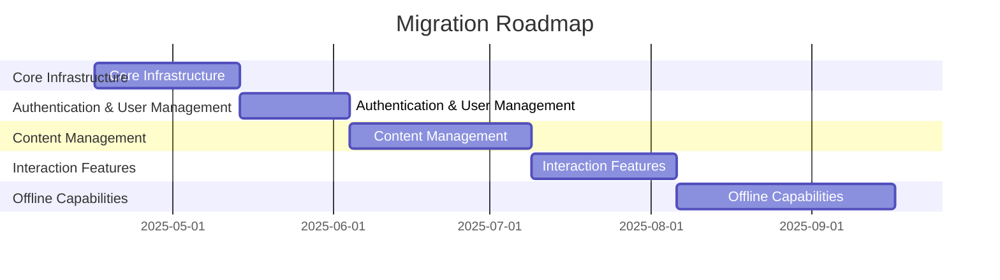

# Migration Roadmap: Discourse + Canvas Migration to Rust/Tauri/Leptos

Generated: 2025-04-16

Total Estimated Effort: **22 weeks**

## Migration Phases

### Phase: Core Infrastructure

**Description**: Set up the basic Rust/Tauri/Leptos infrastructure and implement core database models

**Estimated Effort**: 4 weeks

**Components**:
- DatabaseConnector
- ConfigManager
- LoggingService
- ErrorHandler
- BaseModel

**APIs**:
- /api/health
- /api/version

**Routes**:
- /
- /about
- /status

**Database Tables**:
- schema_migrations
- settings
- configurations

### Phase: Authentication & User Management

**Description**: Implement user authentication, registration, and profile management

**Estimated Effort**: 3 weeks

**Dependencies**:
- Core Infrastructure

**Components**:
- UserComponent
- LoginComponent
- RegisterComponent
- ProfileComponent
- AuthService

**APIs**:
- /api/auth/login
- /api/auth/register
- /api/auth/logout
- /api/users
- /api/users/{id}
- /api/users/me

**Routes**:
- /login
- /register
- /profile
- /users
- /users/{id}

**Database Tables**:
- users
- user_profiles
- sessions
- roles
- permissions

### Phase: Content Management

**Description**: Implement content creation, editing, and viewing functionality

**Estimated Effort**: 5 weeks

**Dependencies**:
- Authentication & User Management

**Components**:
- PostComponent
- TopicComponent
- CategoryComponent
- EditorComponent
- ContentService

**APIs**:
- /api/posts
- /api/posts/{id}
- /api/topics
- /api/topics/{id}
- /api/categories
- /api/categories/{id}

**Routes**:
- /posts
- /posts/{id}
- /posts/new
- /topics
- /topics/{id}
- /topics/new
- /categories
- /categories/{id}

**Database Tables**:
- posts
- topics
- categories
- tags
- attachments

### Phase: Interaction Features

**Description**: Implement commenting, voting, notifications, and other interaction features

**Estimated Effort**: 4 weeks

**Dependencies**:
- Content Management

**Components**:
- CommentComponent
- VoteComponent
- NotificationComponent
- ActivityFeedComponent
- InteractionService

**APIs**:
- /api/comments
- /api/comments/{id}
- /api/votes
- /api/notifications
- /api/activities

**Routes**:
- /comments/{id}
- /notifications
- /activities

**Database Tables**:
- comments
- votes
- notifications
- activities
- user_preferences

### Phase: Offline Capabilities

**Description**: Implement offline-first functionality with data synchronization

**Estimated Effort**: 6 weeks

**Dependencies**:
- Interaction Features

**Components**:
- SyncManager
- OfflineStorage
- ConflictResolver
- SyncStatusComponent
- NetworkDetector

**APIs**:
- /api/sync
- /api/sync/status
- /api/sync/conflicts

**Routes**:
- /sync
- /sync/status
- /sync/conflicts

**Database Tables**:
- sync_logs
- sync_conflicts
- sync_queue
- sync_metadata
- offline_changes

## Critical Path Items

- Database schema design
- Authentication system
- Offline data synchronization
- Content editor component

## Risks

- Complex offline synchronization logic may require additional time
- Integration between Canvas and Discourse features may be challenging
- Performance optimization for large datasets

## Recommendations

- Start with a small subset of features for initial proof of concept
- Implement comprehensive test suite early in the process
- Use feature flags to enable incremental deployment
- Consider using CRDT for conflict resolution in offline mode

## Timeline

