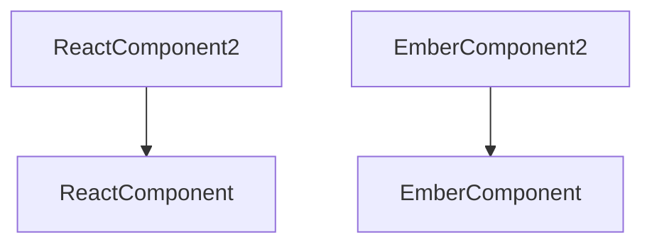

# Migration Report

Generated: 2025-04-18 17:22:09.135089200 UTC

## Progress Summary

Migration Progress: 16.7% (1/6 components)
- Not Started: 4
- In Progress: 0
- Completed: 1
- Failed: 1
- Skipped: 0

## Completed Components

| Component | Type | Original Path | Migrated Path |
|-----------|------|--------------|---------------|
| EmberComponent | Ember | src/components/EmberComponent.js | generated/leptos/components/ember/embercomponent.rs |

## Failed Components

| Component | Type | Error |
|-----------|------|-------|
| AngularComponent | Angular | Simulated failure |

## Dependency Graph

