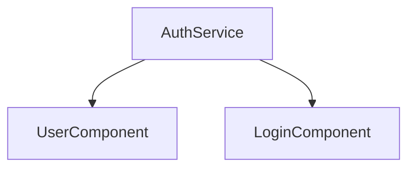

# Unified Analyzer Generators Guide

This guide provides detailed information about the visualization and documentation generators available in the Unified Analyzer.

## Overview

The Unified Analyzer includes several generators that can create various types of documentation and visualizations from the analysis results. These generators help you understand the structure and behavior of the analyzed codebase and plan the migration to Rust/Tauri/Leptos.

## Available Generators

### Migration Roadmap Generator

The Migration Roadmap Generator creates a phased migration plan based on the analysis results.

#### Usage

```bash
./unified-analyze.bat --roadmap --path /path/to/project
```

#### Output

- `migration_roadmap.md`: A Markdown file containing the migration roadmap with phases, dependencies, components, APIs, routes, database tables, estimated effort, critical path items, risks, and recommendations.
- `migration_roadmap.json`: A JSON file containing the same information in a structured format.

#### Example

```markdown
# Migration Roadmap: Discourse + Canvas Migration to Rust/Tauri/Leptos

Generated: 2025-04-16

Total Estimated Effort: **22 weeks**

## Migration Phases

### Phase: Core Infrastructure

**Description**: Set up the basic Rust/Tauri/Leptos infrastructure and implement core database models

**Estimated Effort**: 4 weeks

**Components**:
- DatabaseConnector
- ConfigManager
...
```

### Component Tree Generator

The Component Tree Generator creates visualizations of the component hierarchy and dependencies in the application.

#### Usage

```bash
./unified-analyze.bat --component-tree --path /path/to/project
```

#### Output

- `component_tree.md`: A Markdown file containing a Mermaid diagram of the component hierarchy and detailed information about each component.
- `component_tree.html`: An HTML file with an interactive D3.js visualization of the component hierarchy.

#### Example

```markdown
# Component Tree Visualization

This diagram shows the component hierarchy and dependencies in the application.



## Component Details

### UserComponent

**Description**: Displays user information and profile summary

**File**: `src/components/user/UserComponent.rs`

**Dependencies**:
- AuthService
...
```

### API Map Generator

The API Map Generator creates visualizations of the API endpoints in the application.

#### Usage

```bash
./unified-analyze.bat --api-map --path /path/to/project
```

#### Output

- `api_map.md`: A Markdown file containing tables of API endpoints grouped by category and HTTP method, as well as a Mermaid diagram of the API flow.
- `api_map.html`: An HTML file with an interactive visualization of the API endpoints.

#### Example

```markdown
# API Map

This document provides a comprehensive map of all API endpoints in the application.

## Table of Contents

- [Authentication](#authentication)
- [Users](#users)
...

## Authentication

### POST Endpoints

| Path | Description | Auth Required | Parameters |
|------|-------------|--------------|------------|
| `/api/auth/login` | Authenticate user and return JWT token | No | email, password |
...
```

### All Visualizations

You can generate all visualizations at once using the `--viz` option:

```bash
./unified-analyze.bat --viz --path /path/to/project
```

This will generate all the visualizations mentioned above.

## Integration with Analysis Pipeline

The generators are integrated with the analysis pipeline and can be used in conjunction with the analysis commands:

```bash
# Run full analysis and generate all visualizations
./unified-analyze.bat --full --viz --path /path/to/project

# Run quick analysis and generate migration roadmap
./unified-analyze.bat --quick --roadmap --path /path/to/project
```

## Customization

The generators can be customized by modifying their implementation in the `tools/unified-analyzer/src/generators` directory:

- `migration_roadmap_generator.rs`: Implementation of the Migration Roadmap Generator
- `component_tree_generator.rs`: Implementation of the Component Tree Generator
- `api_map_generator.rs`: Implementation of the API Map Generator

## Extending the Generators

You can extend the generators by implementing new ones following the same pattern. To add a new generator:

1. Create a new file in the `tools/unified-analyzer/src/generators` directory
2. Implement the generator using the `UnifiedAnalysisOutput` as input
3. Add the generator to the `mod.rs` file in the same directory
4. Update the command-line interface in `unified-analyze.bat` to include the new generator

## Upcoming Visualizations

The following visualizations are currently in development and will be available in future releases:

### Database Schema Diagram Generator

The Database Schema Diagram Generator will create visualizations of the database schema, including tables, columns, relationships, and indexes.

#### Planned Features

- Entity-Relationship Diagram (ERD) of the database schema
- Table details with columns, data types, and constraints
- Relationship visualization with foreign keys
- Index information and performance recommendations

#### Planned Usage

```bash
./unified-analyze.bat --db-schema --path /path/to/project
```

### Authentication Flow Diagram Generator

The Authentication Flow Diagram Generator will create visualizations of the authentication and authorization flows in the application.

#### Planned Features

- Sequence diagrams of authentication flows (login, registration, password reset)
- Authorization model visualization
- Role and permission hierarchy diagrams
- Security recommendations based on best practices

#### Planned Usage

```bash
./unified-analyze.bat --auth-flow --path /path/to/project
```

### Business Logic Diagram Generator

The Business Logic Diagram Generator will create visualizations of the core business logic and workflows in the application.

#### Planned Features

- Workflow diagrams of key business processes
- Decision tree visualizations
- Domain model diagrams
- Critical path analysis

#### Planned Usage

```bash
./unified-analyze.bat --business-logic --path /path/to/project
```

## Performance Optimization

The Unified Analyzer is continuously being optimized for better performance with large codebases. Current and planned optimizations include:

### Current Optimizations

- Parallel processing of analysis modules
- Incremental analysis to avoid reprocessing unchanged files
- Memory-efficient data structures

### Planned Optimizations

- Caching of intermediate analysis results
- Lazy loading of large data structures
- Streaming processing of large files
- GPU acceleration for complex visualizations

## Troubleshooting

### Common Issues

- **Missing dependencies**: Make sure you have all the required dependencies installed, including Rust, Cargo, and any other dependencies required by the generators.
- **Path issues**: Make sure you provide the correct path to the project you want to analyze.
- **Output directory issues**: Make sure the output directory exists and is writable.
- **Memory issues**: For large codebases, you may need to increase the available memory. Use the `--memory` option to specify the maximum memory usage in MB.
- **Timeout issues**: For complex analyses, you may need to increase the timeout. Use the `--timeout` option to specify the maximum analysis time in seconds.

### Performance Tips

- Use the `--quick` option for faster analysis during development
- Use the `--incremental` option to only analyze changed files
- Use the `--parallel` option to enable parallel processing
- Use the `--cache` option to enable caching of intermediate results

### Getting Help

If you encounter any issues with the generators, please:

1. Check the logs in the `logs` directory
2. Consult the troubleshooting section in this guide
3. Check the [GitHub Issues](https://github.com/your-org/unified-analyzer/issues) for known problems
4. Submit a detailed bug report if the issue is not already reported
5. Contact the development team at [support@example.com](mailto:support@example.com)

## Feedback and Contributions

We welcome feedback and contributions to the Unified Analyzer. Please use the provided feedback form to share your thoughts and suggestions. If you'd like to contribute to the project, please check the [Contributing Guide](CONTRIBUTING.md) for more information.
