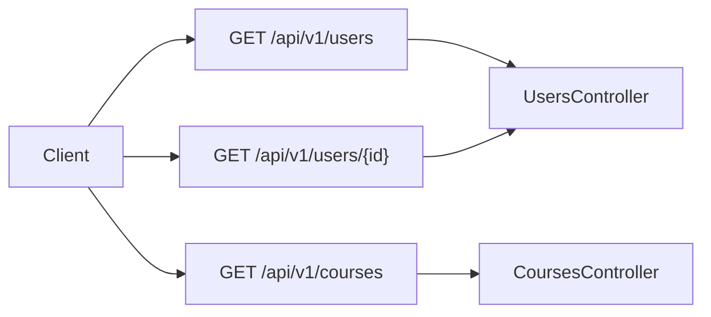

# API Map

This document provides a comprehensive map of all API endpoints in the application.

## Table of Contents

- [CoursesController](#coursescontroller)
- [UsersController](#userscontroller)

## CoursesController

### GET Endpoints

| Path | Description | Auth Required | Parameters |
|------|-------------|--------------|------------|
| `/api/v1/courses` | Get all courses | Yes |  |

## UsersController

### GET Endpoints

| Path | Description | Auth Required | Parameters |
|------|-------------|--------------|------------|
| `/api/v1/users` | Get all users | Yes |  |
| `/api/v1/users/{id}` | Get a specific user | Yes | id |

## API Flow Diagram

