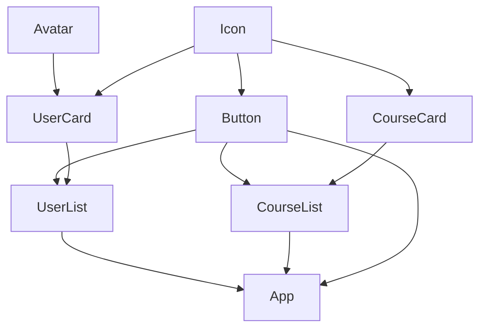

# Component Tree Visualization

This diagram shows the component hierarchy and dependencies in the application.

## Component Details

### Icon

**Description**: Component description

**File**: `src/components/Icon.js`

### App

**Description**: Component description

**File**: `src/App.js`

**Dependencies**:
- UserList
- CourseList
- Button

### UserCard

**Description**: Component description

**File**: `src/components/UserCard.js`

**Dependencies**:
- Avatar
- Icon

### UserList

**Description**: Component description

**File**: `src/components/UserList.js`

**Dependencies**:
- UserCard
- Button

### Button

**Description**: Component description

**File**: `src/components/Button.js`

**Dependencies**:
- Icon

### Avatar

**Description**: Component description

**File**: `src/components/Avatar.js`

### CourseList

**Description**: Component description

**File**: `src/components/CourseList.js`

**Dependencies**:
- CourseCard
- Button

### CourseCard

**Description**: Component description

**File**: `src/components/CourseCard.js`

**Dependencies**:
- Icon

