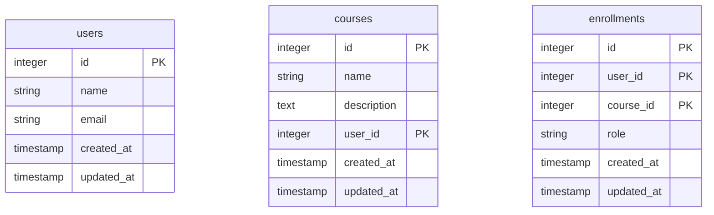

# Database Schema Visualization

This document provides a visualization of the database schema, including tables, columns, relationships, and indexes.

## Entity-Relationship Diagram

## Table Details

### users

| Column | Type | Constraints | Description |
|--------|------|-------------|-------------|
| id | integer | PRIMARY KEY | Unique identifier |
| name | string |  |  |
| email | string |  |  |
| created_at | timestamp | NOT NULL | Creation timestamp |
| updated_at | timestamp | NOT NULL | Last update timestamp |

### courses

| Column | Type | Constraints | Description |
|--------|------|-------------|-------------|
| id | integer | PRIMARY KEY | Unique identifier |
| name | string |  |  |
| description | text |  |  |
| user_id | integer | FOREIGN KEY | Reference to users |
| created_at | timestamp | NOT NULL | Creation timestamp |
| updated_at | timestamp | NOT NULL | Last update timestamp |

### enrollments

| Column | Type | Constraints | Description |
|--------|------|-------------|-------------|
| id | integer | PRIMARY KEY | Unique identifier |
| user_id | integer | FOREIGN KEY | Reference to users |
| course_id | integer | FOREIGN KEY | Reference to courses |
| role | string |  |  |
| created_at | timestamp | NOT NULL | Creation timestamp |
| updated_at | timestamp | NOT NULL | Last update timestamp |

## Relationships

| Parent Table | Child Table | Relationship Type | Foreign Key |
|-------------|------------|-------------------|-------------|
