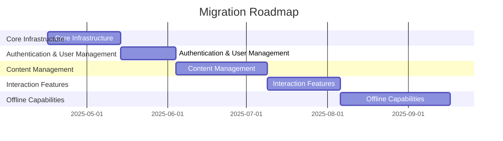

# Migration Roadmap: Discourse + Canvas Migration to Rust/Tauri/Leptos

Generated: 2025-04-16

Total Estimated Effort: **22 weeks**

## Migration Phases

### Phase: Core Infrastructure

**Description**: Set up the basic Rust/Tauri/Leptos infrastructure and implement core database models

**Estimated Effort**: 4 weeks

**Components**:
- App
- Icon
- Button
- CourseList
- Avatar
- CourseCard

**APIs**:
- /api/v1/courses

**Routes**:
- /courses
- /courses/:id
- /courses/:id/enroll
- /assignments
- /assignments/:id
- /assignments/:id/submit

**Database Tables**:
- courses
- enrollments

### Phase: Authentication & User Management

**Description**: Implement user authentication, registration, and profile management

**Estimated Effort**: 3 weeks

**Dependencies**:
- Core Infrastructure

**Components**:
- UserCard
- UserList

**APIs**:
- /api/v1/users
- /api/v1/users/{id}

**Database Tables**:
- users

### Phase: Content Management

**Description**: Implement content creation, editing, and viewing functionality

**Estimated Effort**: 5 weeks

**Dependencies**:
- Authentication & User Management

### Phase: Interaction Features

**Description**: Implement commenting, voting, notifications, and other interaction features

**Estimated Effort**: 4 weeks

**Dependencies**:
- Content Management

### Phase: Offline Capabilities

**Description**: Implement offline-first functionality with data synchronization

**Estimated Effort**: 6 weeks

**Dependencies**:
- Interaction Features

## Critical Path Items

- Database schema design
- Authentication system
- Offline data synchronization
- Content editor component

## Risks

- Complex offline synchronization logic may require additional time
- Integration between Canvas and Discourse features may be challenging
- Performance optimization for large datasets

## Recommendations

- Start with a small subset of features for initial proof of concept
- Implement comprehensive test suite early in the process
- Use feature flags to enable incremental deployment
- Consider using CRDT for conflict resolution in offline mode

## Timeline

