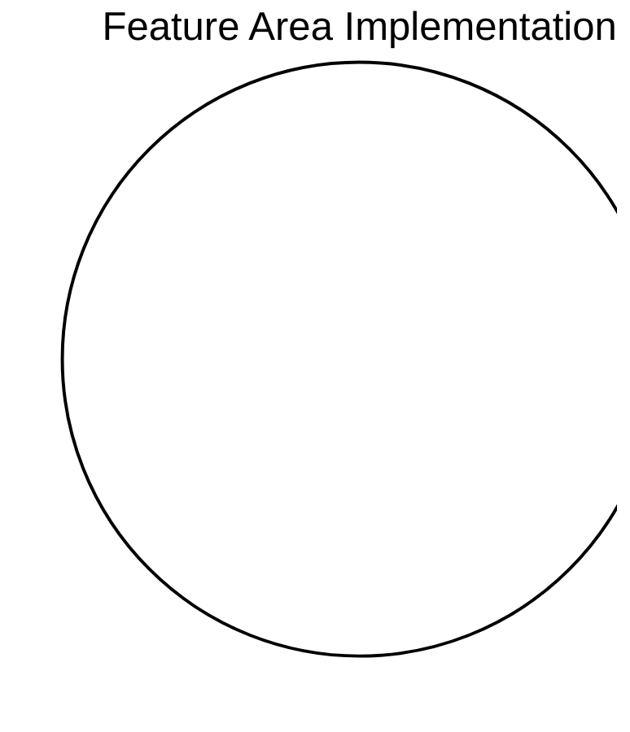

# Feature Coverage Map

_Generated on: 2025-04-09_

## Feature Area Implementation



## Feature Status

| Feature Area | Implemented | Total | Completion |
|--------------|-------------|-------|------------|
| Auth | 0 | 0 | 0% |
| Forum | 0 | 0 | 0% |
| Lms | 0 | 0 | 0% |
| Integration | 0 | 0 | 0% |
| Other | 0 | 0 | 0% |

## Feature Implementation Heatmap

```mermaid
heatmap
  title Feature Implementation Status
  x-axis [Authentication, User Management, Content Management, Discussions, Assessments, Analytics, Notifications, Integration]
  y-axis [Backend, Frontend, Testing]
  0 0 1
  0 1 0
  0 2 0
  1 0 1
  1 1 0
  1 2 0
  2 0 1
  2 1 0
  2 2 0
  3 0 1
  3 1 0
  3 2 0
  4 0 1
  4 1 0
  4 2 0
  5 0 1
  5 1 0
  5 2 0
  6 0 1
  6 1 0
  6 2 0
  7 0 1
  7 1 0
  7 2 0
  color-scheme Blues
```

## Feature Implementation Roadmap

```mermaid
gantt
  title Feature Implementation Roadmap
  dateFormat YYYY-MM-DD
  axisFormat %m-%d
```

## Feature Breakdown

### Auth

| Feature | Status | Implementation |
|---------|--------|----------------|
| User Registration | ❌ Not Started | Not implemented |
| Login/Logout | ❌ Not Started | Not implemented |
| Password Reset | ❌ Not Started | Not implemented |

### Forum

| Feature | Status | Implementation |
|---------|--------|----------------|
| Discussion Threads | ❌ Not Started | Not implemented |
| Comments | ❌ Not Started | Not implemented |
| User Mentions | ❌ Not Started | Not implemented |

### Lms

| Feature | Status | Implementation |
|---------|--------|----------------|
| Courses | ❌ Not Started | Not implemented |
| Assignments | ❌ Not Started | Not implemented |
| Grading | ❌ Not Started | Not implemented |

### Integration

| Feature | Status | Implementation |
|---------|--------|----------------|
| Canvas Integration | ❌ Not Started | Not implemented |
| Discourse Integration | ❌ Not Started | Not implemented |

### Other

| Feature | Status | Implementation |
|---------|--------|----------------|

