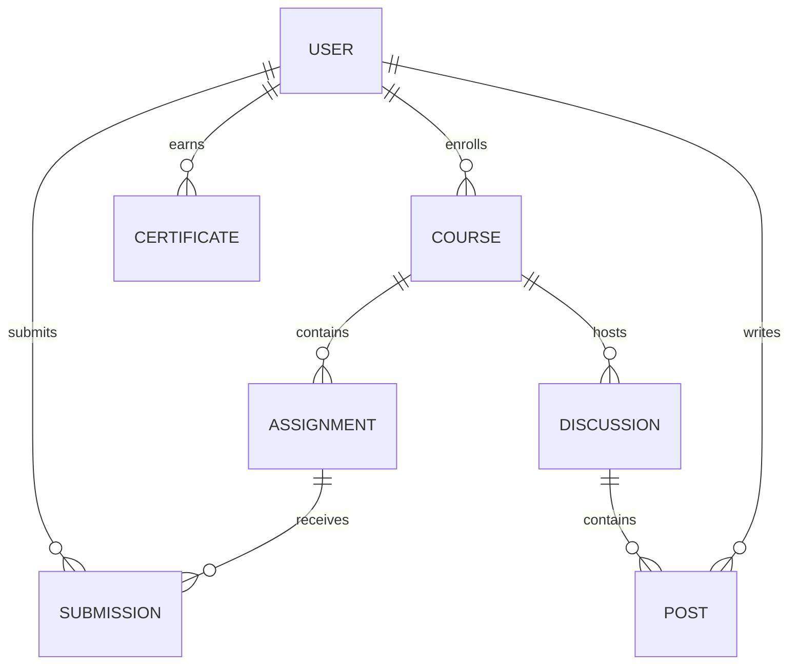

# LMS Data Models

_Last updated: 2025-04-14T21:24:09.752430900-04:00_

## Discourse Models

| Model | Fields | File Path |
|-------|--------|-----------|
| DiscourseClient | client, api_url, api_key, api_username | .\lms-integration\src\api\discourse_client.rs |
| DiscourseApiConfig | pub base_url, pub api_key, pub api_username, pub timeout_seconds, pub max_retries | .\src\api\discourse_client.rs |
| DiscourseFileAttachRequest | pub file_id | .\src\api\discourse_file_routes.rs |
| DiscourseClientConfig | pub base_url, pub api_key, pub api_username | .\src\clients\discourse.rs |
| DiscourseClientOptions | pub base_url, pub api_key, pub api_username | .\src\clients\discourse_client.rs |
| DiscourseNotification | pub id, pub created_at, pub read, pub notification_type, pub additional_fields | .\src-tauri\src\api\discourse_client.rs |
| SsoUser | pub id, pub email, pub name, pub roles | .\src-tauri\src\auth\discourse_sso_service.rs |
| DiscourseResponse<T> | pub success, pub data, pub error | .\src-tauri\src\commands\discourse_commands.rs |
| DiscourseConfig | pub url, pub api_key, pub api_username, pub timeout_seconds, pub poll_interval_seconds | .\src-tauri\src\services\discourse_client.rs |
| Topic | pub id, pub title, pub fancy_title, pub posts_count, pub created_at, pub views, pub reply_count, pub last_posted_at, pub closed, pub archived, pub pinned, pub category_id, pub user_id, pub tags | .\src-tauri\src\services\integration\discourse_integration.rs |

## Native Models

| Model | Fields | File Path |
|-------|--------|-----------|
| FileTypeStats | pub total, pub js, pub rust, pub other | .\fs-utils-wasm\src\lib.rs |
| SyncTransaction | pub transaction_id, pub entity_type, pub source_entity_id, pub target_entity_id, pub direction, pub status, pub created_at, pub updated_at, pub error_message, pub metadata | .\lms-integration\src\models\sync_transaction.rs |
| AnalysisResult | pub timestamp, pub summary, pub code_metrics, pub models, pub api_endpoints, pub ui_components, pub feature_areas, pub tech_debt_metrics, pub recent_changes, pub next_steps, pub overall_progress | .\modules\analyzer\src\core\analysis_result.rs |
| AnalyzerConfig | pub base_dir, pub output_dir, pub target_dirs, pub exclude_patterns, pub quick_mode, pub update_rag_knowledge_base, pub generate_ai_insights, pub analyze_js_files, pub generate_dashboard, pub analyze_tech_debt, pub analyze_code_quality, pub analyze_models, pub tech_stack, pub architecture, pub integrations | .\modules\analyzer\src\core\analyzer_config.rs |
| LlmIntegration | base_dir, api_endpoint, model | .\modules\analyzer\src\core\llm_integration.rs |
| StatisticalTrendAnalyzer | base_dir, trend_analyzer | .\modules\analyzer\src\core\statistical_trend_analyzer.rs |
| TrendAnalyzer | base_dir, history_file, max_history_entries | .\modules\analyzer\src\core\trend_analyzer.rs |
| QueryResult<T> | pub data, pub count, pub success, pub message | .\services\database.rs |
| IntegratedEntity<T, U> | pub canvas, pub discourse, pub integrated | .\services\integration\api_integration.rs |
| JwtClaims | pub user_id, pub email, pub name, pub external_id, pub admin, pub roles, pub exp, pub iat, pub aud, pub iss | .\services\integration\auth\jwt_provider.rs |
| CategoryPermissions | pub everyone, pub staff | .\services\integration\mapping\course_category_mapper.rs |
| EntityMapping | pub entity_type, pub source_id, pub source_system, pub target_system, pub target_id | .\services\integration\model_mapper.rs |
| SyncState | db, logger | .\services\integration\sync_state.rs |
| SyncTransaction | pub transaction_id, pub entity_type, pub operation, pub source_system, pub target_system, pub start_time, pub end_time, pub status, pub steps, pub event | .\services\integration\sync_transaction.rs |
| AppState | sync_state, sync_transaction, sync_service, socket_io | .\services\monitoring\sync_dashboard.rs |
| EntityStats | pub total, pub synced, pub failed, pub pending, pub success_rate | .\services\monitoring\sync_monitor.rs |
| Course | pub id, pub code, pub name, pub description, pub instructor_id, pub start_date, pub end_date, pub created_at, pub updated_at, pub status | .\shared\models\course.rs |
| ForumCategory | pub id, pub name, pub slug, pub description, pub course_id, pub parent_id, pub color, pub text_color, pub created_at, pub updated_at | .\shared\models\forum.rs |
| and related functionality | None detected | .\shared\models\user.rs |
| Course | pub id, pub title, pub description, pub instructor_id, pub created_at, pub updated_at | .\shared\src\models\course.rs |
| ForumCategory | pub id, pub name, pub description, pub slug | .\shared\src\models\forum.rs |
| User | pub id, pub username, pub email, pub display_name, pub avatar_url | .\shared\src\models\user.rs |
| AiKnowledgeEnhancer | base_dir, knowledge_dir | .\src\analyzers\ai_knowledge_enhancer.rs |
| DashboardData | timestamp, overall_progress, feature_areas, recent_changes, next_steps, tech_debt_metrics | .\src\analyzers\dashboard_generator.rs |
| TechDebtAnalyzer | base_dir, patterns | .\src\analyzers\modules\tech_debt_analyzer.rs |
| TrendAnalyzer | base_dir, history_dir | .\src\analyzers\modules\trend_analyzer.rs |
| AnalysisResult | pub timestamp, pub project_status, pub models, pub api_endpoints, pub ui_components, pub code_quality, pub tests, pub integration, pub architecture, pub sync_system, pub blockchain, pub feature_areas, pub recommendations | .\src\analyzers\modules\unified_analyzer.rs |
| AnalyzerOptions | pub use_cache, pub implementation_threshold, pub gemini_api_key, pub incremental, pub skip_reports, pub skip_relationship_maps, pub skip_performance_analysis | .\src\analyzers\modules\unified_project_analyzer.rs |
| RecordViewRequest | user_id, topic_id | .\src\api\discussion_participation.rs |
| CreateDiscussionMappingRequest | pub canvas_discussion_id, pub discourse_topic_id, pub course_category_id, pub title | .\src\api\discussion_routes.rs |
| AttachmentRequest | pub entity_type, pub entity_id | .\src\api\file_routes.rs |
| Category | pub id, pub name, pub slug, pub description, pub created_at, pub updated_at | .\src\api\forum.rs |
| AddPostAttachmentsRequest | pub file_ids | .\src\api\forum_attachment_routes.rs |
| ForumApiClient | base_url, timeout_ms | .\src\api\forum_client.rs |
| CreateMappingRequest | pub course_id, pub category_id | .\src\api\integration.rs |
| CreateMappingRequest | pub canvas_course_id, pub discourse_category_id, pub name, pub sync_direction | .\src\api\mapping_routes.rs |
| SearchResult | pub hits, pub total_hits, pub processing_time_ms | .\src\api\search_client.rs |
| SubmissionAttachmentRequest | pub file_id | .\src\api\submission_attachment_routes.rs |
| CreateTopicMappingRequest | pub canvas_topic_id, pub discourse_topic_id, pub course_id | .\src\api\topic_mapping.rs |
| CanvasWebhookPayload | pub event_name, pub event_data | .\src\api\webhooks.rs |
| GreetArgs<'a> | name | .\src\app.rs |
| AppState | pub db_pool, pub course_category_repo, pub topic_mapping_repo, pub jwt_service, pub integration_service, pub sync_service, pub sync_monitor, pub auth_service, pub canvas_client, pub file_storage | .\src\app_state.rs |
| LoginRequest | pub username, pub password, pub source | .\src\auth\handlers.rs |
| Claims | pub sub, pub exp, pub iat, pub role, pub canvas_id, pub jti, pub discourse_id, pub email, pub name | .\src\auth\jwt.rs |
| JwtClaims | pub id, pub email, pub roles, pub exp, #[serde(skip_serializing_if = "Option, pub iat | .\src\auth\jwt_service.rs |
| RefreshTokenData | pub user_id, pub token_id, pub expires_at, pub revoked | .\src\auth\refresh_token.rs |
| DiscoursePayload | pub external_id, pub email, pub username, pub name, pub admin, pub moderator, pub groups, pub return_sso_url | .\src\auth\sso.rs |
| SsoRequest | pub return_url | .\src\auth\sso_handler.rs |
| ProjectAnalysis | timestamp, summary, components, models, routes, integrations, tech_stack, architecture | .\src\bin\project_analyzer.rs |
| AuditEntry | model, file, source, source_file, percentage, output | .\src\bin\update_audit.rs |
| DashboardStats | pub total_users, pub new_users_today, pub total_topics, pub new_topics_today, pub total_posts, pub new_posts_today, pub flagged_content | .\src\components\admin\dashboard.rs |
| UserListResponse | pub users, pub total_users, pub total_pages, pub page, pub per_page | .\src\components\admin\users.rs |
| LoginRequest | email, password | .\src\components\auth\login.rs |
| RegisterRequest | name, email, password, password_confirmation, username | .\src\components\auth\register.rs |
| CourseDetail | id, title, description, instructor, image_url, modules | .\src\components\courses\course_detail.rs |
| Course | id, title, description, instructor, image_url | .\src\components\courses\course_list.rs |
| RuleParseResult | valid, requirement, error | .\src\components\course_builder.rs |
| CourseIntegrationSettings | pub course_id, pub canvas_course_id, pub auto_sync_enabled, pub sync_frequency_hours, pub sync_modules, pub sync_assignments, pub sync_discussions, pub sync_files, pub sync_announcements, pub last_sync | .\src\components\course_integration_settings.rs |
| SearchHit | id, title, content, category_id, category_name, created_at, slug | .\src\components\forum\optimized_search.rs |
| SearchHit | id, title, content, category_id, category_name, created_at, slug | .\src\components\forum\search.rs |
| from module_manager.rs | None detected | .\src\components\module_item_manager.rs |
| Module | pub id, pub course_id, pub name, pub description, pub position, pub prerequisite_module_id, pub unlock_at, pub created_at, pub updated_at, pub published, pub items | .\src\components\module_manager.rs |
| SyncHistoryEntry | pub id, pub sync_type, pub content_id, pub content_type, pub sync_time, pub success, pub error_message, pub duration_ms | .\src\components\sync_history.rs |
| SyncStatus | pub canvas_connected, pub discourse_connected, pub last_sync, pub pending_syncs, pub sync_in_progress, pub sync_errors | .\src\components\sync_status.rs |
| CreateAssignmentRequest | canvas_id, course_id, title, description, points_possible, due_date, unlock_date, lock_date | .\src\controllers\assignment_controller.rs |
| LoginRequest | pub username, pub password, pub source | .\src\controllers\auth_controller.rs |
| CategoryResponse | category, course | .\src\controllers\category_controller.rs |
| CreateCourseRequest | canvas_id, name, code, description, instructor_id, start_date, end_date | .\src\controllers\course_controller.rs |
| CreateTopicRequest | title, category_id, initial_post_content, pinned | .\src\controllers\topic_controller.rs |
| ForumConfig | pub categories, pub trust_levels, pub plugins | .\src\core\forum.rs |
| Category | pub id, pub name, pub description, pub created_at | .\src\db.rs |
| Feedback | pub id, pub user_id, pub category, pub content, #[serde(skip_serializing_if = "Option, pub rating, pub timestamp, pub status | .\src\feedback\collector.rs |
| GeminiResponse | analysis | .\src\gemini.rs |
| ForumSettings | pub forum_name, pub forum_description, pub logo_url, pub favicon_url, pub primary_color, pub allow_guest_view, pub require_email_verification, pub allow_registration, pub allow_file_uploads, pub max_upload_size_mb, pub allowed_file_types, pub topics_per_page, pub posts_per_page, pub min_chars_per_post, pub max_chars_per_post, pub enable_user_signatures | .\src\models\admin.rs |
| Assignment | pub id, pub name, pub description, pub due_date | .\src\models\assignment.rs |
| Badge | pub id, pub name, pub description, pub badge_type_id, pub badge_grouping_id, pub image_upload_id, pub system, pub enabled, pub multiple_grant, pub allow_title, pub target_posts, pub show_posts, pub auto_revoke, pub created_at, pub updated_at | .\src\models\badge.rs |
| Category | pub id, pub name, pub slug, pub description, pub created_at, pub updated_at | .\src\models\category.rs |
| Course | pub id, pub code, pub name, pub description, pub instructor_id, pub start_date, pub end_date, pub status, pub access_code, pub enrollment_count, pub category_id, pub created_at, pub updated_at, pub canvas_course_id, pub discourse_category_id, pub integration_status | .\src\models\course\mod.rs |
| Course | pub id, pub title, pub description, pub created_at, pub updated_at, pub canvas_id, pub course_code, pub start_date, pub end_date, pub enrollments, pub term, pub discourse_id, pub slug, pub color, pub position, pub parent_id, pub last_sync, pub source_system | .\src\models\course.rs |
| Discussion | pub id, pub title, pub message, pub created_at, pub updated_at, pub creator_id, pub canvas_id, pub course_id, pub pinned, pub locked, pub allow_rating, pub only_graders_can_rate, pub discourse_id, pub category_id, pub slug, pub views, pub posts_count, pub closed, pub archived, pub tags, pub last_sync, pub source_system | .\src\models\discussion.rs |
| Category | pub id, pub name, pub slug, pub description, pub color, pub text_color, pub position, pub parent_category_id, pub course_id, pub module_id, pub created_at, pub updated_at, pub topic_count, pub post_count | .\src\models\forum\category.rs |
| Post | pub id, pub topic_id, pub user_id, pub post_number, pub raw, pub html, pub cooked, pub reply_to_post_id, pub updated_by_id, pub deleted_at, pub editor_id, pub like_count, pub reads, pub created_at, pub updated_at, #[serde(skip_serializing_if = "Option, pub user | .\src\models\forum\post.rs |
| Tag | pub id, pub title, pub context_type, pub context_id, pub tag_type, pub url, pub workflow_state, pub created_at, pub updated_at, pub content_type, pub content_id | .\src\models\forum\tag.rs |
| Topic | pub id, pub title, pub slug, pub category_id, pub user_id, pub closed, pub pinned, pub pinned_globally, pub visible, pub deleted_at, pub views, pub posts_count, pub like_count, pub created_at, pub updated_at, pub bumped_at, pub last_posted_at, pub highest_post_number, pub excerpt, #[serde(skip_serializing_if = "Option, pub posts, #[serde(skip_serializing_if = "Option, pub category, #[serde(skip_serializing_if = "Option, pub user | .\src\models\forum\topic.rs |
| Category | pub id, pub name, pub description, pub slug, pub parent_category_id, pub topic_count, pub post_count, pub position, pub color, pub text_color, pub read_restricted, pub created_at, pub updated_at, pub eportfolio_id | .\src\models\forum.rs |
| Course | pub id, pub name, pub course_code, pub workflow_state, pub account_id, pub root_account_id, pub enrollment_term_id, pub start_at, pub end_at, pub grading_standard_id, pub is_public, pub created_at, pub course_format, pub restrict_enrollments_to_course_dates, pub enrollment_count, pub allow_student_forum_attachments, pub open_enrollment, pub self_enrollment, pub license, pub allow_wiki_comments, pub hide_final_grade, pub time_zone, pub uuid, pub default_view, pub syllabus_body, pub course_color | .\src\models\lms.rs |
| CourseCategoryMapping | pub id, pub course_id, pub category_id, pub sync_enabled, pub created_at, pub updated_at, pub last_synced_at, pub sync_topics, pub sync_users | .\src\models\mapping.rs |
| ModelFactory; | pub fn create<T, model_type, data, source, ) -> Result<Box<dyn std, None => return Err(ModelFactoryError | .\src\models\model_factory.rs |
| Module | pub id, pub course_id, pub title, pub position, pub items_count, pub publish_final_grade, pub published, pub status, pub created_at, pub updated_at | .\src\models\module.rs |
| Notification | pub id, pub user_id, pub subject, pub message, pub created_at, pub read, pub notification_type, pub source_system, pub canvas_id, pub discourse_id, pub url, pub metadata | .\src\models\notification.rs |
| Notification | pub id, pub notification_type, pub user_id, pub actor_id, pub target_id, pub target_type, pub data, pub read, pub created_at | .\src\models\notifications.rs |
| Post | pub id, pub topic_id, pub user_id, pub content, pub post_number, pub created_at, pub updated_at | .\src\models\post.rs |
| SearchRequest | pub query, pub filter_type, pub filter_categories, pub filter_tags, pub filter_date_from, pub filter_date_to, pub filter_user_id, pub sort_by, pub page, pub limit | .\src\models\search.rs |
| SyncQueueItem | pub id, pub topic_mapping_id, pub sync_direction, pub status, pub attempt_count, pub max_attempts, pub last_attempt_at, pub error_message, pub created_at, pub updated_at | .\src\models\sync_queue.rs |
| SyncState | db | .\src\models\sync_state.rs |
| Transaction | pub id, pub entity_type, pub entity_id, pub operation, pub source_system, pub status, pub created_at, pub completed_at | .\src\models\sync_transaction.rs |
| Topic | pub id, pub category_id, pub user_id, pub title, pub slug, pub created_at, pub updated_at | .\src\models\topic.rs |
| TopicMapping | pub id, pub canvas_topic_id, pub discourse_topic_id, pub mapping_id, pub sync_enabled, pub created_at, pub updated_at, pub last_synced_at, pub canvas_updated_at, pub discourse_updated_at | .\src\models\topic_mapping.rs |
| UserModel | pub avatarUrl, pub avatar_template, pub avatar_url, pub badgeCount, pub bio, pub canvasId, pub createdAt, pub created_at, pub data, pub discourseId, pub email, pub enrollments, pub id, pub lastLogin, pub lastSeenAt, pub last_seen_at, pub locale, pub name, pub source, pub timezone, pub trustLevel, pub trust_level, pub updatedAt, pub updated_at, pub username, pub website, pub websiteUrl | .\src\models\unified\user_model.rs |
| UserActivity | pub id, pub user_id, pub activity_type, pub target_id, pub target_type, pub data, pub created_at | .\src\models\user\activity.rs |
| UserFollow | pub id, pub follower_id, pub following_id, pub created_at | .\src\models\user\follow.rs |
| to your existing user module file | pub id, pub username, pub display_name, pub avatar_url | .\src\models\user\mod.rs |
| UserProfile | pub user_id, pub bio, pub website, pub location, pub title, pub tag_line, pub profile_views, pub trust_level, pub is_moderator, pub is_admin, pub last_seen_at, pub created_topics_count, pub posts_count, pub likes_given, pub likes_received, pub featured_topic_id, pub followers_count, pub following_count, pub avatar_url, pub profile_background_url, pub card_background_url, pub custom_fields, pub badges | .\src\models\user\profile.rs |
| User | pub id, pub name, pub email, pub roles | .\src\models\user.rs |
| UserPermissionMapping | pub id, pub canvas_user_id, pub discourse_user_id, pub canvas_role, pub discourse_group, pub sync_enabled, pub created_at, pub updated_at, pub last_synced_at | .\src\models\user_permission.rs |
| GeminiOptions | pub base_dir, pub gemini_api_key, pub min_time_between_calls, pub use_cache, pub skip_gemini_25 | .\src\modules\gemini_analyzer.rs |
| GitHubAnalyzer<M> | metrics, client, token, owner, repo, cache_dir | .\src\modules\github_analyzer.rs |
| GraphNode | pub id, pub label, pub node_type, pub properties, pub system | .\src\modules\knowledge_graph_generator.rs |
| FunctionNode | pub name, pub params, pub body | .\src\modules\ml_analyzer.rs |
| RagOptions | pub output_dir, pub chunk_size, pub chunk_overlap, pub include_metadata | .\src\modules\rag_document_generator.rs |
| Document | pub id, pub content, pub metadata, pub embedding | .\src\modules\rag_retriever.rs |
| DatabaseSolution | pub engine, pub driver, pub configuration, pub database_path, pub migrations | .\src\modules\report_generator.rs |
| ModelProperty | pub name, pub property_type, pub required, pub default_value, pub description | .\src\modules\source_analyzer.rs |
| VectorDatabaseOptions | pub db_type, pub dimensions, pub collection_name, pub qdrant_url, pub qdrant_api_key | .\src\modules\vector_database_adapter.rs |
| MetricsCollector | metrics, counters, timers, gauges, logger | .\src\monitoring\metrics.rs |
| SyncMetrics | pub total_syncs_attempted, pub total_syncs_succeeded, pub total_syncs_failed, pub last_sync_attempt, pub last_successful_sync, pub avg_sync_duration_ms, pub recent_error_rate, pub canvas_api_healthy, pub discourse_api_healthy, pub database_healthy | .\src\monitoring\sync_metrics.rs |
| UserIdResponse | id | .\src\pages\follows_page.rs |
| PendingItemsQuery | limit | .\src\routes\monitoring.rs |
| NotificationsQuery | read, notification_type, since, limit | .\src\routes\notification_routes.rs |
| WebhookResponse | status, #[serde(skip_serializing_if = "Option, result, #[serde(skip_serializing_if = "Option, message | .\src\routes\webhook_routes.rs |
| NewCategory | name, description | .\src\routes.rs |
| ApiClient | client, canvas_config, discourse_config | .\src\services\api.rs |
| Attachment | pub id, pub filename, pub content_type, pub size, pub url, pub created_at, pub user_id, pub is_public | .\src\services\attachment_service.rs |
| User | pub id, pub name, pub email | .\src\services\auth.rs |
| FileMetadata | pub id, pub name, pub path, pub content_type, pub size, pub is_public, pub user_id, pub created_at, pub updated_at, pub md5_hash | .\src\services\file_storage_service.rs |
| ForumService; | pub async fn get_category(id, id, name, description, ..Default | .\src\services\forum.rs |
| GeminiResponse | pub analysis | .\src\services\gemini.rs |
| SyncEvent | pub entity_type, pub entity_id, pub operation, pub source_system, pub target_system, pub data, pub timestamp, pub transaction_id | .\src\services\integration\sync_service.rs |
| CanvasAnnouncement | pub id, pub title, pub message, pub course_id | .\src\services\integration.rs |
| CrossReference | pub id, pub source_type, pub source_id, pub target_type, pub target_id, pub created_at, pub updated_at, pub metadata | .\src\services\integration_service.rs |
| ModelSyncService | model_factory, canvas_api, discourse_api | .\src\services\model_sync_service.rs |
| UserMapping | pub user_id, pub canvas_id, pub discourse_id | .\src\services\notification_service.rs |
| OfflineSyncService | pool, topic_repo, post_repo, offline_actions, id_mappings | .\src\services\offline_sync_service.rs |
| ValidationResult | pub is_valid, pub errors, pub warnings | .\src\services\submission_validation_service.rs |
| UnifiedAuthService | jwt_service, oauth2_client | .\src\services\unified_auth_service.rs |
| UserParticipationService | db_pool, notification_service | .\src\services\user_participation_service.rs |
| WebhookResult | pub status, pub event_type, pub notification_id, pub message, pub data | .\src\services\webhook_service.rs |
| WebSocketService | ws, connected, error | .\src\services\websocket.rs |
| AppState | pub user, pub theme, pub notifications, pub is_online, pub last_sync, pub forum | .\src\state\app_state.rs |
| LocalStorage | storage | .\src\storage\local_storage.rs |
| SyncQueue | operations | .\src\sync\sync_queue.rs |
| SyncState | pub last_sync_timestamp, pub entities | .\src\sync\sync_state.rs |
| PreloadManager | preload_map, active_route, preloaded | .\src\util\route_preload.rs |
| ApiClient | client, base_url | .\src\utils\api_client.rs |
| User | pub id, pub username, pub email, pub created_at, pub role | .\src\utils\auth.rs |
| ProjectStructure | pub directories, pub files_by_type, pub files_by_dir, pub dir_categories | .\src\utils\file_system_utils.rs |
| MemoryProfile | allocated_objects, allocation_stack, total_allocated, snapshot_history, timings, ongoing_operations | .\src\utils\profiler.rs |
| ResourceOptions | pub use_cache, pub cache_ttl_seconds, pub refresh_cache, pub max_retries | .\src\utils\resource.rs |
| SyncOperation | pub id, pub operation_type, pub entity_type, pub entity_id, pub payload, pub timestamp, pub synced | .\src\utils\sync.rs |
| WebSocketClient | url, socket, status, message_callbacks, status_callbacks, auto_reconnect, reconnect_interval, _reconnect_timer, max_reconnect_attempts, current_reconnect_attempts, message_queue | .\src\utils\websocket.rs |
| ForumRealtimeClient | socket, state, updates, subscribed_topics, subscribed_categories, ping_id, latest_ping_time, ping_interval_handle, auth_token, base_url, max_reconnect_attempts, reconnect_timeout_ms | .\src\websocket\forum_realtime.rs |
| GeminiConfig | pub api_key, pub model, pub temperature, pub max_tokens | .\src-tauri\src\ai\gemini_analyzer.rs |
| AiKnowledgeEnhancer | base_dir, knowledge_dir | .\src-tauri\src\analyzers\ai_knowledge_enhancer.rs |
| AnalysisRequest | pub target_dirs, pub exclude_patterns, pub output_dir, pub update_rag_knowledge_base, pub generate_ai_insights, pub analyze_js_files, pub generate_dashboard, pub analyze_tech_debt | .\src-tauri\src\analyzers\analysis_commands.rs |
| AnalysisCommand | pub target_dirs, pub exclude_patterns, pub output_dir, pub update_rag_knowledge_base, pub generate_ai_insights, pub analyze_js_files, pub generate_dashboard, pub analyze_tech_debt | .\src-tauri\src\analyzers\analysis_runner.rs |
| DashboardData | timestamp, overall_progress, feature_areas, recent_changes, next_steps, tech_debt_metrics | .\src-tauri\src\analyzers\dashboard_generator.rs |
| for compatibility\n#[derive(Debug, Clone, Serialize, Deserialize)]\npub | use crate, base_dir, docs_dir, rag_dir | .\src-tauri\src\analyzers\docs_updater.rs |
| Base64FileUploadRequest | pub filename, pub content_type, pub base64_data, pub entity_type, pub entity_id, pub metadata | .\src-tauri\src\api\attachments.rs |
| CertificateRequest | pub user_id, pub course_id, pub metadata | .\src-tauri\src\api\blockchain.rs |
| CourseRequest | name, code, description, status | .\src-tauri\src\api\courses.rs |
| CreateMappingRequest | pub canvas_discussion_id, pub discourse_topic_id, pub course_category_id, pub title | .\src-tauri\src\api\discussion_routes.rs |
| FileUploadRequest | pub context_type, pub context_id, pub is_public | .\src-tauri\src\api\file_management.rs |
| near other request structs | sourceSystems, canvas | .\src-tauri\src\api\forum.rs |
| CreateMappingRequest | pub course_id, pub category_id | .\src-tauri\src\api\forum_mapping.rs |
| PostsQuery | page, per_page | .\src-tauri\src\api\forum_posts.rs |
| TopicQuery | pub page, pub per_page, pub course_id, pub category_id | .\src-tauri\src\api\forum_topics.rs |
| ActivityQuery | limit | .\src-tauri\src\api\integration.rs |
| TopicMappingResponse | pub id, pub canvas_topic_id, pub discourse_topic_id, pub local_topic_id, pub last_sync_at, pub sync_status | .\src-tauri\src\api\integration_commands.rs |
| CourseIntegrationSettings | pub course_id, pub canvas_course_id, pub auto_sync_enabled, pub sync_frequency_hours, pub sync_modules, pub sync_assignments, pub sync_discussions, pub sync_files, pub sync_announcements, pub last_sync | .\src-tauri\src\api\integration_settings.rs |
| CourseFilter | pub status, pub user_id | .\src-tauri\src\api\lms\courses.rs |
| CanvasSyncResponse | message, created_modules, updated_modules, created_items, updated_items | .\src-tauri\src\api\module_commands.rs |
| NotificationIdRequest | pub notification_id | .\src-tauri\src\api\notification_commands.rs |
| AppState | search_client | .\src-tauri\src\api\search.rs |
| CourseIntegrationSettings | pub course_id, pub canvas_course_id, pub auto_sync_enabled, pub sync_frequency_hours, pub sync_modules, pub sync_assignments, pub sync_discussions, pub sync_files, pub sync_announcements, )]b content_type, pub last_sync | .\src-tauri\src\api\sync_history.rs |
| SyncStatus | pub canvas_connected, pub discourse_connected, pub last_sync, pub pending_syncs, pub sync_in_progress, pub sync_errors | .\src-tauri\src\api\sync_status.rs |
| Claims | sub, exp, iat, role, canvas_id, discourse_id | .\src-tauri\src\auth\jwt_handler.rs |
| Claims | pub sub, pub exp, pub iat, pub role, #[serde(skip_serializing_if = "Option, pub canvas_id, #[serde(skip_serializing_if = "Option, pub discourse_id, pub jti, pub email, pub name | .\src-tauri\src\auth\jwt_service.rs |
| Claims | pub sub, pub name, pub exp, pub iat, pub is_admin | .\src-tauri\src\auth.rs |
| BenchmarkConfig | pub duration_seconds, pub users, pub ramp_up_seconds, pub scenarios | .\src-tauri\src\benchmark\mod.rs |
| ProjectAnalysis | timestamp, summary, components, models, routes, integrations, tech_stack, architecture | .\src-tauri\src\bin\project_analyzer.rs |
| ForumPost | pub id, pub content, pub author, pub timestamp, pub version | .\src-tauri\src\blockchain\anchoring.rs |
| AdaptiveBatcher | db_pool, chain, differential_anchoring, config | .\src-tauri\src\blockchain\batching.rs |
| ConsensusConfig | pub validation_threshold, pub block_interval, pub max_peers, pub gossip_interval | .\src-tauri\src\blockchain\config.rs |
| UserId(Uuid); | Self(Uuid | .\src-tauri\src\blockchain\domain.rs |
| AchievementTx<'a> | user_id, course_id, achievement_type, timestamp, signature | .\src-tauri\src\blockchain\memory.rs |
| PerformanceMetrics | tx_process, block_creation, sync_latency, memory_usage, tx_count, block_count | .\src-tauri\src\blockchain\metrics.rs |
| HybridChain | blockchain, crdt_store, config | .\src-tauri\src\blockchain\mod.rs |
| AdaptiveSyncManager | batcher | .\src-tauri\src\blockchain\sync.rs |
| CachedValue<T> | value, inserted_at, access_count | .\src-tauri\src\cache\advanced_cache.rs |
| TopicCache<T> | T, cache, pending_requests, ttl | .\src-tauri\src\cache\topic_cache.rs |
| AuthState | pub jwt_service, pub canvas_auth_service, pub discourse_sso_service | .\src-tauri\src\commands\auth_commands.rs |
| NotificationState | pub jwt_service, pub canvas_client, pub discourse_client | .\src-tauri\src\commands\notification_commands.rs |
| WebhookState | None detected | .\src-tauri\src\commands\webhook_commands.rs |
| Config | pub app, pub forum, pub database, pub search, pub media, pub websocket | .\src-tauri\src\config\mod.rs |
| CurrentUserId(pub String); | pub jwt_secret, pub jwt_issuer, pub jwt_audience, pub access_token_expiration, pub refresh_token_expiration, pub refresh_token_enabled | .\src-tauri\src\core\auth.rs |
| AppConfig | pub database, pub server, pub sync | .\src-tauri\src\core\config.rs |
| ErrorResponse | pub error, pub error_code | .\src-tauri\src\core\errors.rs |
| SystemHealth | pub canvas_api_healthy, pub discourse_api_healthy, pub local_db_healthy, pub sync_engine_healthy, pub last_checked | .\src-tauri\src\core\monitoring.rs |
| CreateCategoryRequest | pub name, pub description, pub course_id, pub parent_id, pub color | .\src-tauri\src\forum\categories.rs |
| CreateTopicRequest | pub category_id, pub title, pub content | .\src-tauri\src\forum\topics.rs |
| Course | pub id, pub name, pub code, pub description, pub instructor_id, pub start_date, pub end_date, pub published, pub created_at, pub updated_at | .\src-tauri\src\lms\models\course.rs |
| Module | pub id, pub course_id, pub name, pub position, pub unlock_at, pub require_sequential_progress, pub published, pub items_count, pub created_at, pub updated_at | .\src-tauri\src\lms\models\module.rs |
| Course | pub id, pub code, pub name, pub description, pub instructor_id, pub start_date, pub end_date, pub status, pub created_at, pub updated_at, pub syllabus, pub visibility, pub allow_self_enrollment, pub enrollment_code, pub homepage_type, pub theme_color, pub banner_image_url | .\src-tauri\src\lms\models.rs |
| AppState | conn, db, chain, batcher, sync_manager, metrics, governor, jwt_secret | .\src-tauri\src\main.rs |
| JwtClaims | pub sub, pub name, pub email, pub roles, pub exp, pub iat, pub jti, pub iss, pub aud, #[serde(skip_serializing_if = "Option, pub canvas_id, #[serde(skip_serializing_if = "Option, pub discourse_id | .\src-tauri\src\models\auth.rs |
| Certificate | pub id, pub user_id, pub course_id, pub issued_at, pub metadata | .\src-tauri\src\models\blockchain.rs |
| Category | pub id, pub name, pub slug, pub description, pub color, pub text_color, pub parent_id, pub position, pub created_at, pub updated_at, pub is_deleted | .\src-tauri\src\models\category.rs |
| Assignment | pub id, pub course_id, pub title, pub description, pub points_possible, pub due_date, pub available_from, pub available_until, pub is_published, pub created_at, pub updated_at | .\src-tauri\src\models\content\assignment.rs |
| Submission | pub id, pub assignment_id, pub user_id, pub content, pub body, pub url, pub submission_type, pub grade, pub score, pub grader_id, pub status, pub is_late, pub attempt, pub canvas_submission_id, pub submitted_at, pub graded_at, pub created_at, pub updated_at, pub attachment_ids, pub comments | .\src-tauri\src\models\content\submission.rs |
| Course | pub id, pub name, pub code, pub description, pub instructor_id, pub start_date, pub end_date, pub status, pub created_at, pub updated_at | .\src-tauri\src\models\course\course.rs |
| Enrollment | pub id, pub user_id, pub course_id, pub role, pub state, pub created_at, pub updated_at, pub last_activity_at, pub start_at, pub end_at, pub canvas_enrollment_id | .\src-tauri\src\models\course\enrollment.rs |
| Module | pub id, pub course_id, pub name, pub description, pub position, pub prerequisite_module_id, pub unlock_at, pub created_at, pub updated_at, pub published, pub canvas_module_id, pub items | .\src-tauri\src\models\course\module.rs |
| Course | pub id, pub title, pub description, pub instructor_id, pub created_at, pub status | .\src-tauri\src\models\course.rs |
| Discussion | pub id, pub course_id, pub title, pub content, pub topic_id, pub status, pub created_at, pub updated_at | .\src-tauri\src\models\discussion.rs |
| DiscussionMapping | pub id, pub canvas_discussion_id, pub discourse_topic_id, pub course_category_id, pub title, pub last_sync, pub sync_enabled, pub sync_posts, pub created_at | .\src-tauri\src\models\discussion_mapping.rs |
| Category | pub id, pub name, pub description, pub slug, pub parent_id, pub position, pub color, pub text_color, pub is_hidden, pub created_at, pub updated_at, pub discourse_category_id, pub course_id, pub sync_status, pub topic_count, pub subcategories | .\src-tauri\src\models\forum\category.rs |
| TopicMapping | pub id, pub canvas_topic_id, pub discourse_topic_id, pub last_sync_at, pub sync_status, pub local_topic_id | .\src-tauri\src\models\forum\mapping.rs |
| Post | pub id, pub topic_id, pub author_id, pub parent_id, pub content, pub html_content, pub created_at, pub updated_at, pub likes, pub is_solution, pub score, pub read_status, pub attachment_ids, pub canvas_entry_id, pub discourse_post_id, pub sync_status | .\src-tauri\src\models\forum\post.rs |
| Topic | pub id, pub category_id, pub title, pub content, pub author_id, pub is_pinned, pub is_closed, pub is_question, pub assignment_id, pub created_at, pub updated_at, pub last_post_at, pub publish_at, pub read_status, pub view_count, pub canvas_discussion_id, pub discourse_topic_id, pub sync_status, pub tags, pub post_ids | .\src-tauri\src\models\forum\topic.rs |
| UserId(pub i64); | impl fmt, fn fmt(&self, f | .\src-tauri\src\models\ids.rs |
| IntegrationStatus | pub connected, pub last_sync, pub discourse_url, pub synced_topics_count, pub synced_categories_count, pub sync_operations_24h | .\src-tauri\src\models\integration.rs |
| CourseCategoryMapping | pub id, pub course_id, pub category_id, pub sync_enabled, pub last_synced_at, pub created_at, pub updated_at | .\src-tauri\src\models\mapping.rs |
| Module | pub id, pub course_id, pub title, pub position, pub items_count, pub publish_final_grade, pub published, pub status, pub created_at, pub updated_at | .\src-tauri\src\models\module.rs |
| Notification | pub id, pub user_id, pub title, pub message, pub notification_type, pub status, pub reference_id, pub reference_type, pub created_at, pub updated_at | .\src-tauri\src\models\notification.rs |
| Post | pub id, pub topic_id, pub user_id, pub content, pub content_html, pub created_at, pub updated_at, pub is_deleted | .\src-tauri\src\models\post.rs |
| Submission | pub id, pub assignment_id, pub user_id, pub content, pub attachments, pub status, pub score, pub feedback, pub submitted_at, pub graded_at | .\src-tauri\src\models\submission.rs |
| SyncConfig | pub enabled, pub sync_interval_seconds, pub check_interval_seconds, pub max_retries, pub retry_delay_seconds, pub sync_courses, pub sync_discussions, pub sync_users | .\src-tauri\src\models\sync_config.rs |
| Tag | pub id, pub name, pub description, pub created_at, pub updated_at, pub is_deleted | .\src-tauri\src\models\tag.rs |
| Topic | pub id, pub title, pub slug, pub category_id, pub user_id, pub views, pub created_at, pub updated_at, pub last_posted_at, pub is_closed, pub is_pinned, pub is_deleted | .\src-tauri\src\models\topic.rs |
| Assignment | pub id, pub title, pub description, pub created_at, pub updated_at, pub course_id, pub due_date, pub points_possible, pub submission_types, pub canvas_specific_fields, pub discourse_specific_fields | .\src-tauri\src\models\unified\assignment.rs |
| Course | pub id, pub title, pub description, pub created_at, pub updated_at, pub canvas_specific_fields, pub discourse_specific_fields | .\src-tauri\src\models\unified\course.rs |
| User | pub id, pub name, pub email, pub username, pub avatar, pub canvas_id, pub discourse_id, pub last_login, pub source_system, pub roles, pub metadata | .\src-tauri\src\models\unified\user.rs |
| UserPreferences | pub id, pub user_id, pub theme, pub email_notifications, pub push_notifications, pub forum_digest, pub language, pub time_zone, pub date_format, pub compact_view | .\src-tauri\src\models\user\preferences.rs |
| Profile | pub id, pub user_id, pub bio, pub location, pub website, pub job_title, pub company, pub interests, pub created_at, pub updated_at, pub twitter, pub github, pub linkedin | .\src-tauri\src\models\user\profile.rs |
| User | pub id, pub name, pub email, pub username, pub avatar_url, pub created_at, pub updated_at, pub last_seen_at, pub canvas_user_id, pub sis_user_id, pub lti_user_id, pub sortable_name, pub short_name, pub discourse_user_id, pub trust_level, pub post_count | .\src-tauri\src\models\user\user.rs |
| User | pub id, pub email, pub first_name, pub last_name, pub role, pub created_at, pub updated_at | .\src-tauri\src\models\user.rs |
| MetricSummary | count, min, max, avg, p95, p99 | .\src-tauri\src\monitoring\metrics.rs |
| CompletionRuleParser; | pub fn parse_rule(&self, rule_text, let c_rule_text = CString | .\src-tauri\src\parser_integration.rs |
| ProfilerEntry | calls, total_duration_ns, min_duration_ns, max_duration_ns | .\src-tauri\src\profiler.rs |
| Category | pub id, pub name, pub slug, pub description, pub created_at, pub updated_at | .\src-tauri\src\repositories\forum.rs |
| Category | pub id, pub name, pub slug, pub description, pub created_at, pub updated_at, pub topic_count | .\src-tauri\src\repositories\forum_optimized.rs |
| CreateCategoryPayload | pub name, pub slug, pub description, pub parent_id | .\src-tauri\src\routes\categories.rs |
| CreatePostPayload | pub topic_id, pub user_id, pub content | .\src-tauri\src\routes\posts.rs |
| CreateTopicPayload | pub title, pub category_id, pub content, pub user_id | .\src-tauri\src\routes\topics.rs |
| RegisterUserPayload | pub username, pub email, pub password, pub display_name | .\src-tauri\src\routes\users.rs |
| MeiliSearchConfig | pub host, pub api_key | .\src-tauri\src\search\embedded.rs |
| SearchStatus | pub state, pub documents_indexed, pub is_available, pub last_indexed | .\src-tauri\src\search\manager.rs |
| TopicDocument | pub id, pub title, pub content, pub category_id, pub category_name, pub user_id, pub created_at, pub slug | .\src-tauri\src\search\meilisearch.rs |
| FileInfo | pub id, pub filename, pub content_type, pub size, pub upload_date, pub entity_type, pub entity_id, pub user_id, pub metadata, pub url | .\src-tauri\src\services\file_storage_service.rs |
| Announcement | pub id, pub title, pub message, pub course_id | .\src-tauri\src\services\integration\integration_service.rs |
| IntegrationService | db, discourse_client, canvas_client | .\src-tauri\src\services\integration_service.rs |
| ModelSyncService | canvas_client, discourse_client | .\src-tauri\src\services\sync\model_sync_service.rs |
| SyncManager | user_sync, course_sync, assignment_sync, connection_status, sync_lock | .\src-tauri\src\services\sync\sync_manager.rs |
| SyncEvent | pub transaction_id, pub entity_type, pub entity_id, pub operation, pub source_system, pub target_system, pub timestamp, pub data | .\src-tauri\src\services\sync\transaction_handler.rs |
| CanvasCourse | pub id, pub name, pub description | .\src-tauri\src\services\sync.rs |
| SyncStatus | pub is_running, pub last_sync_started, pub last_sync_completed, pub next_scheduled_sync, pub current_operation, pub success_count, pub error_count, pub sync_errors | .\src-tauri\src\services\sync_manager.rs |
| Course | pub id, pub name, pub code, pub description, pub created_at, pub updated_at, pub deleted_at | .\src-tauri\src\shared\models\course.rs |
| SyncOperation | pub id, pub device_id, pub user_id, pub operation_type, pub entity_type, pub entity_id, pub payload, pub timestamp, pub vector_clock, pub synced, pub synced_at | .\src-tauri\src\sync\operations.rs |
| Task | pub id, pub task_type, pub priority, pub created_at, pub status | .\src-tauri\src\tasks\queue.rs |
| BlockEvent<'a> | tx_count, hash, duration_ms | .\src-tauri\src\telemetry\logging.rs |
| FileEntry | path, is_directory, size, children | .\src-tauri\src\utils\index_project.rs |
| TestModel | pub date | .\src-tauri\tests\date_utils_tests.rs |
| Assignment | id, title, description, due_date, points_possible, topic_id | .\src-ui\components\assignments\assignment_topic_mapper.rs |
| Category | id, name, slug, description, parent_id, course_id, position | .\src-ui\components\courses\course_category_mapper.rs |
| OfflineAction | id, action_type, entity_type, entity_id, description, created_at | .\src-ui\components\sync\offline_sync_manager.rs |
| Topic | id, title, slug, post_count, view_count, created_at, updated_at, pinned, closed, author_id | .\src-ui\components\topics\topic_list.rs |
| User | pub id, pub username, pub email, pub role, pub canvas_id | .\src-ui\hooks\use_auth.rs |
| IntegrationStatus | pub connected, pub last_sync, pub pending_syncs, pub sync_in_progress, pub sync_errors | .\src-ui\models\integration.rs |
| Notification | pub id, pub title, pub message, pub notification_type, pub created_at, pub read, pub action_url, pub action_text, pub entity_type, pub entity_id | .\src-ui\models\notification.rs |
| Category | id, name, description | .\src-ui\pages\categories.rs |
| Category | id, name, description | .\src-ui\pages\category.rs |
| Course | id, name, code, description, instructor_id, is_published | .\src-ui\pages\courses\courses_list.rs |
| CourseParams | course_id | .\src-ui\pages\courses\course_detail.rs |
| Topic | id, category_id, title, content | .\src-ui\pages\topic.rs |
| TopicParams | topic_id | .\src-ui\pages\topics\topic_detail.rs |
| BlockchainMethod | name, params, description | .\tools\doc-generator\src\bin\generate_blockchain_docs.rs |
| Metrics | models, api_endpoints, code_quality | .\tools\project-analyzer\src\ai_insights_generator.rs |
| AnalysisArgs | #[arg(short, long, default_value_t = String, base_dir, #[arg(long, default_value_t = String, canvas, #[arg(long, default_value_t = String, discourse, skip_cache, skip_source_analysis, #[arg(short, long, value_enum, default_value_t = ReportType, report | .\tools\project-analyzer\src\full_analysis_runner.rs |
| ArchitectureInfo | None detected | .\tools\project-analyzer\src\main.rs |
|  | template.push_str("    // TODO, template.push_str("    pub id, template.push_str("    pub name, template.push_str("    pub created_at, template.push_str("    pub updated_at | .\tools\project-analyzer\src\template_generator.rs |
| TechDebtAnalyzer | base_dir, patterns | .\tools\unified-analyzer\src\analyzers\modules\tech_debt_analyzer.rs |
| AnalysisResult | pub timestamp, pub project_status, pub models, pub api_endpoints, pub ui_components, pub code_quality, pub tests, pub integration, pub architecture, pub sync_system, pub blockchain, pub feature_areas, pub recommendations | .\tools\unified-analyzer\src\analyzers\modules\unified_analyzer.rs |
| AnalysisResult | pub timestamp, pub project_status, pub models, pub api_endpoints, pub ui_components, pub code_quality, pub tests, pub integration, pub architecture, pub sync_system, pub blockchain, pub feature_areas, pub recommendations | .\tools\unified-analyzer\src\analyzers\unified_analyzer.rs |
| KnowledgeSection | title, content, keywords, importance | .\tools\unified-analyzer\src\analyzers\unified_analyzer_extensions.rs |
| AuditEntry | model, file, source, source_file, percentage, output | .\tools\update_audit.rs |

## Canvas Models

| Model | Fields | File Path |
|-------|--------|-----------|
| CanvasClient | client, api_url, api_key | .\lms-integration\src\api\canvas_client.rs |
| CanvasClient | client, base_url, auth_token | .\src\adapters\canvas_adapter.rs |
| CanvasApiConfig | pub base_url, pub access_token, pub timeout_seconds, pub max_retries | .\src\api\canvas_client.rs |
| CanvasFileUploadRequest | pub name, pub content_type, pub content, pub parent_folder_id, pub on_duplicate | .\src\api\canvas_file_routes.rs |
| CanvasClient | base_url, api_key | .\src\api_clients\canvas.rs |
| CanvasClientConfig | pub base_url, pub token | .\src\clients\canvas.rs |
| CanvasClientOptions | pub base_url, pub token | .\src\clients\canvas_client.rs |
| SyncStatus | pub course_id, pub canvas_course_id, pub modules_synced, pub modules_local_only, pub modules_canvas_only, pub items_synced, pub items_local_only, pub items_canvas_only, pub last_sync | .\src\components\canvas_sync_status.rs |
| CanvasDiscussionPayload | id, title, message, user_id, course_id | .\src\controllers\canvas_integration_controller.rs |
| Grade | pub A, pub B, pub C, pub D, pub E, pub F, pub G, pub H, pub I, pub J, pub K, pub L, pub M, pub N, pub O, pub P, pub Q, pub R, pub S, pub exports | .\src\models\canvas\grade.rs |
| Group | pub Tracker, pub TrackerBase, pub TrackerGroup, pub TrackerStream, pub addUnit, pub bubbleChange, pub buffer, pub completed, pub completion, pub debug, pub depth, pub exports, pub finish, pub finished, pub from, pub ii, pub indent, pub length, pub nameInTree, pub names, pub newGroup, pub newItem, pub newStream, pub output, pub parentGroup, pub toTest, pub totalWeight, pub tracker, pub trackerId, pub trackers, pub unit, pub util, pub valPerWeight, pub weight | .\src\models\canvas\group.rs |
| Module | pub exports | .\src\models\canvas\module.rs |
| User | pub Default, pub https, pub modelName, pub name, pub userDefinedMetadata, pub x | .\src\models\canvas\user.rs |
| CanvasUser | id, email, name, roles | .\src\services\canvas_auth_service.rs |
| CanvasWebhookPayload | pub event_type, pub payload | .\src\webhooks\canvas.rs |
| CanvasNotification | pub id, pub created_at, pub read, pub notification_type, pub additional_fields | .\src-tauri\src\api\canvas_client.rs |
| CanvasUser | pub id, pub name, pub email, pub roles, pub sortable_name, pub short_name, pub avatar_url, pub time_zone, pub locale, pub bio | .\src-tauri\src\auth\canvas_auth_service.rs |
| CanvasConfig | pub url, pub api_token, pub timeout_seconds | .\src-tauri\src\services\canvas_client.rs |
| DiscussionTopic | pub id, pub title, pub message, pub user_id, pub posted_at, pub assignment_id, pub published, pub locked, pub pinned, pub position, pub discussion_type, pub last_reply_at, pub course_id | .\src-tauri\src\services\integration\canvas_integration.rs |
| CanvasModule | pub id, pub name, pub position, pub published, pub items_count, pub items_url, pub state, pub unlock_at, pub prerequisite_module_ids | .\src-tauri\src\services\integration\canvas_module_sync.rs |

## Haskell Models

| Model | Fields | File Path |
|-------|--------|-----------|
| Query | { queryType, , tables, , conditions, , projections | .\haskell-integration\src\Query\Optimizer.hs |
| QueryType | executeQuery, runQueryWithMemTracking, executeQueryPure, matchesConditions, matchCondition, queryMemLimit, logMemoryWarning | .\haskell-integration\src\Query\Optimizer.hs |
| Condition | executeQuery, runQueryWithMemTracking, executeQueryPure, matchesConditions, matchCondition, queryMemLimit, logMemoryWarning | .\haskell-integration\src\Query\Optimizer.hs |
| SyncOperation | { opId, , opType, , entityId, , payload | .\haskell-integration\src\Sync\CRDT.hs |
| OperationType | None detected | .\haskell-integration\src\Sync\CRDT.hs |
| ResolvedOperation | { resolvedOpId, , success, , conflicts | .\haskell-integration\src\Sync\CRDT.hs |

## Entity Relationships

## Data Migration Notes

### Canvas to LMS
- Course data is migrated with structure preserved
- User accounts are synchronized with unified authentication
- Assignment and submission history is maintained

### Discourse to LMS
- Discussion forums are embedded within course contexts
- User profiles are synchronized
- Post history and attachments are preserved
